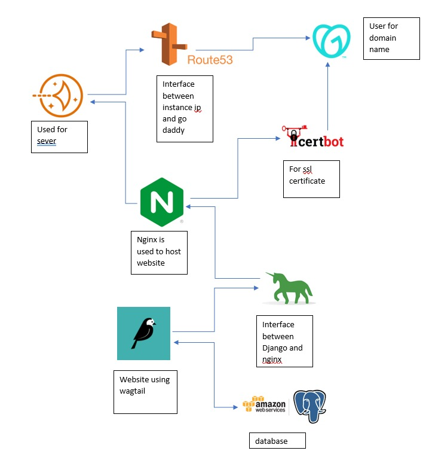

# getHarsh

## Table of contents

- Technology stack used
- What's included
- Documentation

## Technology stack used

1. Python3 3.2.0
2. Django Web Framework 3.1.7
3. [Wagtail CMS](https://wagtail.io) for content administration. 
4. [PostgreSQL 10.5](https://www.postgresql.org/) is the database we use in production and locally.
5. [Psycopg](http://initd.org/psycopg/) is the Python library that lets Python talk to Postgres.
6. [Amazon S3](https://aws.amazon.com/free/?all-free-tier.sort-by=item.additionalFields.SortRank&all-free-tier.sort-order=asc&awsf.Free%20Tier%20Categories=categories%23storage&trk=ps_a134p000006gEXGAA2&trkCampaign=acq_paid_search_brand&sc_channel=PS&sc_campaign=acquisition_IN&sc_publisher=Google&sc_category=Storage&sc_country=IN&sc_geo=APAC&sc_outcome=acq&sc_detail=amazon%20s3&sc_content=S3_e&sc_matchtype=e&sc_segment=477000700292&sc_medium=ACQ-P|PS-GO|Brand|Desktop|SU|Storage|S3|IN|EN|Text&s_kwcid=AL!4422!3!477000700292!e!!g!!amazon%20s3&ef_id=CjwKCAjwuvmHBhAxEiwAWAYj-MxGign8CZZzAQNFFMiCQBwdTWVkAFHM6HG8qd6BlOARAYn6iKEJGRoCFWUQAvD_BwE:G:s&s_kwcid=AL!4422!3!477000700292!e!!g!!amazon%20s3&awsf.Free%20Tier%20Types=*all) provides object storage through a web service 
7. interface
8.  [Gunicorn](https://gunicorn.org/#docs) interface between nginx and Django
9. [Lightsail](https://aws.amazon.com/lightsail/) offers you everything needed to build an application or website
10. [Route53](https://aws.amazon.com/route53/) instance between instance ip and go daddy
11. [Certbot](https://certbot.eff.org/) for ssl certificate

## What's included

Within the download you'll find the following directories and files,  logically grouping common assets and providing both compiled and  minified variations. You'll see something like this:

```markdown
GETHARSH/
├──blog/
│   ├── __init.py__
│   ├── admin.py
│   ├── apps.py
│   ├── feeds.py
│   ├── forms.py
│   ├── models.py
│   ├── tests.py
│   ├── urls.py
│   ├── views.py
│   ├── wagtail_hooks.py
├──blog_extension/
│   ├── __init.py__
│   ├── admin.py
│   ├── apps.py
│   ├── forms.py
│   ├── models.py
│   ├── tests.py
│   ├── urls.py
│   ├── views.py
├──cmswagtail/
│   ├── __init.py__
│   ├── settings/
│   │   ├── __init.py__
│   │   ├── base.py
│   │   ├── dev.py
│   │   ├── production.py
│   ├── static/
│   ├── templates/
│   ├── __init__.py
│   ├── urls.py
│   ├── wsgi.py
├──home/
│   ├── __init__.py
│   ├── context_processors.py
│   ├── models.py
├──search/
│   ├── __init__.py
│   ├── views.py
├──user_management/
│   ├── __init.py__
│   ├── admin.py
│   ├── apps.py
│   ├── forms.py
│   ├── models.py
│   ├── signals.py
│   ├── tests.py
│   ├── views.py
├──manage.py/
```

Static  contains static files(like css, js and media), templates contain the html pages. For further information visit [Django documentation](https://docs.djangoproject.com/en/3.2/). 

#### For further information on various .py files:

- admin.py file is used to display your models in the Django admin panel. You can also customize your admin panel.
- manage.py is Django’s command-line utility for administrative tasks, click [here](https://docs.djangoproject.com/en/3.2/ref/django-admin/) for more info
  feeds.py is used for creating RSS Feeds with Django, click [here](https://docs.djangoproject.com/en/3.2/ref/contrib/syndication/) for more info
- forms.py is used for creating custom forms through models, click [here](https://docs.djangoproject.com/en/3.2/topics/forms/) for more info
- models.py is the single, definitive source of information about your data, click [here](https://docs.djangoproject.com/en/3.2/topics/db/models/) for more info
- urls.py is used for handling urls on website, click [here](https://docs.djangoproject.com/en/3.2/topics/http/urls/) for more info
- views.py contains Python function **that takes a Web request and returns a Web response**, click [here](https://docs.djangoproject.com/en/3.2/topics/http/views/) for more info
- base.py contains the settings of the project through which the website runs, click [here](https://docs.djangoproject.com/en/3.2/topics/settings/) for more info
- wsgi.py contains calling convention for web servers to forward requests to web applications or frameworks written in the **Python** programming language. click [here](https://docs.djangoproject.com/en/3.2/howto/deployment/wsgi/) for more info


## Documentation

Here is a flow chart of how the project works



### Installation and configuration 

Clone the repository

Using the console, navigate to the root directory in which your projects live and clone this project's repository:

```bash
git clone git@github.com:getHarsh/getHarsh.git
cd getHarsh
// make your python virtualenv
virtualenv -p python3 virtualenv
source virtualenv/bin/activate
```

with virtualenv activated and inside the project directory

```
pip install -r requirements.txt
./manage.py migrate
./manage.py createsuperuser
./manage.py runserver
```

