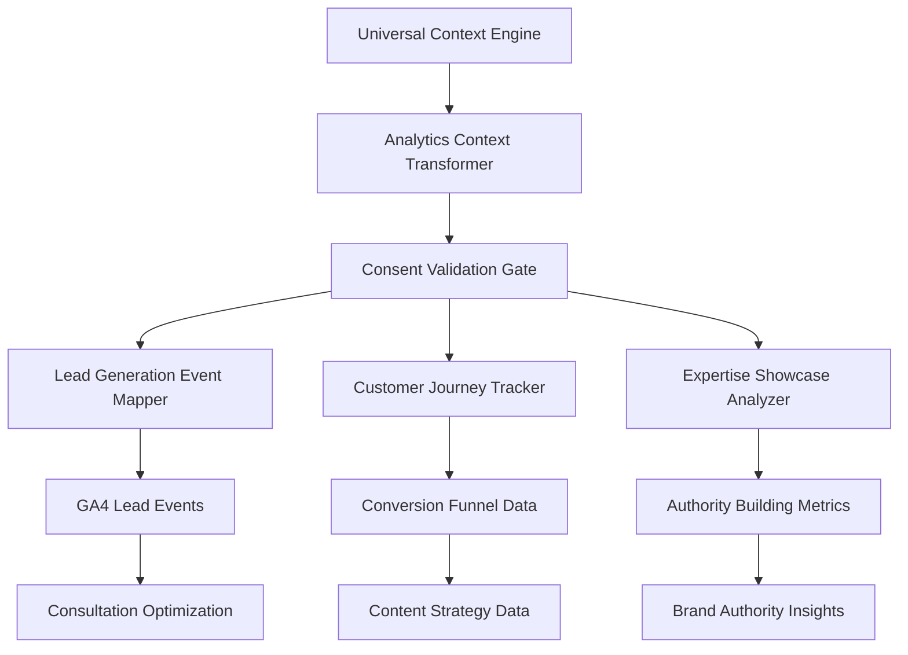

# Consent-Compliant Analytics & Lead Generation System

## Overview

The **Consent-Compliant Analytics & Lead Generation System** is a **pure transformation layer** that consumes rich context from the [Central Context Engine](./CONTEXT-ENGINE.md) to automatically create **GDPR-compliant analytics tracking** optimized for lead generation, consultation booking, and project sponsorship conversions.

**Pure Transformation**: This system contains NO detection logic - all conversion potential calculation, interest level detection, and lead quality scoring happens in the Context Engine.

**Business Model Focus**: This system is specifically designed for a **lead magnet ecosystem** that drives consulting sales through content engagement, expertise showcasing, and relationship building.

**Universal Context Source**: All context extraction (ecosystem, domain, project, page, component, theme, business) is handled by the [Central Context Engine](./CONTEXT-ENGINE.md)

> **Context Details**: See [CONTEXT-ENGINE.md](./CONTEXT-ENGINE.md) for complete multi-dimensional context extraction and business intelligence

## Static Site Architecture Constraints

**🚨 CRITICAL**: This analytics system is designed for static sites hosted on GitHub Pages with the following limitations:

### ✅ What's Possible (Client-Side Only)

- **Consent Mode v2**: Full implementation with all 4 parameters
- **Client-side tracking**: GA4, Facebook Pixel (basic mode only)
- **LocalStorage/Cookies**: For consent persistence
- **Connection-aware loading**: Using `navigator.connection` API
- **Request batching**: Client-side event queuing
- **Basic conversion tracking**: Form submissions, clicks

### ❌ What's NOT Possible (Requires Server)

- **Server-side GTM**: Requires Google Cloud Run ($30-50/month)
- **Enhanced conversions**: Needs server-side hashing
- **First-party cookies**: Requires server to set HttpOnly cookies
- **Facebook Enhanced Matching**: High legal risk + needs server
- **Real-time data processing**: No server = no backend processing
- **User authentication**: No server-side sessions

### ⚠️ Legal Warnings

- **Facebook Pixel Enhanced Matching**: €1.34 million fine risk - DO NOT ENABLE
- **Automatic Advanced Matching (AAM)**: Can collect SSNs, bank accounts - NEVER USE
- **PII Collection**: Must have explicit consent before any tracking

## Analytics Context Transformation

### Universal Context to Consent-Compliant Analytics

The Analytics system receives universal context and transforms it specifically for GDPR-compliant lead generation tracking:



## Business Model Analytics Architecture

### Privacy-Safe Data Separation

**CRITICAL**: Never expose internal tracking data in HTML attributes, ARIA labels, or structured data. This violates user privacy and can result in screen readers announcing tracking information.

**Public Data** (Safe for HTML/ARIA/SEO):
- Component type and variant
- User action (click, submit, view)
- Content type (tutorial, guide, article)
- Page section (header, footer, main)
- File formats and types

**Internal Data** (Analytics only - NEVER in HTML):
- Customer journey stage
- Lead quality scores
- Conversion intent
- Business context
- Engagement metrics
- Behavioral scoring

```javascript
// ❌ WRONG - Exposes tracking data
<button data-journey-stage="decision" 
        data-lead-score="85"
        aria-label="Contact - High value lead">

// ✅ CORRECT - Clean separation
<button data-action="contact"
        aria-label="Contact us">
// Track internally in JavaScript only
```

### Lead Generation Focused Event Structure

```javascript
class LeadGenerationAnalytics {
  constructor(universalContext) {
    this.context = universalContext; // From Central Context Engine
  }
  
  generateLeadGenerationEvents() {
    const { semantics, content, sources, business, technical, dynamicSignals } = this.context;
    
    // Extract intent from enhanced context
    const intent = dynamicSignals?.intent || {};
    
    // GDPR Consent Gate - Analytics only if consent granted
    if (!technical.consent.analyticsConsent) {
      return this.generateConsentDeniedEvents();
    }
    
    return {
      // Lead generation focused events
      leadMagnetEngagement: this.trackLeadMagnetEngagement(),
      expertiseShowcase: this.trackExpertiseShowcase(),
      customerJourneyProgress: this.trackCustomerJourneyProgress(),
      conversionFunnelEvents: this.trackConversionFunnelEvents(),
      
      // Consultation business events
      consultationInterest: this.trackConsultationInterest(),
      appointmentBooking: this.trackAppointmentBooking(),
      projectSponsorship: this.trackProjectSponsorship(),
      
      // Content strategy events
      contentEngagement: this.trackContentEngagement(),
      technicalDepthAnalysis: this.trackTechnicalDepthAnalysis(),
      audienceSegmentation: this.trackAudienceSegmentation()
    };
  }
  
  // Lead magnet engagement tracking
  trackLeadMagnetEngagement() {
    const { business, semantics, content, behavior, dynamicSignals } = this.context;
    const intent = dynamicSignals?.intent || {};
    
    return {
      event: 'lead_magnet_engagement',
      parameters: {
        // Clean business context from Context Engine
        lead_magnet_type: business.leadMagnetType,
        customer_journey_stage: business.customerJourneyStage,
        engagement_goal: business.engagementGoal,
        
        // Enhanced intent context
        content_intent: intent.contentIntent,
        engagement_type: intent.engagementType,
        conversion_focus: intent.conversionFocus?.join(',') || 'none',
        
        // Content intelligence from Context Engine
        content_type: semantics.contentType,
        technical_level: semantics.technicalLevel,
        audience_type: semantics.audience,
        
        // Business metrics from Context Engine
        conversion_potential: behavior.conversionPotential,
        expertise_demonstration: business.expertiseDemonstration,
        authority_building_value: business.authorityValue,
        
        // Sponsorship tracking
        is_sponsored: dynamicSignals?.sponsor?.isSponsored || false,
        sponsor_name: dynamicSignals?.sponsor?.name || null
      }
    };
  }
  
  // Customer journey progression for lead generation
  trackCustomerJourneyProgress() {
    const { business, semantics, relationships, behavior } = this.context;
    
    return {
      event: 'customer_journey_progress',
      parameters: {
        // Journey stage analysis from Context Engine
        current_stage: business.customerJourneyStage,
        funnel_stage_info: business.funnelStages[business.customerJourneyStage],
        
        // Lead qualification metrics from Context Engine
        engagement_depth: behavior.engagementDepth,
        technical_alignment: business.technicalAlignment,
        consultation_readiness: business.consultationReadiness,
        
        // Business intelligence from Context Engine
        lead_quality_score: business.leadQualityScore,
        conversion_probability: behavior.conversionProbability,
        
        // Ecosystem context
        domain_journey: relationships.crossDomainJourney,
        content_path: relationships.pageFlow
      }
    };
  }
  
  // Consultation business tracking
  trackConsultationInterest() {
    const { business, semantics, sources, behavior } = this.context;
    
    // Only track if conversion-focused business model
    if (business.conversionType === 'content_engagement') return null;
    
    return {
      event: 'consultation_interest',
      parameters: {
        // Conversion context from Context Engine
        conversion_type: business.conversionType,
        consultation_vertical: business.consultingVertical,
        expertise_area: business.expertiseArea,
        
        // Interest indicators from Context Engine
        interest_level: behavior.interestLevel,
        engagement_signals: business.engagementSignals,
        decision_stage_indicators: business.decisionStageIndicators,
        
        // Business context from Context Engine
        project_complexity: semantics.technicalLevel,
        estimated_project_value: business.estimatedProjectValue,
        content_value_info: business.contentValueMapping[semantics.contentType]
      }
    };
  }
}
```

## Consent-First Analytics Implementation (Static Site Compatible)

### GDPR Compliant Tracking with Consent Mode v2

**⚠️ IMPORTANT**: This implementation is designed for static sites hosted on GitHub Pages. All tracking occurs client-side only.

### Consent Compliance Standards

**Google Consent Mode v2 Requirements** (Required for EU users):
- `analytics_storage`: Controls analytics cookies
- `ad_storage`: Controls advertising cookies  
- `ad_user_data`: Controls user data for ads (v2 required)
- `ad_personalization`: Controls ad personalization (v2 required)

**GDPR Compliance Checklist**:
- ✅ Default all consent to 'denied'
- ✅ Load consent UI before any tracking
- ✅ Store consent preferences (90 days max)
- ✅ Provide granular consent options
- ✅ Enable consent withdrawal
- ✅ Document data usage clearly

```javascript
class ConsentCompliantAnalytics {
  constructor(universalContext) {
    this.context = universalContext;
    this.consentMode = this.initializeConsentMode();
  }
  
  initializeConsentMode() {
    const { technical } = this.context;
    
    // Initialize Google Analytics with Consent Mode v2 parameters
    // REQUIRED: All 4 parameters for v2 compliance
    gtag('consent', 'default', {
      'analytics_storage': 'denied',        // Core analytics cookies
      'ad_storage': 'denied',              // Advertising cookies
      'ad_user_data': 'denied',            // User data for ads (v2)
      'ad_personalization': 'denied',      // Ad personalization (v2)
      'functionality_storage': 'granted',   // Essential functionality
      'security_storage': 'granted'        // Security features
    });
    
    // Advanced consent mode configuration (client-side only)
    gtag('config', this.getAnalyticsID(), {
      consent_mode: 'advanced',             // Use advanced consent mode
      anonymize_ip: true,                   // IP anonymization required
      allow_google_signals: false,         // Disable advertising features
      send_page_view: false,               // Manual page view control
      cookie_expires: 7776000,             // 90 days (shorter than default)
      cookie_flags: 'SameSite=Strict;Secure', // Strict security
      // Static site specific settings
      transport_type: 'beacon',            // Reliable for static sites
      page_referrer: document.referrer     // Track referrers client-side
    });
    
    return {
      consentRequired: technical.consent.required,
      defaultState: 'denied',
      mode: 'advanced',
      staticSiteMode: true  // Flag for static site limitations
    };
  }
  
  // Update consent based on user choice (Consent Mode v2)
  updateConsent(consentData) {
    const { business } = this.context;
    
    // Store consent in localStorage for static site persistence
    localStorage.setItem('userConsent', JSON.stringify(consentData));
    
    // Analytics consent
    if (consentData.analytics) {
      gtag('consent', 'update', {
        'analytics_storage': 'granted'
      });
      
      // Enable lead generation analytics
      this.enableLeadGenerationTracking();
    }
    
    // Marketing consent (only for conversion-focused business models)
    if (consentData.marketing && business.conversionType !== 'content_engagement') {
      gtag('consent', 'update', {
        'ad_storage': 'granted',
        'ad_user_data': 'granted',         // v2 parameter
        'ad_personalization': 'granted'    // v2 parameter
      });
      
      // Enable conversion tracking
      this.enableConversionTracking();
    }
  }
  
  // Check stored consent on page load (static site pattern)
  loadStoredConsent() {
    const storedConsent = localStorage.getItem('userConsent');
    if (storedConsent) {
      const consentData = JSON.parse(storedConsent);
      this.updateConsent(consentData);
    }
  }
  
  // Lead generation specific tracking
  enableLeadGenerationTracking() {
    const { business, semantics } = this.context;
    
    // Track page views with business context
    gtag('event', 'page_view', {
      // Business model context
      business_model: 'lead_generation',
      lead_magnet_type: business.leadMagnetType,
      customer_journey_stage: business.customerJourneyStage,
      
      // Content context (consent-dependent)
      content_type: semantics.contentType,
      audience_type: semantics.audience,
      technical_level: semantics.technicalLevel,
      
      // Lead generation metrics (from Context Engine)
      conversion_potential: this.context.calculateConversionPotential(),
      expertise_demonstration: this.context.assessExpertiseDemonstration()
    });
  }
  
  // Conversion tracking for consultation business
  enableConversionTracking() {
    const { business } = this.context;
    
    // Set up conversion events
    const conversionEvents = {
      'contact_form_submit': {
        conversion_value: 100, // Lead value
        currency: 'USD'
      },
      'appointment_booking': {
        conversion_value: 500, // Consultation value
        currency: 'USD'
      },
      'project_sponsorship': {
        conversion_value: 50, // Sponsorship value
        currency: 'USD'
      }
    };
    
    // Configure conversion tracking
    Object.entries(conversionEvents).forEach(([event, config]) => {
      gtag('config', this.getAnalyticsID(), {
        custom_map: {
          [`custom_parameter_${event}`]: 'conversion_type'
        }
      });
    });
  }
}
```

## Lead Generation Event Mapping

### Content to Conversion Tracking

```javascript
class LeadGenerationEventMapper {
  constructor(universalContext) {
    this.context = universalContext;
  }
  
  mapContentToConversion() {
    const { semantics, business, sources } = this.context;
    
    // Use content value mapping from Context Engine
    const contentValue = business.contentValueMapping[semantics.contentType];
    
    return contentValue || {
      leadValue: 'general_engagement',
      conversionPath: 'awareness → consideration',
      trackingPriority: 'low'
    };
  }
  
  // Track consultation funnel progression
  trackConsultationFunnel() {
    const { business, semantics, behavior } = this.context;
    
    // Use funnel stages from Context Engine
    const currentStage = business.funnelStages[business.customerJourneyStage];
    
    return {
      event: 'consultation_funnel_progress',
      parameters: {
        funnel_stage: business.customerJourneyStage,
        stage_events: currentStage.events,
        next_stage: currentStage.nextStage,
        conversion_probability: currentStage.conversionRate,
        
        // Lead generation context from Context Engine
        lead_quality_score: business.leadQualityScore,
        consultation_readiness: business.consultationReadiness,
        estimated_project_value: business.estimatedProjectValue
      }
    };
  }
}
```

## Privacy-First Implementation

### Complete GDPR Compliance Integration

```liquid
<!-- Universal Context Generation -->


<!-- Analytics Context Transformation -->


<!-- Consent-First Analytics Implementation (Static Site) -->
<script>
// GDPR-compliant analytics initialization for GitHub Pages
window.dataLayer = window.dataLayer || [];
function gtag(){dataLayer.push(arguments);}

// Initialize with Consent Mode v2 defaults (all 4 parameters required)
gtag('consent', 'default', {
  'analytics_storage': 'denied',
  'ad_storage': 'denied',
  'ad_user_data': 'denied',         // v2 parameter
  'ad_personalization': 'denied',    // v2 parameter
  'functionality_storage': 'granted',
  'security_storage': 'granted'
});

// Configure Analytics with static site optimizations
gtag('js', new Date());
gtag('config', '{{ site.analytics.ga4_id }}', {
  consent_mode: 'advanced',
  anonymize_ip: true,
  allow_google_signals: false,
  send_page_view: false,
  cookie_expires: {{ analytics_context.privacy.cookieExpiry }},
  cookie_flags: 'SameSite=Strict;Secure',
  // Static site specific optimizations
  transport_type: 'beacon',          // Reliable for page unload
  page_referrer: document.referrer,  // Track referrers client-side
  custom_map: {                      // Custom dimensions for static tracking
    'dimension1': 'static_site_mode',
    'dimension2': 'github_pages_host'
  }
});

// Business model aware event tracking

  // Lead generation tracking (consent-dependent)
  document.addEventListener('DOMContentLoaded', function() {
    // Check consent before tracking
    if (getConsentState('analytics')) {
      // Track page view with business context
      gtag('event', 'page_view', {
        business_model: '{{ analytics_context.business.conversionType }}',
        lead_magnet_type: '{{ analytics_context.business.leadMagnetType }}',
        customer_journey_stage: '{{ analytics_context.business.customerJourneyStage }}',
        content_type: '{{ analytics_context.content.type }}',
        technical_level: '{{ analytics_context.content.technicalLevel }}',
        audience_type: '{{ analytics_context.content.audience }}'
      });
    }
  });


// Consultation interest tracking
function trackConsultationInterest(action) {
  if (!getConsentState('analytics')) return;
  
  gtag('event', 'consultation_interest', {
    event_category: 'lead_generation',
    event_action: action,
    conversion_type: '{{ analytics_context.business.conversionType }}',
    consultation_vertical: '{{ analytics_context.business.consultingVertical }}',
    interest_level: '{{ analytics_context.business.interestLevel }}', // From Context Engine
    lead_quality_score: '{{ analytics_context.business.leadQualityScore }}' // From Context Engine
  });
}

// Performance: Optimized project sponsorship tracking with error handling
const trackProjectSponsorship = (function() {
  let timeoutId;
  const DEBOUNCE_DELAY = 500; // ms - prevent double-clicks
  
  return function(projectId, amount) {
    // Performance: Debounce rapid calls
    clearTimeout(timeoutId);
    
    timeoutId = setTimeout(() => {
      try {
        // Robustness: Validate input parameters
        if (!projectId) {
          console.error('Project ID required for sponsorship tracking');
          return;
        }
        
        // Performance: Check consent state efficiently
        if (!window.analyticsInstance?.getConsentState('marketing')) {
          console.log('Sponsorship tracking blocked: Marketing consent not granted');
          return;
        }
        
        const sponsorshipValue = amount || estimateProjectValue();
        
        // Performance: Use analytics instance for consistent tracking
        window.analyticsInstance.trackEvent('project_sponsorship_interest', {
          event_category: 'sponsorship',
          event_action: 'sponsor_inquiry',
          project_id: projectId,
          sponsorship_value: sponsorshipValue,
          conversion_type: 'project_sponsorship'
        });
        
        // Facebook Pixel tracking (with error handling)
        if (window.fbq && typeof window.fbq === 'function') {
          try {
            fbq('track', 'InitiateCheckout', {
              content_type: 'project_sponsorship',
              content_ids: [projectId],
              value: sponsorshipValue,
              currency: 'USD'
            });
          } catch (fbqError) {
            console.error('Facebook Pixel sponsorship tracking failed:', fbqError);
            window.analyticsInstance?.trackError('fbq_sponsorship_failed', fbqError.message);
          }
        }
        
      } catch (error) {
        console.error('Sponsorship tracking failed:', error);
        window.analyticsInstance?.trackError('sponsorship_tracking_failed', error.message);
      }
    }, DEBOUNCE_DELAY);
  };
})();

// Performance: Estimate project value with caching
function estimateProjectValue() {
  if (estimateProjectValue.cache) {
    return estimateProjectValue.cache;
  }
  
  try {
    // Simple estimation based on project complexity
    const complexity = document.querySelector('[data-project-complexity]')?.dataset.projectComplexity || 'medium';
    const valueMap = { simple: 25, medium: 50, complex: 100 };
    
    estimateProjectValue.cache = valueMap[complexity] || 50;
    return estimateProjectValue.cache;
    
  } catch (error) {
    console.error('Failed to estimate project value:', error);
    return 50; // Default value
  }
}

// Consent state management
function getConsentState(type) {
  const consentCookie = getCookie('consent-preferences');
  if (!consentCookie) return false;
  
  const consent = JSON.parse(consentCookie);
  return consent[type] === true;
}

// Update consent and enable tracking
function updateAnalyticsConsent(consentData) {
  if (consentData.analytics) {
    gtag('consent', 'update', {
      analytics_storage: 'granted'
    });
  }
  
  
  if (consentData.marketing) {
    gtag('consent', 'update', {
      ad_storage: 'granted',
      ad_user_data: 'granted',
      ad_personalization: 'granted'
    });
  }
  
}
</script>

<!-- Meta Pixel (Conversion-focused business models only) -->
<!-- ⚠️ WARNING: Enhanced Matching DISABLED for GDPR compliance -->
<!-- 🚨 CRITICAL: Do NOT enable Automatic Advanced Matching (AAM) -->
<!-- A company was fined €1.34 million for accidentally enabling AAM -->

<script>
// Meta Pixel with consent management (BASIC implementation only)
function initializeMetaPixel() {
  if (!getConsentState('marketing')) return;
  
  !function(f,b,e,v,n,t,s) {
    if(f.fbq)return;n=f.fbq=function(){n.callMethod?
    n.callMethod.apply(n,arguments):n.queue.push(arguments)};
    if(!f._fbq)f._fbq=n;n.push=n;n.loaded=!0;n.version='2.0';
    n.queue=[];t=b.createElement(e);t.async=!0;
    t.src=v;s=b.getElementsByTagName(e)[0];
    s.parentNode.insertBefore(t,s)
  }(window, document,'script','https://connect.facebook.net/en_US/fbevents.js');
  
  // CRITICAL: Basic init only - NO enhanced matching parameters
  fbq('init', '{{ site.analytics.meta_pixel_id }}');
  // DO NOT ADD: { em: 'email', ph: 'phone' } - This is enhanced matching!
  
  // Disable automatic data collection to prevent accidental PII leaks
  fbq('set', 'autoConfig', false, '{{ site.analytics.meta_pixel_id }}');
  
  // Track page view with business context (no PII)
  fbq('track', 'PageView', {
    content_category: '{{ analytics_context.business.leadMagnetType }}',
    content_type: '{{ analytics_context.content.type }}',
    value: {{ analytics_context.business.estimatedValue }},
    currency: 'USD'
  });
}

// Initialize Meta Pixel if consent granted
document.addEventListener('consentUpdated', function(e) {
  if (e.detail.marketing) {
    initializeMetaPixel();
  }
});
</script>

```

## Local Build Security & Analytics Configuration

### Secure Environment Variable Processing

**Critical Security Architecture**: Analytics credentials and secrets are processed locally by getHarsh engine before Jekyll execution to prevent CI/CD secret exposure:

```yaml
# Local build security pattern - getHarsh engine responsibility
security_model:
  local_processing:
    # REQUIRED: Environment variables processed locally only
    ga4_id: "${GA4_TRACKING_ID}"           # Resolved locally to actual value
    meta_pixel_id: "${META_PIXEL_ID}"      # Resolved locally to actual value
    
    # REQUIRED: Local redaction for safety
    redacted_placeholders:
      - "GA-XXXXXXXXXX"                    # Safe placeholder for GA4 ID
      - "PIXEL_PLACEHOLDER"                # Safe placeholder for Meta Pixel
    
  github_pages_output:
    # REQUIRED: Only static, processed files pushed to GitHub
    analytics_config: "static_config.js"   # Processed config file
    no_secrets: true                       # No environment variables in repository
    no_raw_config: true                    # No unprocessed configuration files
```

### Processed Analytics Configuration Pattern

```javascript
// REQUIRED: Processed analytics configuration (generated locally, pushed as static file)
// This file is generated by getHarsh engine with processed environment variables
class ProcessedAnalyticsConfig {
  constructor() {
    // REQUIRED: Values resolved during local build only
    this.config = {
      // Analytics IDs processed locally from environment variables
      ga4Id: 'GA-1234567890',              // Real value substituted locally
      metaPixelId: '123456789012345',       // Real value substituted locally
      
      // Repository context for analytics targeting
      repositoryContext: 'domain',          // or 'blog' for blog repositories
      targetType: 'domain',                 // or 'blog', 'project', 'docs'
      
      // Build mode for analytics behavior
      buildMode: 'production',              // 'local' or 'production'
      
      // REQUIRED: Local build security markers
      processedLocally: true,               // Confirms local processing
      containsNoSecrets: true,              // Safety confirmation
      generatedAt: '2025-01-15T10:30:00Z'   // Build timestamp
    };
    
    // REQUIRED: Validate processed configuration
    this.validateConfig();
  }
  
  // REQUIRED: Configuration validation for security
  // Note: This validates configuration integrity, not content
  validateConfig() {
    const { ga4Id, metaPixelId } = this.config;
    
    // REQUIRED: Ensure no environment variable patterns remain
    if (ga4Id.includes('${') || ga4Id.includes('GA-X')) {
      throw new Error('Security violation: Unprocessed GA4 ID detected');
    }
    
    if (metaPixelId.includes('${') || metaPixelId.includes('PIXEL_')) {
      throw new Error('Security violation: Unprocessed Meta Pixel ID detected');
    }
    
    // REQUIRED: Validate analytics ID format
    if (!/^GA-[0-9A-Z]{10}$/.test(ga4Id)) {
      throw new Error('Invalid GA4 ID format - security check failed');
    }
    
    if (!/^[0-9]{15}$/.test(metaPixelId)) {
      throw new Error('Invalid Meta Pixel ID format - security check failed');
    }
  }
  
  // REQUIRED: Get validated analytics configuration
  getAnalyticsConfig() {
    return {
      ga4: {
        id: this.config.ga4Id,
        config: {
          anonymize_ip: true,
          allow_google_signals: false,
          cookie_expires: 7776000,  // 90 days
          cookie_flags: 'SameSite=Strict;Secure'
        }
      },
      metaPixel: {
        id: this.config.metaPixelId,
        enabled: this.config.targetType !== 'docs', // Disable for documentation sites
        consentRequired: true
      },
      security: {
        processedLocally: this.config.processedLocally,
        buildMode: this.config.buildMode,
        repositoryContext: this.config.repositoryContext
      }
    };
  }
}

// REQUIRED: Initialize with processed configuration
const analyticsConfig = new ProcessedAnalyticsConfig();
```

### Repository-Aware Analytics Integration

```javascript
// REQUIRED: Analytics behavior based on repository context and build mode
class RepositoryAwareAnalytics {
  constructor(processedConfig, universalContext) {
    this.config = processedConfig.getAnalyticsConfig();
    this.context = universalContext;
    this.repositoryContext = this.context.targetContext.repositoryContext;
    this.buildMode = this.config.security.buildMode;
  }
  
  // REQUIRED: Initialize analytics based on repository context
  initializeAnalytics() {
    // REQUIRED: Different analytics behavior per repository
    switch (this.repositoryContext) {
      case 'domain':
        return this.initializeDomainAnalytics();
      case 'blog':
        return this.initializeBlogAnalytics();
      default:
        return this.initializeGenericAnalytics();
    }
  }
  
  // REQUIRED: Domain repository analytics (homepage, projects)
  initializeDomainAnalytics() {
    const { ga4, metaPixel } = this.config;
    
    // REQUIRED: GA4 for domain tracking
    gtag('config', ga4.id, {
      ...ga4.config,
      custom_map: {
        custom_parameter_repository: 'domain',
        custom_parameter_content_type: 'ecosystem_showcase'
      }
    });
    
    // REQUIRED: Enhanced conversion tracking for domain
    this.setupConversionTracking('domain', {
      lead_generation: { value: 100, currency: 'USD' },
      project_inquiry: { value: 200, currency: 'USD' },
      consultation_request: { value: 500, currency: 'USD' }
    });
    
    return {
      analyticsId: ga4.id,
      pixelId: metaPixel.enabled ? metaPixel.id : null,
      trackingType: 'conversion_optimized',
      repositoryContext: 'domain'
    };
  }
  
  // REQUIRED: Blog repository analytics (content engagement)
  initializeBlogAnalytics() {
    const { ga4, metaPixel } = this.config;
    
    // REQUIRED: GA4 for blog tracking
    gtag('config', ga4.id, {
      ...ga4.config,
      custom_map: {
        custom_parameter_repository: 'blog',
        custom_parameter_content_type: 'educational_content'
      }
    });
    
    // REQUIRED: Content-focused tracking for blog
    this.setupContentTracking('blog', {
      article_completion: { engagement_type: 'deep_read' },
      tutorial_progress: { engagement_type: 'skill_building' },
      technical_showcase: { engagement_type: 'expertise_demonstration' }
    });
    
    return {
      analyticsId: ga4.id,
      pixelId: metaPixel.enabled ? metaPixel.id : null,
      trackingType: 'content_engagement',
      repositoryContext: 'blog'
    };
  }
  
  // REQUIRED: Local build mode analytics (development safety)
  initializeLocalModeAnalytics() {
    if (this.buildMode !== 'local') return;
    
    // REQUIRED: Local development analytics (no external tracking)
    console.log('Analytics initialized in local mode - external tracking disabled');
    
    // REQUIRED: Mock analytics for local development
    window.gtag = function() {
      console.log('Local Analytics Event:', arguments);
    };
    
    window.fbq = function() {
      console.log('Local Meta Pixel Event:', arguments);
    };
    
    // REQUIRED: Local analytics validation
    this.validateLocalAnalytics();
  }
  
  // REQUIRED: Validate analytics configuration for local builds
  // Note: This validates configuration safety, not content
  validateLocalAnalytics() {
    const { ga4, metaPixel, security } = this.config;
    
    // REQUIRED: Ensure local build safety
    if (!security.processedLocally) {
      throw new Error('Security violation: Analytics not processed locally');
    }
    
    // REQUIRED: Local mode should use localhost-safe analytics
    if (this.buildMode === 'local') {
      if (ga4.id.includes('localhost') || ga4.id === 'GA-LOCALHOST') {
        console.log('Local analytics configuration validated');
      } else {
        console.warn('Production analytics detected in local build');
      }
    }
  }
}
```

### GitHub Pages Security Model

```yaml
# REQUIRED: Security model for GitHub Pages deployment
github_pages_security:
  input_requirements:
    # REQUIRED: Only static, processed files
    processed_html: "Static HTML with embedded analytics IDs"
    processed_js: "JavaScript with resolved configuration values"
    processed_css: "CSS with no environment variable references"
    
    # REQUIRED: No raw configuration files
    no_environment_files: true
    no_unprocessed_config: true
    no_build_secrets: true
  
  output_guarantees:
    # REQUIRED: GitHub never sees sensitive data
    no_ci_secrets: "No environment variables in CI/CD"
    no_build_time_resolution: "No dynamic secret resolution"
    static_file_serving: "Pure static file serving only"
    
  security_boundaries:
    # REQUIRED: Clear security boundaries
    local_boundary: "getHarsh engine processes secrets locally"
    github_boundary: "GitHub Pages serves static files only"
    user_boundary: "Users receive processed, safe content"
```

### Multi-Repository Analytics Coordination

```javascript
// REQUIRED: Coordinate analytics across distributed repositories
class MultiRepositoryAnalyticsCoordinator {
  constructor(universalContext) {
    this.context = universalContext;
    this.crossRepositoryUrls = this.context.targetContext.crossRepositoryUrls;
    this.repositoryContext = this.context.targetContext.repositoryContext;
  }
  
  // REQUIRED: Cross-repository analytics setup
  setupCrossRepositoryAnalytics() {
    const analyticsMapping = {
      // REQUIRED: Each repository gets appropriate analytics configuration
      'domain': {
        trackingFocus: 'conversion_optimization',
        crossTrackingEnabled: true,
        conversionEvents: ['lead_generation', 'consultation_booking']
      },
      'blog': {
        trackingFocus: 'content_engagement',
        crossTrackingEnabled: true,
        conversionEvents: ['newsletter_signup', 'content_completion']
      }
    };
    
    const currentConfig = analyticsMapping[this.repositoryContext];
    
    // REQUIRED: Enable cross-domain tracking
    if (currentConfig.crossTrackingEnabled) {
      this.enableCrossDomainTracking();
    }
    
    return currentConfig;
  }
  
  // REQUIRED: Cross-domain tracking for distributed repositories
  enableCrossDomainTracking() {
    const domains = Object.values(this.crossRepositoryUrls).map(url => {
      try {
        return new URL(url).hostname;
      } catch {
        return url.replace(/^https?:\/\//, '').split('/')[0];
      }
    });
    
    // REQUIRED: Configure cross-domain tracking in GA4
    gtag('config', analyticsConfig.config.ga4Id, {
      cookie_domain: 'auto',
      cookie_flags: 'SameSite=None;Secure',
      linker: {
        domains: domains,
        accept_incoming: true
      }
    });
    
    // REQUIRED: Track cross-repository navigation
    this.trackCrossRepositoryNavigation(domains);
  }
  
  // REQUIRED: Track navigation between repositories
  trackCrossRepositoryNavigation(domains) {
    document.addEventListener('click', (event) => {
      const link = event.target.closest('a');
      if (!link || !link.href) return;
      
      try {
        const linkDomain = new URL(link.href).hostname;
        const currentDomain = window.location.hostname;
        
        // REQUIRED: Track cross-repository navigation
        if (domains.includes(linkDomain) && linkDomain !== currentDomain) {
          gtag('event', 'cross_repository_navigation', {
            event_category: 'navigation',
            event_label: `${currentDomain} → ${linkDomain}`,
            source_repository: this.repositoryContext,
            target_domain: linkDomain,
            cross_repository_journey: true
          });
        }
      } catch (error) {
        console.warn('Cross-repository tracking failed:', error);
      }
    });
  }
}
```

## Static Site Performance Optimizations

> **Performance Standards**: See [PERFORMANCE.md](./PERFORMANCE.md) for Core Web Vitals requirements and optimization strategies

### Client-Side Only Implementation

```javascript
// REQUIRED: Performance optimizations for GitHub Pages static hosting
class StaticSiteAnalyticsOptimizer {
  constructor() {
    this.eventQueue = [];
    this.batchTimer = null;
    this.connectionType = this.detectConnection();
  }
  
  // Connection-aware loading (no server required)
  // Note: This is infrastructure detection, not content detection
  // See PERFORMANCE.md for Network Information API usage
  detectConnection() {
    const connection = navigator.connection || navigator.mozConnection || navigator.webkitConnection;
    if (!connection) return 'unknown';
    
    return {
      effectiveType: connection.effectiveType, // 4g, 3g, 2g, slow-2g
      saveData: connection.saveData,          // Data saver enabled
      downlink: connection.downlink           // Mb/s
    };
  }
  
  // Lazy load analytics based on connection
  shouldLoadAnalytics() {
    if (this.connectionType === 'unknown') return true;
    
    // Don't load on slow connections or data saver
    if (this.connectionType.saveData) return false;
    if (this.connectionType.effectiveType === 'slow-2g') return false;
    if (this.connectionType.effectiveType === '2g') return false;
    
    return true;
  }
  
  // Batch events for performance (client-side queue)
  queueEvent(eventName, parameters) {
    this.eventQueue.push({ eventName, parameters, timestamp: Date.now() });
    
    // Clear existing timer
    if (this.batchTimer) clearTimeout(this.batchTimer);
    
    // Send batch after 1 second of inactivity or 10 events
    if (this.eventQueue.length >= 10) {
      this.sendBatch();
    } else {
      this.batchTimer = setTimeout(() => this.sendBatch(), 1000);
    }
  }
  
  // Send batched events
  sendBatch() {
    if (this.eventQueue.length === 0) return;
    
    // Get consent state from localStorage (static site pattern)
    const consent = JSON.parse(localStorage.getItem('userConsent') || '{}');
    if (!consent.analytics) return;
    
    // Send all queued events
    this.eventQueue.forEach(({ eventName, parameters }) => {
      gtag('event', eventName, parameters);
    });
    
    // Clear queue
    this.eventQueue = [];
  }
  
  // Optimize script loading for static sites
  loadAnalyticsScript() {
    if (!this.shouldLoadAnalytics()) {
      console.log('Analytics disabled: slow connection or data saver');
      return;
    }
    
    // Check consent before loading
    const consent = JSON.parse(localStorage.getItem('userConsent') || '{}');
    if (!consent.analytics) return;
    
    // Lazy load GA4 script
    const script = document.createElement('script');
    script.async = true;
    script.src = `https://www.googletagmanager.com/gtag/js?id=${this.getGA4Id()}`;
    
    // Use performance observer to load after critical resources
    if ('PerformanceObserver' in window) {
      const observer = new PerformanceObserver(() => {
        document.head.appendChild(script);
        observer.disconnect();
      });
      observer.observe({ entryTypes: ['largest-contentful-paint'] });
    } else {
      // Fallback: load after DOM ready
      document.addEventListener('DOMContentLoaded', () => {
        document.head.appendChild(script);
      });
    }
  }
}

// Initialize optimizer
const analyticsOptimizer = new StaticSiteAnalyticsOptimizer();
```

### Static Site Consent UI Pattern

```javascript
// REQUIRED: Custom consent UI for static sites (no server-side CMPs)
class StaticSiteConsentManager {
  constructor() {
    this.consentKey = 'userConsent';
    this.consentExpiry = 90 * 24 * 60 * 60 * 1000; // 90 days in ms
  }
  
  // Check if consent is needed
  needsConsent() {
    const stored = localStorage.getItem(this.consentKey);
    if (!stored) return true;
    
    const { timestamp } = JSON.parse(stored);
    return (Date.now() - timestamp) > this.consentExpiry;
  }
  
  // Save consent choices (static site pattern)
  saveConsent(choices) {
    const consent = {
      ...choices,
      timestamp: Date.now()
    };
    
    localStorage.setItem(this.consentKey, JSON.stringify(consent));
    
    // Update Google consent state
    gtag('consent', 'update', {
      'analytics_storage': choices.analytics ? 'granted' : 'denied',
      'ad_storage': choices.marketing ? 'granted' : 'denied',
      'ad_user_data': choices.marketing ? 'granted' : 'denied',
      'ad_personalization': choices.marketing ? 'granted' : 'denied'
    });
    
    // Trigger custom event for other scripts
    window.dispatchEvent(new CustomEvent('consentUpdated', { detail: choices }));
  }
  
  // Get current consent state
  getConsent() {
    const stored = localStorage.getItem(this.consentKey);
    if (!stored) return { analytics: false, marketing: false };
    
    const { analytics, marketing } = JSON.parse(stored);
    return { analytics, marketing };
  }
}
```

## Key Benefits

### Lead Generation Optimized Analytics

✅ **GDPR Compliant by Default**: Advanced consent mode with strict privacy defaults  
✅ **Lead Generation Focused**: Event structure optimized for consulting business model  
✅ **Customer Journey Intelligence**: Track progression from awareness to consultation  
✅ **Expertise Showcase Metrics**: Measure authority building and technical competence demonstration  
✅ **Consultation Funnel Optimization**: Track and optimize consultation booking process  
✅ **Project Sponsorship Tracking**: Monitor project funding and sponsorship interest  
✅ **Content Strategy Data**: Understand which content drives best consultation leads  
✅ **Zero Configuration**: Business context automatically drives tracking decisions  
✅ **High Performance**: Event batching, caching, debouncing, and lazy loading  
✅ **Error Resilient**: Comprehensive error handling with graceful degradation  
✅ **Memory Efficient**: Cached consent states and optimized resource usage  
✅ **Network Optimized**: Connection-aware loading and request batching

**Business Model Conversions Tracked**:

- **Lead Generation**: Contact form submissions, consultation inquiries
- **Appointment Booking**: Calendar scheduling, consultation bookings
- **Project Sponsorship**: Funding requests, project support inquiries
- **Content Engagement**: Tutorial completions, expertise demonstration

**Related Systems**:

- [CONTEXT-ENGINE.md](./CONTEXT-ENGINE.md) - Universal context extraction with business intelligence
- [STANDARDS.md](./STANDARDS.md) - Standards-compliant implementation with consent management
- [PERFORMANCE.md](./PERFORMANCE.md) - Performance optimization and Core Web Vitals
- [ARIA.md](./ARIA.md) - Accessibility transformation
- [SEO.md](./SEO.md) - SEO meta transformation
- [AI.md](./AI.md) - AI discovery transformation

This **Consent-Compliant Analytics & Lead Generation System** transforms universal context into sophisticated lead generation analytics while maintaining strict GDPR compliance and optimizing for the consulting expertise business model.

## Pure Transformation Architecture

**IMPORTANT**: This Analytics system is a **pure transformation layer** that:

1. **Receives** universal context from the Central Context Engine
2. **Transforms** context into GDPR-compliant analytics events
3. **Contains NO business logic detection** - all lead scoring, conversion potential, and interest level calculations happen in the Context Engine
4. **Uses pre-calculated metrics** from Context Engine for all business intelligence

The only detection methods remaining in this system are:

- `detectConnection()` - Infrastructure detection for performance optimization
- `validateConfig()` - Security validation for configuration integrity
- `validateLocalAnalytics()` - Safety validation for local builds

These are NOT content/business detection methods but infrastructure and security concerns specific to the analytics implementation.
