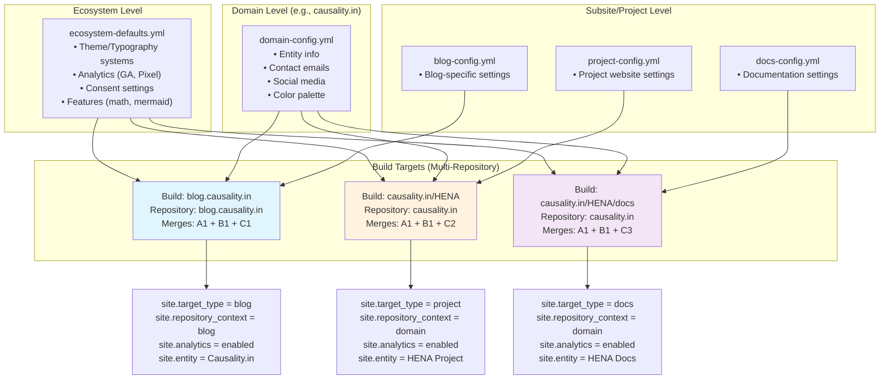
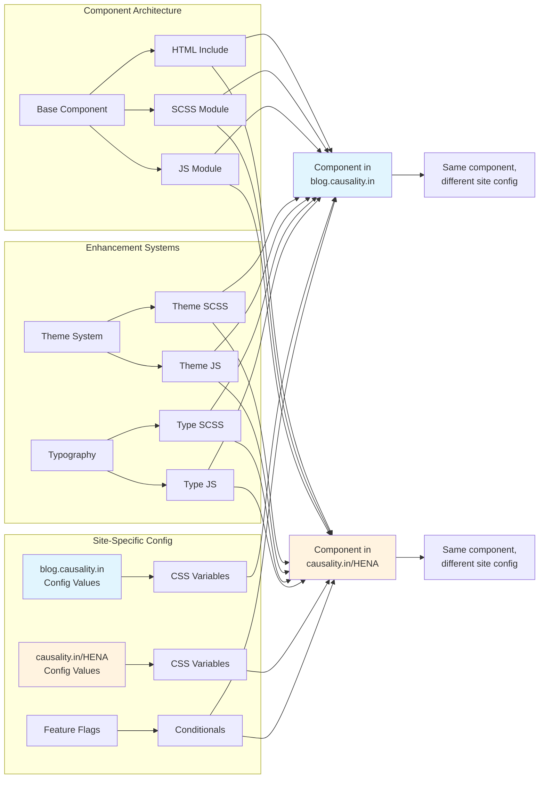

# Jekyll Theme Architecture

## Executive Summary

This specification defines a **config-driven Jekyll theme** that serves as the presentation layer for a multi-domain, multi-repository ecosystem. The theme provides 57 Universal Intelligence components (15 atoms, 24 molecules, 18 organisms) that support all features defined in the proto schemas (SEO, analytics, AI integration, accessibility, PWA, consent management) while maintaining a pure separation between configuration and presentation.

**Multi-Repository Distributed Serving**: The theme operates across multiple GitHub repositories serving different paths of the same domain experience, enabling distributed load balancing while maintaining unified user experience.

## Core Architecture Principles

### Platform Restrictions

**IMPORTANT**: This theme engine strictly supports only these platforms:
- **Social Media**: Twitter/X, GitHub, LinkedIn, YouTube, Instagram, HuggingFace, Reddit
- **Community**: Discord, WhatsApp Channels, Email
- **Analytics**: Google Analytics, Meta Pixel (with consent)

No other platforms (Facebook, Pinterest, Disqus, etc.) are supported by design to maintain focus and simplicity.

### 1. Config-Driven UI System

#### Dark Mode Architecture
Dark mode is achieved through the intelligent combination of:
- **Color Palette**: Provides both light and dark color sets
- **Theme System**: Knows how to apply dark mode transformations
- **Configuration**: Only controls behavior (enable/default/toggle)

```scss
// Example: Glassmorphism + Ocean palette in dark mode
[data-theme="dark"] {
  // Ocean palette provides dark colors
  --color-background: #0f172a;  // From ocean palette
  
  // Glassmorphism adjusts its effects
  --glass-opacity: 0.1;  // More transparent in dark
  --glass-blur: 16px;    // Stronger blur in dark
}
```

No separate dark color configuration needed - it's built into the systems!

#### Multi-Repository Distributed Architecture

> **SEO/Analytics Implementation**: See [STANDARDS.md - Multi-repository SEO/AI file distribution](./STANDARDS.md#multi-repository-seoai-file-distribution) for complete setup

**Repository Architecture Pattern**:
- `getharsh.in` repository → serves `/`, `/HENA/`, `/HENA/docs/`
- `blog.getharsh.in` repository → serves `blog.getharsh.in/`
- **Unified Experience**: End users see seamless domain/path navigation despite distributed repositories
- **Distributed Load**: Multiple GitHub repositories distribute serving load across GitHub's infrastructure

**Parallel Config Inheritance Paths**:
- **Domain + Blog**: `ecosystem-defaults → domain → blog`
- **Domain + Project + Docs**: `ecosystem-defaults → domain → project → docs`

The getHarsh engine creates different merged configurations for different build targets and repository contexts:



**Critical Understanding**: 
- Components are atomic and target-aware - they read `site.*` variables including `site.target_type` and `site.repository_context`
- The getHarsh engine determines which configs to merge based on build target AND repository context
- Same component code works everywhere but adapts behavior based on target and repository context
- Components generate correct cross-repository URLs using `site.cross_repository_urls`
- This enables ecosystem-wide features (analytics, consent) while maintaining site-specific identity across distributed repositories

```
Proto Schemas → getHarsh Engine Processing → Jekyll Theme Rendering
      ↓               ↓                           ↓
Define behavior   Local Build + Repository    Target-Aware Components
                  Context + Config Merge      + Cross-Repo Navigation
```

- **Zero hardcoded values** - Everything comes from getHarsh engine processed configuration
- **Single source of truth** - Proto schemas define all behavior, validated before Jekyll receives config
- **Target-aware components** - Components adapt behavior based on `site.target_type` and `site.repository_context`
- **Repository context awareness** - Cross-repository navigation and URL generation
- **Local build security** - Environment variables handled locally, only static files pushed to GitHub
- **Multi-repository coordination** - Distributed serving with unified domain experience
- **Theme system architecture** - Swappable visual systems (glassmorphism, retrofuturism, etc.)
- **Component semantic richness** - Full support for AI, SEO, analytics, accessibility ([COMPONENTS.md](./COMPONENTS.md), [STANDARDS.md](./STANDARDS.md))
- **Three-layer context architecture** - Detection ([CONTEXT-DETECTION.md](./CONTEXT-DETECTION.md)) → Engine ([CONTEXT-ENGINE.md](./CONTEXT-ENGINE.md)) → Transformation ([Consumer Systems](./COMPONENTS.md))
- **Component specifications** - Single source of truth in [COMPONENT-TABLE.md](./COMPONENT-TABLE.md)

### 2. Jekyll HTML Escaping Solution

**Critical Discovery**: Jekyll escapes HTML when passed as include parameters. This is by design - Jekyll treats parameter values as strings for security.

**The Problem**:
```liquid
<!-- This causes HTML escaping -->

  


<!-- Result: &lt;button&gt; instead of <button> -->
```

**The Solution**: Start/End Pattern for Container Components
```liquid
<!-- This preserves HTML properly -->

  

<!-- Result: <button> renders correctly -->
```

**Implementation Rule**: 
- **Simple components** (buttons, headings, images): Use single includes with parameters ([COMPONENTS.md - Interactive Components](./COMPONENTS.md#3-interactive-components))
- **Container components** (sections, grids, articles): Use start/end pattern to wrap content ([COMPONENTS.md - Layout Components](./COMPONENTS.md#1-layout-components-foundation))

**Why This Matters**: Without this pattern, our entire component architecture would fail due to escaped HTML. This is not a workaround - it's the correct Jekyll pattern used by major themes like Minimal Mistakes.

### 3. Multi-Repository Architecture Patterns

#### Repository Context Detection and Cross-Repository Navigation

**Repository Context Configuration**:
```yaml
# Domain repository config (serves /)
site:
  repository_context: "domain"
  target_type: "domain"
  serving_paths: ["/", "/HENA/", "/HENA/docs/"]
  cross_repository_urls:
    blog: "https://blog.getharsh.in"
    
# Blog repository config (serves blog subdomain)  
site:
  repository_context: "blog"
  target_type: "blog"
  serving_paths: ["/"]
  cross_repository_urls:
    domain: "https://getharsh.in"
    projects: "https://getharsh.in/{project}"
```

**Cross-Repository Component Navigation**:
```liquid
<!-- Navigation component with repository awareness -->

  <a href="{{ site.cross_repository_urls.blog }}">Blog</a>

  <a href="{{ site.cross_repository_urls.domain }}">Home</a>
  <a href="{{ site.cross_repository_urls.domain }}/HENA/">Projects</a>

```

#### SEO File Coordination Across Repositories

**Distributed robots.txt Strategy**:
```txt
# robots.txt in domain repository (getharsh.in)
User-agent: *
Sitemap: https://getharsh.in/sitemap.xml
Sitemap: https://blog.getharsh.in/sitemap.xml

# robots.txt in blog repository (blog.getharsh.in)  
User-agent: *
Sitemap: https://blog.getharsh.in/sitemap.xml
Sitemap: https://getharsh.in/sitemap.xml
```

**LLMs.txt AI Content Coordination**:
```txt
# llms.txt in primary domain repository
# Domain Content
/: Homepage with ecosystem overview
/about: Company information and mission
/HENA/: AI agent project documentation
/HENA/docs/: Technical documentation

# Cross-Repository Content
https://blog.getharsh.in/: Blog posts and articles
https://blog.getharsh.in/archives: Complete post archives
```

#### Local Build + Static Serving Architecture

**Build Process Flow**:
1. **getHarsh Engine Local Build**: Environment variables processed locally
2. **Repository Context Processing**: Different inheritance processing per repository
3. **Static File Generation**: Built files ready for deployment
4. **Multi-Repository Push**: Static files distributed to appropriate GitHub repositories
5. **GitHub Pages Serving**: Pure static file serving (no Jekyll execution on GitHub)
6. **CNAME Routing**: GoDaddy CNAME points to GitHub Pages serving endpoints

### 4. Information Flow
```yaml
# Configuration cascade
ecosystem.proto (base defaults)
  → domain.proto (brand overrides)
    → blog.proto (context overrides)
      → docs.proto (surgical changes)
        → Jekyll theme (renders final result)
```

**Multi-Domain Architecture**:
```yaml
# Configuration ONLY provides:
# 1. Selection of pre-built systems (pointers)
# 2. Feature flags and settings
# 3. Repository and target context information
# 4. Cross-repository URL mappings
# 5. Entity and legal context
# 6. Minor typography adjustments (sizes/spacing only)

# Domain-specific configuration (as per proto schemas)
getharsh.in:
  # Theme configuration (domain.proto)
  theme:
    # Select pre-built theme system (pointer to existing SCSS module)
    system: "retrofuture-glass"  # Glassmorphism + Retrofuturism hybrid
    
    # Select pre-built typography system (pointer to existing template)
    typography: "cyber-terminal"  # Terminal + Retrofuturism + Cyberpunk
    
    # Select pre-built color palette (accent colors, not backgrounds)
    palette: "harsh-yellow"      # Yellow accents for getHarsh.in
    
    # Select pre-built syntax highlighting theme
    syntax: "adaptive"           # Adapts to palette accent colors
    
    # Dark mode settings (behavior only, colors from palette)
    enable_dark_mode: true
    default_mode: "system"  # light, dark, system
    show_mode_toggle: true
    
  
  # Visual effects (domain.proto)
  visual:
    canvas:
      enabled: true
      physics:
        particle_count: 100
        connection_distance: 150
        particle_speed: 0.5
        bounce: true
        gravity: 0
      visuals:
        # Colors come from selected palette
        particle_size_min: 2
        particle_size_max: 4
        line_opacity: 0.3
  
  # Entity context for legal compliance (domain.proto)
  entity:
    legal_name: "RTEPL"
    domain_entity: "getHarsh Technology Solutions"
    contact_emails:
      info: "info@getharsh.in"
      proposal: "proposal@getharsh.in"
      legal: "legal@getharsh.in"
      accounts: "accounts@getharsh.in"
    
  # Social media (domain.proto - NOT ecosystem level)
  # Only include platforms this domain actually uses
  # Components gracefully handle missing platforms
  social_media:
    twitter: "getHarsh"           # Twitter/X handle
    github: "getHarsh"            # GitHub username
    linkedin: "https://linkedin.com/in/harshjoshi"
    email: "hi@getharsh.in"       # Contact email
    # Optional - only if domain uses them:
    # instagram: "getharsh"
    # youtube: "https://youtube.com/@getHarsh"
    # huggingface: "https://huggingface.co/getHarsh"
    # reddit: "u/getHarsh"
    # discord: "https://discord.gg/XXXXXX"
    # whatsapp: "https://whatsapp.com/channel/XXXXXX"
    
  # Sponsor information for project attribution
  sponsors:
    - brand_name: "AION Labs"
      person_or_org: "organization"
      contribution_type: "infrastructure_support"
      date_started: "2024-01-15"
      description: "Providing Claude Code credits and development time"
      link: "https://aion.xyz"
      status: "active"

# Ecosystem-wide settings (ecosystem.proto)
ecosystem:
  # Analytics (with consent) - processed locally by getHarsh engine
  analytics:
    ga_tracking_id: "GA-123456789"  # Environment variables substituted during local build
    cross_domain_tracking: true
    linked_domains: ["getharsh.in", "causality.in", "rawthoughts.in"]
    # Security: Analytics IDs processed locally, never exposed in repository
  
  # Feature flags
  features:
    community_engagement: true  # Discord or email-based only
    math: true
    mermaid: true
    search: true
    reading_time: true
    syntax_highlighting: true
  
  # SEO defaults
  seo_defaults:
    author: "Harsh Joshi"
    locale: "en_US"
    twitter: "@getHarsh"
    og_image_pattern: "https://{domain}/assets/og-image.png"
  
  # Consent settings
  consent_settings:
    enable_consent_banner: true
    consent_cookie_name: "analytics_consent"
    consent_duration_days: 365
    google_consent_mode_v2: true
```

### 4. The Multi-Dimensional Inheritance Architecture

**Vision**: Multiple inheritance systems work together to create infinite variations with perfect consistency.



#### Layer 1: Base Component Architecture (Three Layers)
```
Every component exists in three parallel layers:

HTML Include (_includes/components/button.html)
├── Defines semantic structure
├── Includes ALL contextual properties:
│   ├── Schema.org markup (itemscope, itemtype)
│   ├── Analytics tracking (data-track-*)
│   ├── AI discovery (data-ai-*)
│   ├── Accessibility (aria-*)
│   ├── PWA support (meta tags)
│   ├── Consent management (data-consent-*)
│   └── Feature flags (conditional rendering)
├── Accepts parameters
└── Outputs semantic HTML

SCSS Module (_sass/components/button.scss)
├── Defines ONLY structural CSS
├── No visual opinions
├── Uses CSS variables
└── Pure layout/positioning

JS Module (assets/js/components/button.js)
├── Defines base behavior
├── Auto-initialization
├── Event handling
└── Reads semantic attributes
```

#### Layer 2: Theme Systems (Also Multi-Layer!)
```
Theme systems are ALSO implemented as SCSS + JS:

Theme SCSS (_sass/theme-systems/retrofuture-glass.scss)
├── Applies visual properties to ALL components
├── Glass effects with neon accents
├── Retro-futuristic borders and glows
├── CRT-style effects and scanlines
└── Cyberpunk-inspired animations

Theme JS (assets/js/theme-systems/retrofuture-glass.js)
├── Dynamic neon glow effects
├── Retro screen flicker simulations
├── Holographic refraction effects
├── Terminal-style transitions
└── Glitch animations on interaction

Available theme systems:
- retrofuture-glass (Glassmorphism + 80s retrofuturism)
- pure-glass (Clean glassmorphism)
- brutalist (Raw concrete aesthetic)
- minimal (Ultra-clean design)
```

#### Layer 3: Responsive Systems (Also Multi-Layer!)
```
Responsive systems are ALSO implemented as SCSS + JS:

Responsive SCSS (_sass/base/_responsive.scss)
├── Mobile-first breakpoint definitions (320px → 1920px)
├── CSS custom properties for responsive values
├── SCSS mixins for consistent breakpoint usage
├── Container responsive behavior
├── Typography fluid scaling
├── Touch target sizing (WCAG 2.2 compliance)
└── Component responsive optimizations

Responsive JS (assets/js/responsive/responsive-manager.js)
├── Breakpoint detection and change handling
├── Device-specific performance optimization
├── Touch vs mouse interaction detection
├── Connection-aware resource loading
└── Business model responsive optimization

CRITICAL RULES:
- NO hardcoded breakpoints in components (use mixins ONLY)
- ALL breakpoints defined in base/_responsive.scss
- Components inherit responsive behavior through mixins
- See RESPONSIVE.md for complete mixin documentation

Available responsive strategies:
- mobile-first (320px → 768px → 1024px → 1440px → 1920px)
- Content-aware breakpoints based on business context
- Performance-optimized for lead generation conversion
```

#### Layer 4: Typography Systems (Also Multi-Layer!)

```
Typography systems are ALSO implemented as SCSS + JS:

Typography SCSS (_sass/typography/cyber-terminal.scss)
├── Monospace type scale with cyberpunk flair
├── JetBrains Mono + custom terminal fonts
├── All-caps headings with wide letter spacing
├── Matrix-style code blocks
└── Retro terminal line heights

Typography JS (assets/js/typography/cyber-terminal.js)
├── Typewriter effects for headings
├── Terminal cursor animations
├── Glitch text effects
└── ASCII art integration

Available typography systems:
- cyber-terminal (Terminal + Retrofuturism + Cyberpunk)
- clean-sans (Modern sans-serif stack)
- editorial (Classic serif typography)
- brutalist-mono (Raw monospace aesthetic)
```

#### Layer 5: Color Palette Systems
```
Color palettes are ALSO pre-built systems:

Palette SCSS (_sass/palettes/ocean.scss)
├── Light mode colors (default)
├── Dark mode colors (automatic variants)
├── Semantic color mappings
├── Contrast ratios guaranteed
└── Theme system integration

Available color palettes (accent colors with white/dark backgrounds):
- harsh-yellow (Yellow accents for getHarsh.in)
- raw-red (Red accents for rawthoughts.in)
- dao-green (Green accents for daostudio.in)
- causality-blue (Blue accents for causality.in)
- sleepwalker-violet (Violet accents for sleepwalker.in)
- monochrome (Neutral grays for minimal sites)
- high-contrast (Accessibility focused)

Each palette provides accent colors with consistent backgrounds:
```scss
// Example: harsh-yellow palette
// Light mode (default)
:root {
  --color-primary: #f59e0b;      // Amber accent
  --color-secondary: #fbbf24;    // Yellow accent
  --color-accent: #f97316;       // Orange accent
  --color-background: #ffffff;   // White background
  --color-surface: #fafafa;      // Slightly off-white
  --color-text: #18181b;         // Near black text
  --color-muted: #71717a;        // Gray text
  // Glass effects use accent with low opacity
}

// Dark mode (automatic with theme system)
[data-theme="dark"] {
  --color-primary: #fbbf24;      // Brighter yellow in dark
  --color-secondary: #fde047;    // Lighter yellow
  --color-accent: #fb923c;       // Brighter orange
  --color-background: #18181b;   // Dark gray background
  --color-surface: #27272a;      // Slightly lighter gray
  --color-text: #fafafa;         // Near white text
  --color-muted: #a1a1aa;        // Light gray text
  // Glass effects more subtle in dark mode
}
```
```

#### Layer 6: Syntax Highlighting Systems
```
Syntax highlighting inherits from color palette:

Syntax SCSS (_sass/syntax/adaptive.scss)
├── Uses palette colors for consistency
├── Token colors based on semantic meanings
├── Background uses --color-background-code
├── Keywords use --color-primary
├── Strings use --color-success
└── Comments use --color-muted

Available syntax themes:
- adaptive (Uses color palette)
- adaptive-high-contrast (Higher contrast variant)
```

#### Layer 7: Configuration Inheritance Chain
```
ecosystem-defaults.yml
├── Theme system & typography (retrofuture-glass, cyber-terminal)
├── Analytics, features, security
├── NO social platforms (ecosystem level is platform-agnostic)
    ↓
domain-config.yml (e.g., getharsh.in)
├── Palette selection (harsh-yellow)
├── Social platforms (only what domain uses)
├── Can have 0-10 platforms from approved list
    ↓
project-config.yml (e.g., HENA)
├── Can override domain social (e.g., project-specific GitHub)
├── Can add new platforms not in domain
├── Can remove platforms from domain
    ↓
blog/docs-config.yml
├── Inherits social from parent
├── Cannot override social (use parent's)
└── Only typography/feature adjustments

Inheritance Rules:
- Missing platforms are handled gracefully (no errors)
- Projects can selectively override social platforms
- Components check if platform exists before rendering
- Empty social sections are valid
```

#### The Magic: How Everything Combines
```
Base Component (HTML + SCSS + JS)
         ↓
    + Responsive System (SCSS + JS)
         ↓
    + Theme System (SCSS + JS)
         ↓
    + Typography System (SCSS + JS)
         ↓
    + Color Palette (SCSS)
         ↓
    + Syntax System (SCSS)
         ↓
    × Configuration Inheritance
         =
    Final Rendered Component
```

**Configuration Simply Selects**:
```yaml
theme:
  system: "retrofuture-glass"  # Activates retrofuture+glass system (SCSS + JS)
  typography: "cyber-terminal" # Activates cyber-terminal type system (SCSS + JS)
  palette: "harsh-yellow"      # Activates yellow accent palette (for getHarsh.in)
  syntax: "adaptive"           # Uses palette-aware syntax highlighting
```

**The Complete Formula**:
```
Result = [Base Component (HTML + SCSS + JS) with Semantic Properties]
       × [Responsive System (SCSS + JS)]
       × [Theme System (SCSS + JS)]
       × [Typography System (SCSS + JS)]
       × [Color Palette (SCSS)]
       × [Syntax System (SCSS)]
       × [Config Inheritance]

Where:
- Base Component = Structure + Semantics (SEO, Analytics, AI, A11y, PWA)
- Responsive System = Mobile-first responsive design with device optimization
- Theme System = Complete visual system with styles AND behaviors
- Typography System = Complete type system with scales AND optimization
- Color Palette = Complete color system with semantic colors
- Syntax System = Palette-aware syntax highlighting
- Config Inheritance = ecosystem → domain → project → docs

Special components inherit from multiple systems:
- Math: Uses theme glass effects + palette colors (blogs/docs only)
- Mermaid: Uses palette colors + typography fonts (blogs/docs only)
- Code blocks: Uses syntax highlighting + theme backgrounds (blogs/docs only)

Dark mode behavior:
- Palette + Theme System work together for dark mode
- Each palette provides light/dark variants
- Theme system knows how to apply dark mode effects
- No separate dark color definitions needed
```

**Example: Button Evolution**
```
1. Base button.html provides:
   <button class="btn" 
           data-component="button"
           data-track-click="true"
           aria-label="...">Click</button>

2. Base button.scss provides:
   .btn { display: inline-flex; padding: var(--btn-padding); }

3. Responsive system adds:
   .btn { min-height: 44px; /* Mobile touch targets */
          font-size: clamp(0.875rem, 2vw, 1rem); /* Fluid sizing */ }
   @media (min-width: 1024px) {
     .btn { min-height: 36px; /* Desktop optimization */ }
   }

4. retrofuture-glass.scss adds:
   .btn { backdrop-filter: blur(12px); background: rgba(...); 
          border: 1px solid var(--color-accent); }

5. retrofuture-glass.js adds:
   Dynamic glow effects and retro animations

6. cyber-terminal.scss adds:
   .btn { font-family: 'JetBrains Mono'; font-weight: 500; 
          text-transform: uppercase; }

7. cyber-terminal.js adds:
   Typewriter effects and glitch animations

8. harsh-yellow palette injects:
   --color-primary: #f59e0b (amber accents)
```

**Configuration Simplicity**:
```yaml
# This is ALL the configuration needs:
getharsh.in:
  theme:
    system: "retrofuture-glass"  # Retrofuturism + Glassmorphism
    typography: "cyber-terminal" # Terminal + Cyberpunk typography
    palette: "harsh-yellow"      # Yellow accent colors
    syntax: "adaptive"           # Adapts to palette colors
```

**Usage Elegance**:
```liquid
<!-- In any .md file, it's this simple: -->


<!-- The button automatically inherits:
     - Glass effects from theme system
     - Inter typography scale
     - Ocean blue from color palette
     - All through the inheritance chain! -->
```

**Why This Architecture is Brilliant**:

1. **True Separation of Concerns**:
   - Base components: Structure + Semantics only
   - Theme systems: Visual language (SCSS + JS)
   - Typography systems: Type language (SCSS + JS)
   - Configuration: Just selections and values

2. **Perfect Unison**:
   - Theme SCSS knows about ALL component classes
   - Theme JS enhances ALL component behaviors
   - Typography scales ALL text elements
   - Everything composed, nothing conflicts

3. **Infinite Combinations**:
   - n theme systems × m typography systems × ∞ colors = endless variety
   - Each combination creates a unique but cohesive experience

4. **Zero Component Configuration**:
   - Components don't know about themes
   - Themes know about components
   - Perfect inversion of control

5. **Extensibility**:
   - Add new theme? Create SCSS + JS modules
   - Add new typography? Create SCSS + JS modules
   - Add new component? Works with ALL themes automatically

**The Poetry**:
- Theme systems are like musical genres (jazz, classical, rock)
- Typography systems are like instruments (piano, violin, guitar)
- Colors are like the key signature (C major, A minor)
- Components are like notes on a page
- Together they create unique symphonies!

## Layer Boundary Definitions

### CRITICAL: Strict Separation of Concerns

Each layer has a specific responsibility and must NOT reach into another layer's domain:

#### Structure Layer (Components)

**Owns**: Layout and semantic structure

```scss
// ✅ CORRECT - Component layer
.component {
  display: flex;              // Layout
  position: relative;         // Positioning
  align-items: center;        // Alignment
  padding: var(--spacing);    // Structural spacing
  width: 100%;                // Dimensions
  min-height: 44px;           // Touch targets
  text-align: left;           // Text alignment
  overflow: hidden;           // Content control
  z-index: var(--z-index);    // Layer management
}
```

#### Visual Layer (Themes)

**Owns**: All aesthetic properties

```scss
// ✅ CORRECT - Theme layer
[data-theme="glass"] .component {
  background: rgba(...);      // Colors
  border: 1px solid ...;      // Borders
  border-radius: 8px;         // Rounded corners
  box-shadow: ...;            // Shadows
  backdrop-filter: blur(12px); // Effects
  opacity: 0.9;               // Transparency
  transition: all 0.3s;       // Animations
  cursor: pointer;            // Visual feedback
  transform: scale(1);        // Visual transforms
}
```

#### Typography Layer (Type Systems)

**Owns**: All text properties

```scss
// ✅ CORRECT - Typography layer
[data-typography="inter"] .component {
  font-family: 'Inter', ...;  // Font family
  font-size: 1rem;            // Font size
  font-weight: 500;           // Font weight
  line-height: 1.5;           // Line height
  letter-spacing: -0.02em;    // Letter spacing
  text-transform: none;       // Text transform
  text-decoration: none;      // Text decoration
  font-feature-settings: ...;  // OpenType features
}
```

### Layer Violation Examples

```scss
// ❌ WRONG - Theme defining structure
[data-theme="glass"] .btn {
  display: flex;              // ❌ Structure in theme!
  padding: 1rem;              // ❌ Structure in theme!
  background: rgba(...);      // ✅ Visual in theme
}

// ❌ WRONG - Component defining visuals  
.btn {
  display: flex;              // ✅ Structure in component
  background: blue;           // ❌ Visual in component!
  border-radius: 4px;         // ❌ Visual in component!
}

// ❌ WRONG - Typography defining structure
[data-typography="inter"] .btn {
  padding: 2rem;              // ❌ Structure in typography!
  font-size: 1rem;            // ✅ Type in typography
}
```

### Enforcement Rules

1. **Components must work without themes**: Test by removing ALL theme classes
2. **Themes must not break structure**: Components maintain layout without themes
3. **Typography only affects text**: No layout or visual properties
4. **Use CSS variables for coordination**: Components define variable hooks
5. **Validate layer purity**: Each file belongs to exactly ONE layer

## CSS & JavaScript Architecture

> **Component Usage Examples**: See [COMPONENTS.md](./COMPONENTS.md) for how these layers compose in real components

### Complete Multi-Layer Module System
```
_sass/
├── components/              # Base component styles (structure only)
│   ├── _button.scss        # .btn { display: flex; padding: ...; }
│   ├── _card.scss          # .card { position: relative; }
│   ├── _layout.scss        # .section, .container, .grid
│   ├── _content.scss       # .article, .heading, .text
│   └── _interactive.scss   # .form, .input, .toggle
│
├── theme-systems/          # Complete visual systems (SCSS layer)
│   ├── _glassmorphism.scss # Glass effects for ALL components
│   ├── _retrofuturism.scss # Neon/grid effects for ALL components
│   ├── _brutalism.scss     # Bold/raw effects for ALL components
│   └── _neomorphism.scss   # Soft shadows for ALL components
│
├── typography/             # Complete typography systems (SCSS layer)
│   ├── _inter.scss         # Full Inter type scale + rhythm
│   ├── _space-grotesk.scss # Full Space Grotesk system
│   ├── _jetbrains.scss     # Full JetBrains Mono system
│   └── _playfair.scss      # Full Playfair Display system
│
└── base/
    ├── _reset.scss         # Normalize styles
    ├── _variables.scss     # CSS custom properties setup
    ├── _responsive.scss    # Responsive breakpoints & mixins (CRITICAL)
    └── _color-injection.scss # Injects config colors

assets/
├── js/
│   ├── components/         # Base component behaviors
│   │   ├── button.js       # Click tracking, states
│   │   ├── card.js         # Impression tracking
│   │   ├── form.js         # Validation, submission
│   │   └── navigation.js   # Mobile menu, dropdowns
│   │
│   ├── theme-systems/      # Theme-specific behaviors (JS layer)
│   │   ├── glassmorphism.js    # Parallax blur, refraction
│   │   ├── retrofuturism.js    # Neon flicker, grid animation
│   │   ├── brutalism.js        # Glitch effects, bold transitions
│   │   └── neomorphism.js      # Soft interactions
│   │
│   ├── typography/         # Typography behaviors (JS layer)
│   │   ├── inter.js        # Variable font, optical sizing
│   │   ├── space-grotesk.js # Display optimizations
│   │   └── jetbrains.js    # Code font features
│   │
│   └── core/
│       ├── component-system.js  # Auto-discovery, initialization
│       ├── theme-loader.js      # Dynamic theme system loading
│       └── analytics.js         # Consent-aware tracking
│
└── icons/
    └── sprite.svg          # Complete icon set (pre-built)
```

### The Multi-Layer Composition in Action

```scss
// main.scss - The Orchestrator
// 1. Import base component styles (structure only)
@import "components/all";

// 2. Import selected theme system (from config)
@import "theme-systems/#{$theme-system}";

// 3. Import selected typography system (from config)
@import "typography/#{$typography-system}";

// 4. Inject color palette (only values from config)
@import "base/color-injection";
```

```scss
// components/_button.scss - Pure Structure
.btn {
  // ONLY structural properties
  display: inline-flex;
  align-items: center;
  justify-content: center;
  text-decoration: none;
  cursor: pointer;
  padding: var(--btn-padding, 0.75rem 1.5rem);
  gap: var(--btn-gap, 0.5rem);
  
  // NO colors, NO effects, NO fonts
  // Just structure and layout
}
```

```scss
// theme-systems/_glassmorphism.scss - Complete Visual System
[data-theme-system="glassmorphism"] {
  // Theme variables
  --glass-blur: 12px;
  --glass-opacity: 0.85;
  --glass-border: 1px solid rgba(255, 255, 255, 0.18);
  --glass-shadow: 0 8px 32px 0 rgba(31, 38, 135, 0.37);
  --hover-lift: translateY(-2px) scale(1.02);
  --transition-smooth: all 0.3s cubic-bezier(0.4, 0, 0.2, 1);
  
  // Apply to ALL components
  .btn {
    background: rgba(var(--color-primary-rgb), var(--glass-opacity));
    backdrop-filter: blur(var(--glass-blur));
    border: var(--glass-border);
    box-shadow: var(--glass-shadow);
    transition: var(--transition-smooth);
    
    &:hover {
      transform: var(--hover-lift);
      box-shadow: 0 12px 48px 0 rgba(31, 38, 135, 0.45);
    }
    
    &:active {
      transform: translateY(0) scale(0.98);
    }
  }
  
  .card {
    background: rgba(var(--color-background-rgb), var(--glass-opacity));
    backdrop-filter: blur(var(--glass-blur));
    border: var(--glass-border);
    // ... glass treatment for cards
  }
  
  .section {
    // ... glass treatment for sections
  }
  
  // EVERY component gets themed!
}
```

```scss
// typography/_inter.scss - Complete Type System
[data-typography="inter"] {
  // Import Inter variable font
  @import url('https://fonts.googleapis.com/css2?family=Inter:wght@100..900&display=swap');
  
  // Type scale
  --font-family: 'Inter', system-ui, -apple-system, sans-serif;
  --scale-ratio: 1.25;
  --text-xs: 0.75rem;
  --text-sm: 0.875rem;
  --text-base: 1rem;
  --text-lg: 1.25rem;
  --text-xl: 1.5rem;
  --text-2xl: 1.875rem;
  --text-3xl: 2.25rem;
  
  // Weights
  --font-thin: 100;
  --font-light: 300;
  --font-regular: 400;
  --font-medium: 500;
  --font-semibold: 600;
  --font-bold: 700;
  
  // Apply to ALL text
  body {
    font-family: var(--font-family);
    font-size: var(--text-base);
    font-weight: var(--font-regular);
    line-height: 1.5;
    font-feature-settings: 'cv08' on, 'cv10' on;
  }
  
  h1, h2, h3, h4, h5, h6 {
    font-weight: var(--font-semibold);
    line-height: 1.2;
  }
  
  h1 { font-size: var(--text-3xl); }
  h2 { font-size: var(--text-2xl); }
  h3 { font-size: var(--text-xl); }
  
  .btn {
    font-weight: var(--font-medium);
    font-size: var(--text-sm);
    letter-spacing: 0.02em;
  }
  
  // EVERY text element gets typed!
}
```

```javascript
// theme-systems/glassmorphism.js - Theme Behaviors
class GlassmorphismTheme {
  constructor() {
    this.initParallaxBlur();
    this.initRefractionEffects();
    this.initGlassPhysics();
  }
  
  initParallaxBlur() {
    // Dynamic blur based on scroll
    document.addEventListener('scroll', () => {
      const elements = document.querySelectorAll('[data-glass-parallax]');
      elements.forEach(el => {
        const speed = el.dataset.glassParallax || 0.5;
        const blur = Math.min(20, scrollY * speed * 0.01);
        el.style.setProperty('--dynamic-blur', `${blur}px`);
      });
    });
  }
  
  initRefractionEffects() {
    // Light refraction on mouse movement
    document.addEventListener('mousemove', (e) => {
      const cards = document.querySelectorAll('.card');
      cards.forEach(card => {
        const rect = card.getBoundingClientRect();
        const x = e.clientX - rect.left;
        const y = e.clientY - rect.top;
        card.style.setProperty('--refraction-x', `${x}px`);
        card.style.setProperty('--refraction-y', `${y}px`);
      });
    });
  }
}

// Auto-initialize when theme is active
if (document.body.dataset.themeSystem === 'glassmorphism') {
  new GlassmorphismTheme();
}
```

### Component Structure Pattern

```scss
// components/_button.scss - ONLY structure
.btn {
  // Pure structure - NO visual properties
  display: inline-flex;
  align-items: center;
  justify-content: center;
  text-decoration: none;
  cursor: pointer;
  
  // Size and spacing use theme variables
  padding: var(--btn-padding);
  gap: var(--btn-gap);
  
  // Responsive behavior using mixins (NO hardcoded breakpoints!)
  @include mobile {
    padding: var(--space-sm) var(--space-md);
    @include touch-friendly; // Ensures 44px minimum touch target
  }
  
  @include tablet-up {
    padding: var(--space-md) var(--space-lg);
  }
  
  // ALL visual properties come from theme system
}
```

## JavaScript Architecture - The Same Multi-Layer Pattern!

> **Intelligent Analytics**: See [ANALYTICS.md - Complete System](./ANALYTICS.md) for ARIA-powered semantic analytics with clean labeling
> 
> **Analytics Implementation**: See [STANDARDS.md - Analytics Implementation](./STANDARDS.md#analytics-implementation-google-analytics--facebook-pixel) for GDPR consent and tracking setup

### CRITICAL: JavaScript Module Separation Principles

Just like CSS, JavaScript follows the same strict layer separation:

1. **Base Component Layer**: Pure functionality (event handling, state, accessibility)
2. **Theme Enhancement Layer**: Visual behaviors (animations, effects, theme-specific interactions)
3. **Typography Enhancement Layer**: Type behaviors (font loading, text effects)
4. **Business Intelligence Layer**: Consumes Context Engine data (NO business logic in components!)

**The Key Insight**: Components consume intelligence from Context Engine, they don't create it. All detection and calculation happens in the [Detection Layer](./CONTEXT-DETECTION.md), orchestrated by the [Context Engine](./CONTEXT-ENGINE.md), and consumed by components as pure transformation layers.

```javascript
// ❌ WRONG - Business logic in component
class Button {
  calculateLeadScore() {
    // Business calculation in component!
    return complexity * engagement * 0.7;
  }
}

// ✅ CORRECT - Component consumes Context Engine intelligence
class Button {
  constructor(element, universalContext) {
    this.context = universalContext; // From Context Engine
    this.leadScore = this.context.business.leadQualityScore; // Pre-calculated by Detection Layer!
  }
}
```

### Layer 1: Base Component Behaviors

```javascript
// components/button.js - Universal intelligence with ARIA-powered analytics
class Button {
  static selector = '[data-component="button"]';
  
  constructor(element) {
    this.element = element;
    this.context = window.universalContext; // From Context Engine
    this.init();
  }
  
  init() {
    // Base behaviors with universal intelligence
    this.setupUniversalTracking();
    this.enhanceAccessibility();
    this.enhanceIntelligentAnalytics(); // NEW: Same engine as ARIA
    this.manageStates();
  }
  
  setupUniversalTracking() {
    // Universal consent-aware tracking
    if (this.shouldTrack()) {
      this.element.addEventListener('click', () => {
        // Check consent at time of interaction
        if (this.hasConsent()) {
          analytics.track('button_click', {
            action: this.element.dataset.trackAction,
            label: this.element.dataset.trackLabel,
            category: this.element.dataset.trackCategory || 'button'
          });
        }
      });
    }
  }
  
  shouldTrack() {
    // Universal check: analytics enabled in config?
    return window.site?.analytics?.enabled && 
           this.element.dataset.trackClick === 'true';
  }
  
  hasConsent() {
    // Universal consent check
    const category = this.element.dataset.consentCategory || 'analytics';
    return !window.consentManager || 
           window.consentManager.hasConsent(category);
  }
  
  enhanceAccessibility() {
    // Dynamic ARIA updates
    this.element.addEventListener('click', () => {
      if (this.element.dataset.announces) {
        this.announceAction();
      }
    });
  }
  
  enhanceIntelligentAnalytics() {
    // Apply pre-calculated analytics intelligence from Context Engine
    const { analytics } = this.context;
    
    // Enrich element with intelligent data attributes
    if (analytics.eventData) {
      Object.entries(analytics.eventData).forEach(([key, value]) => {
        this.element.setAttribute(`data-analytics-${key}`, value);
      });
    }
  }
}
```

### Layer 2: Theme System Behaviors

```javascript
// theme-systems/glassmorphism.js - Visual behaviors
class GlassmorphismTheme {
  constructor() {
    this.initParallaxBlur();
    this.initRefractionEffects();
    this.initGlassPhysics();
  }
  
  initParallaxBlur() {
    // Dynamic blur based on scroll
    document.addEventListener('scroll', () => {
      const elements = document.querySelectorAll('[data-glass-parallax]');
      elements.forEach(el => {
        const speed = el.dataset.glassParallax || 0.5;
        const blur = Math.min(20, scrollY * speed * 0.01);
        el.style.setProperty('--dynamic-blur', `${blur}px`);
      });
    });
  }
  
  initRefractionEffects() {
    // Light refraction on mouse movement
    document.addEventListener('mousemove', (e) => {
      const cards = document.querySelectorAll('.card');
      cards.forEach(card => {
        const rect = card.getBoundingClientRect();
        const x = (e.clientX - rect.left) / rect.width;
        const y = (e.clientY - rect.top) / rect.height;
        
        // Create refraction gradient
        card.style.setProperty('--refraction-x', x);
        card.style.setProperty('--refraction-y', y);
      });
    });
  }
}
```

### Layer 3: Typography System Behaviors

```javascript
// typography/inter.js - Typography enhancements
class InterTypography {
  constructor() {
    this.loadVariableFont();
    this.setupOpticalSizing();
    this.enableOpenTypeFeatures();
  }
  
  loadVariableFont() {
    // Progressive enhancement with variable fonts
    if ('FontFace' in window) {
      const font = new FontFace('Inter', 
        'url(/assets/fonts/inter-var.woff2) format("woff2-variations")',
        { 
          weight: '100 900',
          display: 'swap'
        }
      );
      
      font.load().then(() => {
        document.fonts.add(font);
        document.body.classList.add('inter-loaded');
        this.optimizeRendering();
      });
    }
  }
  
  setupOpticalSizing() {
    // Dynamic optical sizing based on computed size
    const resizeObserver = new ResizeObserver(entries => {
      entries.forEach(entry => {
        const size = parseInt(getComputedStyle(entry.target).fontSize);
        entry.target.style.fontVariationSettings = `"opsz" ${size}`;
      });
    });
    
    // Observe all text elements
    document.querySelectorAll('h1, h2, h3, h4, h5, h6, p, span').forEach(el => {
      resizeObserver.observe(el);
    });
  }
}
```

### Universal Component Discovery System

```javascript
// core/component-system.js - Auto-discovery
class ComponentSystem {
  static components = new Map();
  
  static register(ComponentClass) {
    this.components.set(ComponentClass.selector, ComponentClass);
  }
  
  static init() {
    // Auto-discover and initialize ALL components
    this.components.forEach((ComponentClass, selector) => {
      document.querySelectorAll(selector).forEach(element => {
        new ComponentClass(element);
      });
    });
  }
  
  static Component = class {
    // Base class for all components
    constructor(element) {
      this.element = element;
      this.readConfigIntelligently();
    }
    
    readConfigIntelligently() {
      // Read universal config with target and repository context awareness
      this.config = {
        analytics: window.site?.analytics?.enabled || false,
        intelligentAnalytics: window.site?.features?.intelligent_analytics || true, // NEW: ARIA-powered analytics
        consent: window.site?.consent?.enabled || false,
        seo: window.site?.seo?.enabled || false,
        ai: window.site?.ai?.enabled || false,
        // Target and repository context for component behavior adaptation
        targetType: window.site?.target_type || 'domain',
        repositoryContext: window.site?.repository_context || 'domain',
        crossRepositoryUrls: window.site?.cross_repository_urls || {},
        servingPaths: window.site?.serving_paths || ['/'],
        inheritancePath: window.site?.inheritance_path || ['ecosystem-defaults'],
        // ... universal config reading
      };
    }
  };
}

// Auto-initialize when DOM is ready
document.addEventListener('DOMContentLoaded', () => {
  ComponentSystem.init();
});
```

### Module Loading and Enhancement Pattern

The JavaScript module system follows a clear loading and enhancement pattern:

```javascript
// core/module-loader.js - Intelligent module loading
class ModuleLoader {
  static async loadModules() {
    // 1. Load Context Engine first (provides intelligence)
    await this.loadContextEngine();
    
    // 2. Load base components (pure functionality)
    await this.loadBaseComponents();
    
    // 3. Load theme enhancements (visual behaviors)
    await this.loadThemeEnhancements();
    
    // 4. Load typography enhancements (type behaviors)
    await this.loadTypographyEnhancements();
    
    // 5. Initialize everything with Context Engine data
    this.initializeWithContext();
  }
  
  static async loadContextEngine() {
    // Context Engine provides all business intelligence
    // It orchestrates the Detection Layer (CONTEXT-DETECTION.md) to analyze content
    // and provides pre-calculated context to all components
    const context = await import('./context-engine.js');
    window.universalContext = await context.generateUniversalContext();
  }
  
  static initializeWithContext() {
    // Pass universal context to all components
    ComponentSystem.components.forEach((ComponentClass, selector) => {
      document.querySelectorAll(selector).forEach(element => {
        new ComponentClass(element, window.universalContext);
      });
    });
  }
}
```

### Context Engine Integration Pattern

Components consume pre-calculated intelligence from the [Context Engine](./CONTEXT-ENGINE.md), which uses the [Detection Layer](./CONTEXT-DETECTION.md) for all analysis:

```javascript
// core/context-consumer.js - Base class for context consumption
class ContextConsumer {
  constructor(element, universalContext) {
    this.element = element;
    this.context = universalContext; // All values pre-calculated by Detection Layer
    this.applyContextIntelligence();
  }
  
  applyContextIntelligence() {
    // Apply business intelligence from Context Engine
    this.applyBusinessContext();
    this.applyBehaviorContext();
    this.applySemanticContext();
    this.applyTechnicalContext();
  }
  
  applyBusinessContext() {
    const { business } = this.context;
    
    // Apply pre-calculated business values from Detection Layer
    // NO calculations here - all intelligence comes from Context Engine
    this.element.dataset.leadScore = business.leadQualityScore;
    this.element.dataset.journeyStage = business.customerJourneyStage;
    this.element.dataset.conversionProbability = business.conversionProbability;
    this.element.dataset.expertiseArea = business.expertiseArea;
  }
  
  applyBehaviorContext() {
    const { behavior } = this.context;
    
    // Apply behavioral intelligence
    this.element.dataset.engagementLevel = behavior.engagementLevel;
    this.element.dataset.interestLevel = behavior.interestLevel;
    this.element.dataset.userIntent = behavior.userIntent;
  }
}

// components/button.js - Extends context consumer
class Button extends ContextConsumer {
  constructor(element, universalContext) {
    super(element, universalContext);
    this.init();
  }
  
  init() {
    // Pure functionality only - NO business logic!
    this.setupEventHandlers();
    this.manageStates();
    this.enhanceAccessibility();
  }
  
  setupEventHandlers() {
    this.element.addEventListener('click', (e) => {
      // Use Context Engine data for tracking
      if (this.context.technical.consent.analyticsConsent) {
        this.trackInteraction({
          // All values come from Context Engine
          leadScore: this.context.business.leadQualityScore,
          journeyStage: this.context.business.customerJourneyStage,
          conversionType: this.context.business.conversionType,
          // NO calculations here!
        });
      }
    });
  }
}
```

### Theme Enhancement Registration

Theme systems enhance components without breaking base functionality:

```javascript
// core/theme-system.js - Theme enhancement registry
class ThemeSystem {
  static themes = new Map();
  static enhancements = new Map();
  
  static register(themeName, ThemeClass) {
    this.themes.set(themeName, ThemeClass);
  }
  
  static enhance(componentName, enhancements) {
    if (!this.enhancements.has(componentName)) {
      this.enhancements.set(componentName, new Map());
    }
    
    Object.entries(enhancements).forEach(([themeName, enhanceFn]) => {
      this.enhancements.get(componentName).set(themeName, enhanceFn);
    });
  }
  
  static applyEnhancements(themeName) {
    const ThemeClass = this.themes.get(themeName);
    if (!ThemeClass) return;
    
    const theme = new ThemeClass();
    
    // Apply enhancements to all components
    this.enhancements.forEach((themeEnhancements, componentName) => {
      const enhanceFn = themeEnhancements.get(themeName);
      if (enhanceFn) {
        document.querySelectorAll(`[data-component="${componentName}"]`)
          .forEach(element => enhanceFn(element, theme));
      }
    });
  }
}

// theme-systems/glassmorphism-enhancements.js
ThemeSystem.enhance('button', {
  glassmorphism: (element, theme) => {
    // Add glass-specific behaviors
    element.addEventListener('mouseenter', () => {
      theme.createRefractionEffect(element);
    });
    
    element.addEventListener('mouseleave', () => {
      theme.removeRefractionEffect(element);
    });
  }
});
```

### Performance and Error Handling

All modules include performance optimization and error resilience:

```javascript
// core/performance-utilities.js
class PerformanceUtils {
  // Debounce for expensive operations
  static debounce(fn, delay = 300) {
    let timeoutId;
    return function(...args) {
      clearTimeout(timeoutId);
      timeoutId = setTimeout(() => fn.apply(this, args), delay);
    };
  }
  
  // Request animation frame for visual updates
  static throttleRAF(fn) {
    let rafId;
    return function(...args) {
      if (rafId) return;
      rafId = requestAnimationFrame(() => {
        fn.apply(this, args);
        rafId = null;
      });
    };
  }
  
  // Safe error boundary
  static withErrorBoundary(fn, fallback) {
    return function(...args) {
      try {
        return fn.apply(this, args);
      } catch (error) {
        console.error('Component error:', error);
        if (window.analyticsInstance) {
          window.analyticsInstance.trackError('component_error', {
            error: error.message,
            stack: error.stack
          });
        }
        return fallback ? fallback.apply(this, args) : undefined;
      }
    };
  }
}

// Usage in components
class OptimizedButton extends Button {
  constructor(element, universalContext) {
    super(element, universalContext);
    
    // Wrap methods with performance utilities
    this.trackInteraction = PerformanceUtils.debounce(
      PerformanceUtils.withErrorBoundary(this.trackInteraction.bind(this))
    );
  }
}
```

This architecture creates a **perfectly orchestrated system** where:

- **Base components** provide structure and universal intelligence
- **Theme systems** provide complete visual languages
- **Typography systems** provide complete type languages
- **Context Engine** provides all business intelligence
- **Configuration** simply selects which systems to combine
- **Everything works together** automatically without conflicts

The result is **infinite visual variety** with **perfect consistency** and **zero configuration overhead**!
