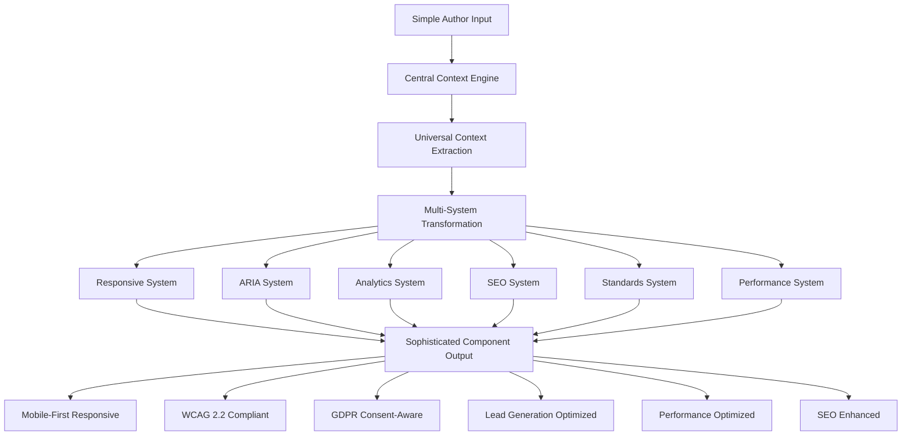
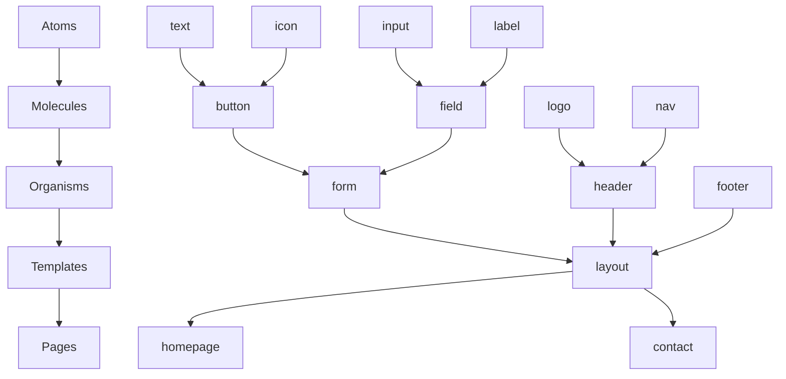
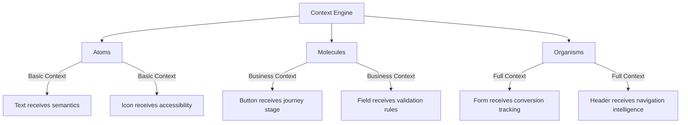

# Universal Intelligence Component Library

## Revolutionary Component Architecture

The **Universal Intelligence Component Library** represents a revolutionary approach to Jekyll components: **simple author input generates sophisticated, standards-compliant output** through the [Central Context Engine](./CONTEXT-ENGINE.md). Every component automatically receives rich context and transforms it for optimal lead generation, accessibility, performance, and compliance.

**Pure Transformation**: This component library is a **pure specification and transformation layer** - all detection logic resides in the Context Engine. Components simply receive and transform pre-calculated context.

**The Magic**: Authors write simple includes, get enterprise-grade output optimized for consulting business success.

> **CRITICAL**: [COMPONENT-TABLE.md](./COMPONENT-TABLE.md) is the SINGLE SOURCE OF TRUTH for all component specifications, variants, inheritance paths, and implementation status. All other component documentation references this master table.



**Universal Context Source**: All components consume from the [Central Context Engine](./CONTEXT-ENGINE.md) which provides:
- **Responsive Intelligence**: Mobile-first responsive design with device optimization
- **Business Intelligence**: Lead generation optimization, customer journey awareness
- **Consent Compliance**: GDPR-compliant tracking with advanced consent mode
- **Standards Compliance**: WCAG 2.2 AA, performance optimization, security headers
- **Semantic Intelligence**: Content type awareness, technical level analysis, audience targeting

## Universal Intelligence Integration

### The Transformation Magic

Every component follows this pattern:

```liquid
<!-- Author Input (Simple) -->


<!-- Central Context Engine (Automatic) -->


<!-- Component Intelligence (Automatic) -->


<!-- Generated Output (Sophisticated) -->
```

**Result**: A simple include becomes an intelligent, business-optimized, standards-compliant component.

### Business Model Intelligence Built-In

Components automatically optimize for the **lead generation consulting business model**:

```javascript
// Automatic business context analysis
const businessContext = {
  conversionType: 'appointment_booking',        // Derived from component usage
  leadMagnetType: 'technical_expertise',       // Derived from content context
  customerJourneyStage: 'decision',            // Derived from page context
  consultingVertical: 'web_development'        // Derived from ecosystem context
};

// Component automatically generates appropriate output
```

## Responsive Design Pattern

### Mobile-First Responsive Architecture

All components in the Universal Intelligence Component Library follow a strict mobile-first responsive pattern using the base responsive layer defined in `RESPONSIVE.md`. Components NEVER define their own breakpoints - they inherit from the centralized system.

**Base Responsive Layer**:
```scss
// From _sass/base/_responsive.scss
// Breakpoints: 320px → 768px → 1024px → 1440px → 1920px
// Mixins: @include mobile, tablet, desktop, large, xl
// Progressive: @include tablet-up, desktop-up, large-up
```

**Component Responsive Pattern**:
```scss
// ✅ CORRECT - Using responsive mixins
.component {
  // Mobile-first base styles
  padding: var(--space-sm);
  
  @include mobile {
    @include touch-friendly; // 44px minimum touch target
  }
  
  @include tablet-up {
    padding: var(--space-md);
  }
  
  @include desktop-up {
    padding: var(--space-lg);
    display: grid;
    grid-template-columns: 1fr 2fr;
  }
}

// ❌ WRONG - Hardcoded breakpoints
.component {
  @media (max-width: 768px) { // NEVER do this!
    padding: 0.5rem;
  }
}
```

**Key Rules**:
1. ALL breakpoints come from `base/_responsive.scss`
2. Use semantic mixins, not hardcoded pixel values
3. Mobile-first approach (base styles for mobile)
4. Progressive enhancement with `*-up` mixins
5. Touch targets minimum 44px on mobile (WCAG 2.2)

See `RESPONSIVE.md` for complete documentation of the responsive system.

## Component Categories

For the complete component specifications, variants, and implementation status, see:

- **[Atoms](./COMPONENT-TABLE.md#atoms-15-components)** - Fundamental building blocks (15 components)
- **[Molecules](./COMPONENT-TABLE.md#molecules-24-components)** - Simple component combinations (24 components)
- **[Organisms](./COMPONENT-TABLE.md#organisms-18-components)** - Complex UI sections (18 components)

The [COMPONENT-TABLE.md](./COMPONENT-TABLE.md) provides:

- Complete component inventory with status (Active/Planned/Future)
- Inheritance paths showing context flow
- Specification file references for implemented components
- Variant options and configuration parameters
- Context integration details for each component

All components automatically receive business context from the Central Context Engine and transform it into conversion-optimized outputs, including:

- Lead generation components (Contact Button, Appointment Calendar, Project Sponsor)
- Content & media components (Smart Links, Audio Player, Diagrams, Embeds)
- Navigation & layout components (Headers, Footers, Social Links)

## Component Intelligence Matrix

### Automatic Feature Integration

Every component automatically receives:

| Feature | Source System | Implementation |
|---------|---------------|----------------|
| **Responsive Behavior** | [RESPONSIVE.md](./RESPONSIVE.md) | Mobile-first responsive design with device optimization |
| **ARIA Labels** | [ARIA.md](./ARIA.md) | Context-driven accessibility markup |
| **Analytics Events** | [ANALYTICS.md](./ANALYTICS.md) | Consent-compliant lead generation tracking |
| **SEO Meta Data** | [SEO.md](./SEO.md) | Schema.org and Open Graph optimization |
| **AI Discovery** | [AI.md](./AI.md) | LLMs.txt and manifest generation |
| **Standards Compliance** | [STANDARDS.md](./STANDARDS.md) | WCAG 2.2 AA, performance, security |
| **Business Optimization** | [CONTEXT-ENGINE.md](./CONTEXT-ENGINE.md) | Lead generation and consultation focus |

## Atomic Design Architecture

### The Atomic Design Methodology

The Universal Intelligence Component Library follows **Atomic Design** principles, creating a hierarchical component system that promotes reusability, consistency, and maintainability:



### Atomic Hierarchy with Context Engine Integration

Each level in the atomic hierarchy consumes Context Engine intelligence differently:

#### **Atoms** (Indivisible Elements)

The smallest functional units that cannot be broken down further:

```liquid
<!-- atoms/text.html -->

<span class="atom-text atom-text--{{ include.variant | default: 'body' }}"
      data-component="atom-text"
      data-semantic-level="{{ universal_context.semantics.textLevel | default: 'p' }}">
  {{ include.content }}
</span>

<!-- atoms/icon.html -->
<svg class="atom-icon atom-icon--{{ include.size | default: 'md' }}"
     data-component="atom-icon"
     aria-hidden="{{ include.decorative | default: 'false' }}"
     
       aria-label="{{ include.label | default: include.name | replace: '-', ' ' | capitalize }}"
     >
  <use href="#icon-{{ include.name }}"></use>
</svg>

<!-- atoms/input.html -->
<input type="{{ include.type | default: 'text' }}"
       class="atom-input"
       data-component="atom-input"
       id="{{ include.id }}"
       name="{{ include.name }}"
       value="{{ include.value }}"
       required aria-required="true"
       disabled
       pattern="{{ include.pattern }}">
```

**Atom Characteristics**:

- Single HTML element (usually)
- No dependencies on other components
- Receives basic context (semantics, accessibility)
- Pure structural/functional purpose

#### **Molecules** (Simple Combinations)

Groups of atoms functioning together as a unit:

```liquid
<!-- molecules/button.html -->

<button class="molecule-button molecule-button--{{ include.variant | default: 'primary' }}"
        data-component="molecule-button"
        data-business-context="{{ universal_context.business.conversionType }}"
        data-journey-stage="{{ universal_context.business.customerJourneyStage }}"
        disabled
        type="{{ include.type | default: 'button' }}">
  
  
    
  
  
  
  
  
    
  
</button>

<!-- molecules/field.html -->
<div class="molecule-field" data-component="molecule-field">
  
  
  
  
  
    
  
  
  
    
  
</div>
```

**Molecule Characteristics**:

- Combines 2-4 atoms
- Single, focused purpose
- Maintains atom independence
- Applies business context from Context Engine

#### **Organisms** (Complex Components)

Relatively complex UI components composed of groups of molecules and/or atoms:

```liquid
<!-- organisms/contact-form.html -->

<form class="organism-form organism-form--contact"
      data-component="organism-contact-form"
      data-business-model="lead_generation"
      data-conversion-value="{{ universal_context.business.estimatedProjectValue }}"
      method="post"
      action="{{ include.action | default: '/contact' }}">
  
  <fieldset class="form-section">
    <legend class="form-section__title">Contact Information</legend>
    
    
    
    
    
    
  </fieldset>
  
  <fieldset class="form-section">
    <legend class="form-section__title">Project Details</legend>
    
    
    
    
  </fieldset>
  
  <div class="form-actions">
    
    
    
  </div>
</form>

<!-- organisms/header.html -->
<header class="organism-header"
        data-component="organism-header"
        role="banner">
  
  
  
  
  
  
  
  
  
  
    
  
</header>
```

**Organism Characteristics**:

- Complete, standalone sections
- Combines multiple molecules/atoms
- Context-aware business logic
- Can be used across different templates

#### **Templates** (Page Structures)

Page-level structures that place organisms into a layout:

```liquid
<!-- templates/default.html -->
<!DOCTYPE html>
<html lang="{{ site.lang | default: 'en' }}">
<head>
  
</head>
<body data-theme="{{ site.theme.system }}"
      data-typography="{{ site.theme.typography }}"
      data-repository-context="{{ site.repository_context }}">
  
  
  
  
  
  <main id="main-content" role="main">
    {{ content }}
  </main>
  
  
  
  
  
  
</body>
</html>
```

### Atomic Design Benefits

1. **Reusability**: Atoms used across multiple molecules
2. **Consistency**: Same atoms = same behavior everywhere
3. **Maintainability**: Change atom once, updates everywhere
4. **Testability**: Test atoms in isolation
5. **Performance**: Smaller, cacheable components
6. **Flexibility**: Easy to create new combinations

### Context Engine Flow Through Atoms



### Atomic Design with Theme Layers

The atomic hierarchy works seamlessly with theme and typography layers:

```scss
// atoms/_text.scss - Pure structure
.atom-text {
  // Only structural properties
  display: inline;
  
  &--body { font-size: var(--text-base); }
  &--small { font-size: var(--text-sm); }
  &--large { font-size: var(--text-lg); }
}

// themes/glassmorphism/_atoms.scss - Theme layer
[data-theme="glassmorphism"] {
  .atom-text {
    // Visual enhancements
    text-shadow: 0 1px 2px rgba(0,0,0,0.1);
    
    &--highlight {
      background: linear-gradient(120deg, 
        rgba(var(--color-primary-rgb), 0.2) 0%, 
        rgba(var(--color-primary-rgb), 0) 100%);
    }
  }
}
```

### Atomic Component Discovery

The JavaScript module system automatically discovers and enhances atomic components:

```javascript
// core/atomic-discovery.js
export class AtomicDiscovery {
  static discover() {
    // Discover all atomic levels
    this.discoverAtoms();
    this.discoverMolecules();
    this.discoverOrganisms();
  }
  
  static discoverAtoms() {
    document.querySelectorAll('[data-component^="atom-"]').forEach(atom => {
      // Apply base atom behaviors
      AtomEnhancer.enhance(atom);
    });
  }
  
  static discoverMolecules() {
    document.querySelectorAll('[data-component^="molecule-"]').forEach(molecule => {
      // Apply molecule behaviors + atom coordination
      MoleculeEnhancer.enhance(molecule);
    });
  }
}
```

## Multi-Layer Component Architecture

> **Complete Component Specifications**: See [COMPONENT-TABLE.md](./COMPONENT-TABLE.md) for component listing, [ATOMS.md](./COMPONENTS/ATOMS.md), [MOLECULES.md](./COMPONENTS/MOLECULES.md), [ORGANISMS.md](./COMPONENTS/ORGANISMS.md) for atomic design patterns

### Architectural Overview

The component library implements a sophisticated multi-layer inheritance system with clean separation of concerns:

```
Context Engine → Core Systems → Theme System → Atoms → Molecules → Organisms
```

Each layer extends the previous, creating an elegant inheritance chain where components gain capabilities while maintaining single responsibility.

### Layer Architecture

#### 1. Base Extension Layer
All components start by extending:
- **Context Engine**: Universal context provider (single source of truth)
- **Core Systems**: ARIA, Responsive, Analytics, SEO, AI (selectively integrated)
- **Theme System**: Colors, Typography, Spacing, Motion, Shadows

#### 2. Atomic Layers
- **Atoms** (15 components): Single-purpose elements, no dependencies
- **Molecules** (24 components): Composed from atoms, can have variants
- **Organisms** (18 components): Complete sections, full system integration

#### 3. File Structure Pattern
Each component maintains separation of concerns:
```
component-name/
├── component-name.html  # Structure only
├── component-name.scss  # Styling only
└── component-name.js    # Behavior only
```

### Inheritance Examples

#### Atom Inheritance
```
Context Engine → ARIA (roles) → Theme (typography) → text.html
                                                   → text.scss
                                                   → text.js
```

#### Molecule Inheritance
```
text atom + icon atom → Analytics (tracking) → button.html
                                             → button.scss (variants)
                                             → button.js
```

#### Organism Inheritance
```
nav molecules + logo + CTAs → All Systems → header.html
                                          → header.scss
                                          → header.js (5 variants)
```

### System Integration Rules

#### Atoms
- **Always**: Context Engine, Theme System
- **Selective**: ARIA (interactive), Responsive (layout)
- **Never**: Analytics, SEO (too granular)

#### Molecules
- **Inherit**: All atom integrations
- **Add**: Analytics (interactions), SEO (content)
- **Variants**: Visual and behavioral variations

#### Organisms
- **Full Integration**: All relevant systems
- **Context Variants**: Adapt based on page type
- **Business Logic**: Complete functionality

### Component Specification Standards

Each component spec must document:
1. **Identity**: Name, type, purpose
2. **Inheritance Chain**: What it extends, systems integrated
3. **File Structure**: The 3-file pattern
4. **API**: Parameters and context consumption
5. **Variants**: If applicable
6. **Usage**: Examples in context

### Directory Organization

```
SPEC/COMPONENTS/
├── ATOMS.md              # Lists all atoms
├── MOLECULES.md          # Lists all molecules  
├── ORGANISMS.md          # Lists all organisms
├── ATOMS/               # Individual atom specs
│   └── *.md
├── MOLECULES/           # Individual molecule specs
│   └── *.md
└── ORGANISMS/           # Individual organism specs
    └── *.md
```

All component specifications follow CAPITAL-CASE.md naming convention.

## Implementation Patterns

### Zero Configuration Beauty

The elegance of the architecture means authors focus on content while components handle sophistication:

**Simple Author Experience:**
```liquid
---
layout: default
title: "Advanced React Patterns"
description: "Learn advanced patterns for scalable React applications"
---

# Advanced React Patterns




```

**Sophisticated Generated Output:**
- **WCAG 2.2 AA compliant** markup with proper ARIA labels
- **GDPR-compliant analytics** tracking with consent validation
- **Lead generation optimized** CTAs and conversion tracking
- **Performance optimized** with lazy loading and resource hints
- **SEO enhanced** with Schema.org structured data
- **Business model aware** with consultation and sponsorship integration

### Business Model Integration

Components automatically optimize for the **consulting expertise business model**:

```javascript
// Performance: Business context from Context Engine with caching
class BusinessContextOptimizer {
  constructor() {
    this.cache = new Map(); // Performance: Cache business decisions
    this.isInitialized = false;
  }
  
  optimizeForBusinessModel(componentContext) {
    // Performance: Return cached result if available
    const cacheKey = 'business_optimization';
    if (this.cache.has(cacheKey)) {
      return this.cache.get(cacheKey);
    }
    
    try {
      const optimization = {
        conversionOptimization: this.getConversionOptimization(componentContext),
        journeyOptimization: this.getJourneyOptimization(componentContext),
        technicalOptimization: this.getTechnicalOptimization(componentContext)
      };
      
      // Performance: Cache the result
      this.cache.set(cacheKey, optimization);
      return optimization;
      
    } catch (error) {
      console.error('Business model optimization failed:', error);
      // Robustness: Return minimal optimization structure
      return {
        conversionOptimization: { enabled: false },
        journeyOptimization: { enabled: false },
        technicalOptimization: { enabled: false }
      };
    }
  }
  
  getConversionOptimization(componentContext) {
    try {
      if (componentContext.business?.conversionType === 'lead_generation') {
        return {
          enabled: true,
          actions: ['add_consultation_ctas', 'track_expertise_demonstration', 'optimize_lead_qualification'],
          priority: 'high'
        };
      }
      return { enabled: false };
    } catch (error) {
      console.error('Conversion optimization failed:', error);
      return { enabled: false, error: error.message };
    }
  }
  
  getJourneyOptimization(componentContext) {
    try {
      if (componentContext.business?.customerJourneyStage === 'decision') {
        return {
          enabled: true,
          actions: ['prioritize_contact_buttons', 'add_appointment_scheduling', 'increase_conversion_tracking'],
          urgency: 'high'
        };
      }
      return { enabled: false };
    } catch (error) {
      console.error('Journey optimization failed:', error);
      return { enabled: false, error: error.message };
    }
  }
  
  getTechnicalOptimization(componentContext) {
    try {
      if (componentContext.semantics?.technicalLevel === 'advanced') {
        return {
          enabled: true,
          actions: ['demonstrate_technical_competence', 'add_consultation_upsells', 'track_expertise_engagement'],
          complexity: 'advanced'
        };
      }
      return { enabled: false };
    } catch (error) {
      console.error('Technical optimization failed:', error);
      return { enabled: false, error: error.message };
    }
  }
}

// Performance: Global instance with lazy initialization
window.businessOptimizer = window.businessOptimizer || new BusinessContextOptimizer();
```

## Key Benefits

### Universal Intelligence Architecture

✅ **Zero Configuration**: Simple includes generate sophisticated output  
✅ **Business Model Optimized**: Every component optimizes for lead generation  
✅ **GDPR Compliant by Default**: Consent management built into every component  
✅ **Standards Compliant**: WCAG 2.2 AA, performance, security automatic  
✅ **Lead Generation Focused**: Consultation and sponsorship CTAs intelligently placed  
✅ **Context-Driven**: Components adapt based on content, audience, and business goals  
✅ **Cross-Domain Intelligence**: Components work consistently across ecosystem domains  
✅ **Maintenance-Free**: Central intelligence means components improve automatically  
✅ **High Performance**: Event debouncing, caching, lazy loading, and optimized resource usage  
✅ **Error Resilient**: Comprehensive error handling with graceful degradation  
✅ **Memory Efficient**: Template caching and efficient business context optimization  
✅ **Network Optimized**: Connection-aware tracking and request batching

**Related Systems**:
- [CONTEXT-ENGINE.md](./CONTEXT-ENGINE.md) - Universal intelligence source
- [RESPONSIVE.md](./RESPONSIVE.md) - Mobile-first responsive design architecture
- [COMPONENT-TABLE.md](./COMPONENT-TABLE.md) - Complete component specifications and priorities
- [STANDARDS.md](./STANDARDS.md) - Standards compliance transformation
- [ANALYTICS.md](./ANALYTICS.md) - Consent-compliant lead generation tracking
- [ARIA.md](./ARIA.md) - Accessibility intelligence
- [SEO.md](./SEO.md) - SEO optimization
- [AI.md](./AI.md) - AI discovery optimization
- [PERFORMANCE.md](./PERFORMANCE.md) - Performance optimization transformation

## Target-Aware Components & Multi-Repository Integration

### Repository Context Components

**Multi-Repository Component Adaptation**: Components automatically adapt behavior based on `site.repository_context` and target-aware processing:

```liquid
<!-- REQUIRED: Target-aware component behavior -->
 Universal Context Generation 


 Repository-aware component adaptation 

   Domain repository: Portfolio showcase focus 
  

   Blog repository: Educational content focus 
  

```

### Cross-Posting Attribution Component

**Automatic Attribution for Cross-Posted Content**: Components receive cross-posting relationships from Context Engine and generate proper attribution:

```liquid
<!-- REQUIRED: Cross-posting attribution component -->
<!-- _includes/components/attribution-notice.html -->

  <aside class="attribution-notice" 
         role="note" 
         aria-label="Content attribution information"
         data-component="attribution-notice">
    
     Universal context for styling and behavior 
    
    
    <div class="attribution-notice__content">
      <p class="attribution-notice__text">
        <span class="sr-only">Original publication notice:</span>
        Originally published on 
        <a href="{{ page.canonical_url }}"
           class="attribution-notice__link"
           aria-label="View original publication on {{ page.primary_blog }}"
           aria-description="Opens original source in new tab"
           target="_blank"
           rel="canonical noopener"
           data-analytics-category="cross_posting"
           data-analytics-action="view_original">
          {{ page.primary_blog }}
        </a>
      </p>
      
      
        <time class="attribution-notice__date" 
              datetime="{{ page.republication_date | date_to_xmlschema }}">
          Republished {{ page.republication_date | date: "%B %d, %Y" }}
        </time>
      
    </div>
  </aside>

```

```scss
// _sass/components/_attribution-notice.scss
.attribution-notice {
  // REQUIRED: Base attribution notice styling
  padding: var(--space-sm);
  margin: var(--space-md) 0;
  border-left: 4px solid var(--color-accent);
  background: var(--color-surface-subtle);
  border-radius: var(--radius-sm);
  
  // REQUIRED: Typography for readability
  font-size: var(--text-sm);
  line-height: var(--line-height-relaxed);
  
  &__content {
    display: flex;
    flex-direction: column;
    gap: var(--space-xs);
  }
  
  &__text {
    margin: 0;
    color: var(--color-text-subtle);
  }
  
  &__link {
    color: var(--color-accent);
    text-decoration: underline;
    font-weight: var(--font-weight-medium);
    
    &:hover {
      color: var(--color-accent-hover);
    }
  }
  
  &__date {
    font-size: var(--text-xs);
    color: var(--color-text-muted);
    font-style: italic;
  }
}
```

```javascript
// assets/js/components/attribution-notice.js
(function() {
  'use strict';
  
  class AttributionNotice extends ComponentSystem.Component {
    static selector = '[data-component="attribution-notice"]';
    
    constructor(element, universalContext) {
      super(element, universalContext);
      this.initializeAttribution();
    }
    
    initializeAttribution() {
      // REQUIRED: Track attribution notice views
      this.trackAttributionView();
      
      // REQUIRED: Handle original source link clicks
      this.setupOriginalSourceTracking();
    }
    
    trackAttributionView() {
      if (this.context.technical.consent.analyticsConsent) {
        this.analytics.trackEvent('attribution_notice_view', {
          event_category: 'cross_posting',
          event_action: 'attribution_displayed',
          canonical_url: this.getCanonicalUrl(),
          primary_blog: this.getPrimaryBlog()
        });
      }
    }
    
    setupOriginalSourceTracking() {
      const originalLink = this.element.querySelector('.attribution-notice__link');
      
      if (originalLink) {
        originalLink.addEventListener('click', (event) => {
          this.trackOriginalSourceClick(event);
        });
      }
    }
    
    trackOriginalSourceClick(event) {
      if (this.context.technical.consent.analyticsConsent) {
        this.analytics.trackEvent('original_source_click', {
          event_category: 'cross_posting',
          event_action: 'view_original_source',
          canonical_url: this.getCanonicalUrl(),
          primary_blog: this.getPrimaryBlog(),
          conversion_type: 'content_attribution'
        });
      }
    }
    
    getCanonicalUrl() {
      return this.element.querySelector('.attribution-notice__link')?.href || '';
    }
    
    getPrimaryBlog() {
      return this.element.querySelector('.attribution-notice__link')?.textContent?.trim() || '';
    }
  }
  
  ComponentSystem.register(AttributionNotice);
})();
```

### Highlight Content Component with Project Prioritization

**Dynamic Content Discovery**: Components scan frontmatter relationships and prioritize content based on business context:

```liquid
<!-- REQUIRED: Dynamic highlight content component -->
<!-- _includes/components/highlight-content.html -->
<section class="highlight-content" 
         data-component="highlight-content"
         role="region"
         aria-labelledby="highlight-heading">
  
   Universal context for intelligent content selection 
  
  
  <h2 id="highlight-heading" class="highlight-content__heading">
    
      Featured Projects
    
      Related Content
    
      Highlighted Content
    
  </h2>
  
  <div class="highlight-content__grid">
     Project priority sorting based on business context 
    
    
    
    
      <article class="highlight-content__item" 
               data-content-type="{{ content_item.layout }}"
               data-business-priority="{{ content_item.business_priority | default: 'medium' }}">
        
         Repository-aware content presentation 
        
          
        
          
        
        
         Cross-repository relationship indicators 
        
          <div class="highlight-content__relationship" 
               aria-label="Related project information">
            <span class="relationship-indicator relationship-indicator--uses">
              Showcases: {{ content_item.uses_project }}
            </span>
          </div>
        
        
        
          <div class="highlight-content__relationship"
               aria-label="Project update information">
            <span class="relationship-indicator relationship-indicator--updates">
              Updates: {{ content_item.updates_project }}
            </span>
          </div>
        
      </article>
    
  </div>
  
   Cross-repository navigation if applicable 
  
    <div class="highlight-content__cross-nav">
      <a href="{{ site.cross_repository_urls.blog }}"
         class="highlight-content__cross-link"
         aria-label="View all blog content: Educational tutorials and insights"
         data-analytics-category="cross_repository"
         data-analytics-action="navigate_to_blog">
        View All Tutorials →
      </a>
    </div>
  
    <div class="highlight-content__cross-nav">
      <a href="{{ site.cross_repository_urls.domain }}"
         class="highlight-content__cross-link"
         aria-label="View portfolio: Project showcase and company information"
         data-analytics-category="cross_repository"
         data-analytics-action="navigate_to_portfolio">
        View Portfolio →
      </a>
    </div>
  
</section>
```

### Sidebar Navigation Component for Documentation

**Documentation-Specific Navigation**: Components adapt for project documentation with contextual navigation:

```liquid
<!-- REQUIRED: Sidebar navigation component -->
<!-- _includes/components/sidebar-navigation.html -->

  <aside class="sidebar-navigation" 
         data-component="sidebar-navigation"
         role="complementary"
         aria-label="Documentation navigation">
    
     Universal context for navigation intelligence 
    
    
    <nav class="sidebar-navigation__nav" role="navigation">
      <h2 class="sidebar-navigation__heading">
        {{ site.project_info.name | default: "Documentation" }}
      </h2>
      
       Dynamic documentation structure 
      
      
      
      <ul class="sidebar-navigation__list" role="list">
        
          <li class="sidebar-navigation__item">
            <a href="{{ doc_page.url }}"
               class="sidebar-navigation__link sidebar-navigation__link--active"
               aria-current="page"
               data-analytics-category="documentation"
               data-analytics-action="navigate_docs">
              {{ doc_page.title }}
            </a>
            
             Sub-navigation for active sections 
            
              <ul class="sidebar-navigation__sublist">
                
                  <li class="sidebar-navigation__subitem">
                    <a href="#{{ subsection.id }}"
                       class="sidebar-navigation__sublink">
                      {{ subsection.title }}
                    </a>
                  </li>
                
              </ul>
            
          </li>
        
      </ul>
      
       Cross-repository navigation back to project 
      
        <div class="sidebar-navigation__cross-nav">
          <a href="{{ site.cross_repository_urls.domain }}/{{ site.project_info.slug }}"
             class="sidebar-navigation__project-link"
             aria-label="Back to project overview"
             data-analytics-category="cross_repository"
             data-analytics-action="back_to_project">
            ← Back to {{ site.project_info.name }}
          </a>
        </div>
      
    </nav>
  </aside>

```

### Cross-Repository URL Components

**Intelligent Cross-Repository Navigation**: Components generate appropriate URLs based on build mode and repository context:

```liquid
<!-- REQUIRED: Cross-repository URL helper component -->
<!-- _includes/components/cross-repo-link.html -->

Usage: 







  <a href="{{ site.cross_repository_urls[target_repo] }}{{ target_path }}"
     class="cross-repo-link cross-repo-link--{{ target_repo }}"
     aria-label="Navigate to {{ target_repo }}: {{ include.aria_description | default: link_text }}"
     target="_blank" rel="noopener"
     data-repository-target="{{ target_repo }}"
     data-analytics-category="cross_repository"
     data-analytics-action="navigate_{{ target_repo }}">
    {{ link_text }}
    
      <span class="cross-repo-link__external-indicator" aria-hidden="true">↗</span>
    
  </a>

```

### Build Mode Component Adaptations

```yaml
# REQUIRED: Component behavior per build mode
component_build_mode_config:
  local_mode:
    # REQUIRED: Local development component behavior
    cross_repository_links: "Same-window navigation to localhost ports"
    analytics_tracking: "Console logging only"
    external_indicators: false
    
  production_mode:
    # REQUIRED: Production component behavior
    cross_repository_links: "New-window navigation with security headers"
    analytics_tracking: "Full analytics integration"
    external_indicators: true
    seo_optimization: true
```

This **Universal Intelligence Component Library** achieves the perfect balance: **simple for authors, sophisticated for users, optimized for business success** while maintaining exceptional performance and error resilience through comprehensive optimization strategies, enhanced with target-aware multi-repository component coordination and cross-posting attribution support.

## Intent-Based Component Behaviors

### Dynamic Component Adaptation

Components automatically adapt their behavior based on content intent from the enhanced Context Engine:

#### Social Share Component Positioning
```liquid



<!-- Component adapts position based on intent -->

  
    <div class="social-share social-share--floating-right social-share--sticky">
  
    <div class="social-share social-share--bottom social-share--static">
  
    <div class="social-share social-share--bottom social-share--minimal">

```

#### Article Navigation CTAs
```liquid

<div class="article-navigation article-navigation--{{ intent }}">
  
    
  
</div>
```

### Navigation Variant Detection

Components receive navigation context from the enhanced Context Engine:

```liquid



<!-- Navigation adapts based on variant -->

  
    
  
    
  
    
  
    
  
    

```

### Responsive Component Behaviors

Components implement specific responsive behaviors as defined in items.md:

#### Article Header Progressive Disclosure
```scss
.article-header {
  // Mobile: HERO, date, audio only
  @include mobile {
    .article-header__chips,
    .article-header__reading-time,
    .article-header__date-modified,
    .article-header__summary { display: none; }
  }
  
  // Tablet: Add chips
  @include tablet {
    .article-header__chips { display: flex; }
  }
  
  // Desktop: Show everything
  @include desktop-up {
    .article-header__reading-time,
    .article-header__date-modified,
    .article-header__summary { display: block; }
  }
}
```

#### Social Discuss Visibility
```scss
.social-discuss {
  // Hidden on mobile as per items.md
  @include mobile {
    display: none;
  }
  
  // Shown on tablet and desktop
  @include tablet-up {
    display: block;
  }
}
```

### Sponsor Disclosure Integration

Components automatically handle sponsor disclosure when present:

```liquid

  <div class="sponsor-disclosure" 
       role="complementary"
       aria-label="Sponsored content disclosure">
    <span class="sponsor-disclosure__label">Sponsored by</span>
    <a href="{{ page.sponsor.url }}" 
       class="sponsor-disclosure__link"
       rel="sponsored">
      {{ page.sponsor.name }}
    </a>
  </div>

```

### Empty State Messaging

Components use context-aware empty state messages:

```liquid

<div class="empty-state">
  <p class="empty-state__message">{{ empty_state.message }}</p>
  <a href="{{ empty_state.link_target }}" 
     class="empty-state__link">
    {{ empty_state.link_text }}
  </a>
</div>
```

All these behaviors are driven by the enhanced Context Engine and deterministic mappings in CONTEXT-MAPPING.md, ensuring consistent, maintainable, and testable component behaviors across the entire ecosystem.

## Pure Transformation Architecture

**IMPORTANT**: This Component Library is a **pure specification and transformation layer** that:

1. **Receives** universal context from the Central Context Engine
2. **Transforms** context into sophisticated component output
3. **Contains NO detection logic** - all detection happens in CONTEXT-DETECTION.md
4. **Uses pre-calculated data** from Context Engine for all business logic, content analysis, and behavioral decisions

Components are purely declarative - they receive rich context and apply transformations through:

- Liquid templates for server-side rendering
- CSS classes from pre-calculated responsive decisions
- ARIA attributes from accessibility transformations
- Analytics data attributes from business transformations
- SEO markup from metadata transformations

This separation ensures components remain simple, testable, and maintainable while delivering enterprise-grade functionality.
