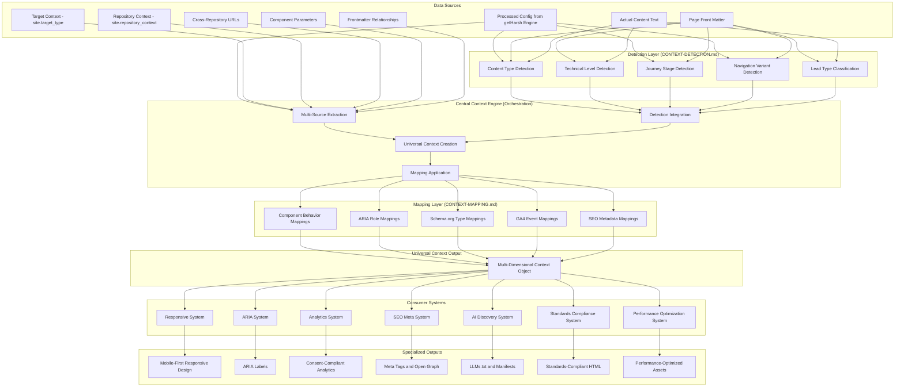

# Central Context Engine - Universal Intelligence Core

## Overview

The **Central Context Engine** is the intelligent core that creates rich, multi-dimensional context from fully processed configuration and dynamic sources.

**Important**: This engine focuses on architecture and orchestration:
- All detection algorithms are defined in [CONTEXT-DETECTION.md](./CONTEXT-DETECTION.md)
- All deterministic mappings are defined in [CONTEXT-MAPPING.md](./CONTEXT-MAPPING.md)
- This separation ensures single source of truth, easy updates, and clear documentation

It receives validated, consolidated configuration from getHarsh engine plus dynamic signals (frontmatter, page context, component parameters) to create sophisticated semantic understanding. This universal context feeds into specialized systems (Responsive, ARIA, Analytics, SEO, AI Discovery, Standards, Performance) that transform it for their specific standards and requirements.

**Revolutionary Architecture**: Instead of each system extracting its own context, we have ONE central engine that combines processed config + dynamic signals to create sophisticated semantic understanding. Each consumer system then transforms this universal context for its specific use case.

### Integration with getHarsh Engine

The Central Context Engine operates within the Jekyll theme system and receives **fully processed, validated configuration** from the getHarsh engine. The getHarsh engine handles:
- Multi-repository configuration inheritance (ecosystem → domain → blog/project → docs)
- **Repository context injection** (`site.repository_context`, `site.target_type`)
- **Cross-repository URL mapping** generation
- Build mode determination (LOCAL vs PRODUCTION with different URLs/paths)
- Content aggregation from distributed sources
- **Local build security** (environment variable substitution)

The Central Context Engine then combines this processed configuration with dynamic signals (frontmatter, page data, component parameters) to create target-aware semantic intelligence.



## Architecture

The Context Engine follows a clear separation of concerns:

### How Detection Works
All content, URL, journey, and technical detection algorithms are implemented in [CONTEXT-DETECTION.md](./CONTEXT-DETECTION.md). The engine calls these detection methods to analyze:
- Content types and structures
- URL patterns and link types
- Technical levels and audiences
- Journey stages and user states
- Business contexts and lead types

### How Mapping Works
Once detection is complete, the engine uses mappings defined in [CONTEXT-MAPPING.md](./CONTEXT-MAPPING.md) to transform detected values into:
- Component behaviors and properties
- ARIA roles and labels
- Schema.org types
- GA4 events
- SEO metadata

### Data Flow
1. **Input**: Processed config + dynamic signals (frontmatter, page data)
2. **Detection**: Apply algorithms from CONTEXT-DETECTION.md
3. **Context Creation**: Build universal context object
4. **Mapping**: Apply transformations from CONTEXT-MAPPING.md
5. **Output**: Rich context for consumer systems

## Multi-Source Data Extraction

### Target-Aware Context Processing Architecture

The engine receives fully processed configuration from getHarsh engine and combines it with dynamic signals to create target-aware semantic understanding:

```liquid
 Target-Aware Context Extraction - Processed Config + Dynamic Signals 

   1. Target and Repository Context (provided by getHarsh engine) 
  
  
  
  
  
  
   2. Processed Configuration Context (validated by getHarsh engine) 
  
  
  
  
  
  
   3. Page Context (frontmatter + dynamic content relationships) 
  
  
  
  
  
  
  
  
  
   4. Component Context (parameters passed to component) 
  
  
  
  
  
  
   5. Theme System Context (processed by getHarsh engine) 
  
  
  
  

```

## Universal Context Schema

### Multi-Dimensional Context Object

The Central Context Engine produces a standardized, rich context object that all consumer systems use:

```javascript
class CentralContextEngine {
  constructor() {
    // All detection logic is delegated to the contextDetection module
    // See CONTEXT-DETECTION.md for implementation details
    this.contextDetection = new ContextDetection();
  }

  generateUniversalContext(processedConfig, pageData, componentParams) {
    return {
      // === TARGET AND REPOSITORY CONTEXT (From getHarsh engine) ===
      targetContext: {
        targetType: processedConfig.target_type,           // domain/blog/project/docs
        repositoryContext: processedConfig.repository_context,  // domain/blog
        inheritancePath: processedConfig.inheritance_path,      // config inheritance chain
        servingPaths: processedConfig.serving_paths,           // paths served by this repository
        crossRepositoryUrls: processedConfig.cross_repository_urls  // navigation URLs
      },
      
      // === PROCESSED CONFIGURATION (Validated by getHarsh engine) ===
      processedConfig: {
        domainInfo: processedConfig.domain_info,
        ecosystemInfo: processedConfig.ecosystem,
        projectInfo: processedConfig.project_info,
        entityInfo: processedConfig.entity,
        sponsorInfo: processedConfig.sponsors,
        themeSystem: processedConfig.theme
      },
      
      // === DYNAMIC SIGNALS (Frontmatter + Component Parameters) ===
      dynamicSignals: {
        page: pageData,  // Direct page data
        component: componentParams,  // Direct component parameters
        frontmatterRelationships: this.extractContentRelationships(pageData),
        intent: this.extractFrontmatterIntent(pageData),
        navigationVariant: this.contextDetection.detectNavigationVariant(processedConfig, pageData),
        sponsor: this.extractSponsorContext(pageData)
      },
      
      // === SEMANTIC ANALYSIS (Delegated to detection) ===
      semantics: {
        contentType: this.contextDetection.detectContentType(pageData),
        technicalLevel: this.contextDetection.detectTechnicalLevel(pageData),
        journeyStage: this.contextDetection.identifyJourneyStageDeterministically(pageData)
      },
      
      // === CONTENT METADATA (Direct from sources) ===
      content: {
        title: pageData.title || '',
        description: pageData.description || '',
        keywords: pageData.tags || []
      },
      
      // === RELATIONSHIP CONTEXT (Hierarchical relationships) ===
      relationships: {
        // These would be populated by the theme/Jekyll engine
        // The engine just passes them through
      },
      
      // === BEHAVIORAL CONTEXT (User interaction context) ===
      // NOTE: Behavior analysis will be done by consumer systems (ANALYTICS.md)
      behavior: {},
      
      // === TECHNICAL CONTEXT (Configuration from getHarsh engine) ===
      technical: {
        // Technical configuration passed from getHarsh engine
        // Consumer systems will use this for their transformations
      },
      
      // === BUSINESS CONTEXT ===
      // NOTE: Business intelligence will be done by consumer systems (ANALYTICS.md, SEO.md)
      business: {
        // Only detection-based classification from CONTEXT-DETECTION.md
        leadType: this.contextDetection.classifyLeadTypeDeterministically(pageData),
        journeyStage: this.contextDetection.identifyJourneyStageDeterministically(pageData)
      }
    };
  }
}
```

## Dynamic Field Resolution System

### Intelligent Field Mapping

The engine searches through ALL hierarchy levels for semantic concepts using flexible field names:

```javascript
class DynamicFieldResolver {
  constructor(allSources) {
    this.sources = {
      ecosystem: allSources.ecosystem || {},
      domain: allSources.domain || {},
      project: allSources.project || {},
      page: allSources.page || {},
      component: allSources.component || {},
      theme: allSources.theme || {}
    };
  }
  
  // Searches through ALL hierarchy levels for specified field names
  findFirstValue(concept) {
    const fieldMappings = {
      // Category/Classification concepts
      category: ['category', 'type', 'classification', 'genre', 'kind'],
      
      // Purpose/Intent concepts  
      purpose: ['purpose', 'intent', 'goal', 'objective', 'aim'],
      
      // Status/Stage concepts
      stage: ['stage', 'status', 'phase', 'state', 'level', 'maturity'],
      
      // Description/Content concepts
      description: ['description', 'summary', 'about', 'content', 'excerpt'],
      
      // Audience/User concepts
      audience: ['audience', 'target_audience', 'users', 'for', 'intended_for', 'readers'],
      
      // Difficulty/Level concepts
      difficulty: ['difficulty', 'level', 'skill_level', 'expertise_required'],
      
      // Keywords/Tags concepts
      keywords: ['tags', 'keywords', 'topics', 'subjects', 'categories', 'labels'],
      
      // Technology/Tools concepts
      technologies: ['technologies', 'tech_stack', 'tools', 'built_with', 'frameworks'],
      
      // Timeline/Duration concepts
      timeline: ['timeline', 'duration', 'project_length', 'timeframe'],
      
      // Role/Contribution concepts
      role: ['role', 'my_role', 'contribution', 'involvement'],
      
      // Business/Conversion concepts
      businessType: ['business_type', 'business_model', 'revenue_model', 'monetization'],
      
      // Lead Generation concepts
      leadType: ['lead_type', 'conversion_type', 'cta_type', 'engagement_type'],
      
      // Consent/Privacy concepts
      privacyLevel: ['privacy_level', 'consent_required', 'gdpr_compliance', 'data_usage'],
      
      // Standards/Compliance concepts
      complianceLevel: ['compliance_level', 'standards_required', 'accessibility_level']
    };
    
    const fieldNames = fieldMappings[concept] || [concept];
    
    for (const source of Object.values(this.sources)) {
      for (const fieldName of fieldNames) {
        if (source[fieldName]) {
          return this.cleanValue(source[fieldName]);
        }
      }
    }
    return null;
  }
  
  // Extracts arrays from ANY matching field across ALL levels
  extractAllValues(concept) {
    const fieldMappings = {
      keywords: ['tags', 'keywords', 'topics', 'subjects', 'categories', 'labels'],
      technologies: ['technologies', 'tech_stack', 'tools', 'built_with', 'frameworks'],
      categories: ['categories', 'tags', 'classifications', 'types']
    };
    
    const fieldNames = fieldMappings[concept] || [concept];
    const values = [];
    
    for (const source of Object.values(this.sources)) {
      for (const fieldName of fieldNames) {
        if (source[fieldName]) {
          const sourceValues = Array.isArray(source[fieldName]) 
            ? source[fieldName] 
            : [source[fieldName]];
          values.push(...sourceValues);
        }
      }
    }
    
    return [...new Set(values.map(v => this.cleanValue(v)))];
  }
  
  // Clean and normalize values dynamically
  cleanValue(value) {
    if (typeof value !== 'string') return value;
    
    return value
      .toLowerCase()
      .replace(/[_-]/g, ' ')
      .replace(/\s+/g, ' ')
      .trim();
  }
}
```

## Core Algorithm Intelligence Layer

### Context Processing Notes

The Context Engine focuses on orchestration and data flow. All intelligence algorithms have been moved to:
- Detection algorithms → [CONTEXT-DETECTION.md](./CONTEXT-DETECTION.md)
- Mapping rules → [CONTEXT-MAPPING.md](./CONTEXT-MAPPING.md)
- Business logic → Consumer systems (ANALYTICS.md, SEO.md, etc.)

The engine's role is to:
1. Collect data from multiple sources
2. Call detection algorithms
3. Apply mappings
4. Provide unified context to consumer systems

## Consumer Integration Patterns

### How Systems Consume Universal Context

Each specialized system receives the universal context and transforms it for their specific standards. See each system's documentation for detailed transformation patterns:

### How Components Consume Context
→ See [COMPONENTS.md](./COMPONENTS.md) for component consumption patterns

### How ARIA System Consumes Context  
→ See [ARIA.md](./ARIA.md) for ARIA consumption patterns

### How Analytics System Consumes Context
→ See [ANALYTICS.md](./ANALYTICS.md) for analytics consumption patterns

### How SEO System Consumes Context
→ See [SEO.md](./SEO.md) for SEO consumption patterns

### How AI System Consumes Context
→ See [AI.md](./AI.md) for AI consumption patterns

### How Responsive System Consumes Context
→ See [RESPONSIVE.md](./RESPONSIVE.md) for responsive consumption patterns

### Universal Consumption Pattern

```javascript
// Universal consumption pattern
class ContextConsumer {
  constructor(universalContext) {
    this.context = universalContext;
  }
  
  // Each system implements its own transformation logic
  transform() {
    throw new Error('Subclasses must implement transform() method');
  }
}

// Example: ARIA System consumption
class ARIAContextConsumer extends ContextConsumer {
  transform() {
    return {
      ariaLabel: this.buildARIALabel(),
      ariaDescription: this.buildARIADescription(),
      ariaRole: this.deriveARIARole(),
      ariaStates: this.deriveARIAStates()
    };
  }
  
  buildARIALabel() {
    const { semantics, content, sources } = this.context;
    
    return [
      content.title,
      semantics.intent === 'conversion' ? 'primary action' : '',
      sources.component.href?.includes('.pdf') ? 'PDF document' : '',
      `${semantics.audience} content`,
      'opens in new tab'
    ].filter(Boolean).join(', ');
  }
}

// Example: Analytics System consumption  
class AnalyticsContextConsumer extends ContextConsumer {
  transform() {
    // Analytics-specific transformation logic belongs in ANALYTICS.md
    // This is just an example of the pattern
    return {
      eventCategory: this.deriveEventCategory(),
      eventAction: this.deriveEventAction(),
      eventLabel: this.deriveEventLabel()
    };
  }
}
```

## Helper Methods

### Data Extraction Helpers

```javascript
// Simple data extraction helpers - no business logic
class DataExtractors {
  // Extract frontmatter intent fields (just passes data through)
  extractFrontmatterIntent(pageData) {
    if (!pageData) return {};
    
    return {
      contentIntent: pageData.content_intent,
      engagementType: pageData.engagement_type,
      conversionFocus: pageData.conversion_focus,
      contentType: pageData.content_type
    };
  }
  
  // Extract content relationships from frontmatter
  extractContentRelationships(pageData) {
    if (!pageData) return {};
    
    return {
      primaryBlog: pageData.primary_blog,
      targetBlogs: pageData.target_blogs,
      usesProjects: pageData.uses_projects,
      updatesProject: pageData.updates_project,
      relatedContent: pageData.related_content
    };
  }
  
  // Extract sponsor information (just data, no text generation)
  extractSponsorContext(pageData) {
    if (!pageData?.sponsor) return null;
    
    return {
      name: pageData.sponsor.name,
      url: pageData.sponsor.url,
      disclosure: pageData.sponsor.disclosure,
      isSponsored: true
    };
  }
}
```

## Implementation Integration

### Usage in Components

Components use the Central Context Engine through a unified interface:

```liquid
<!-- Component includes universal context generation -->
 Universal Context Generation 


<!-- Context is now available for all systems -->
 ARIA System 
<button aria-label="{{ universal_context.aria.label }}"
        aria-describedby="{{ universal_context.aria.description }}">

 Analytics System 
<button data-analytics-category="{{ universal_context.analytics.category }}"
        data-analytics-intent="{{ universal_context.analytics.intent }}">

 SEO System 
<meta name="description" content="{{ universal_context.seo.description }}">
<script type="application/ld+json">{{ universal_context.jsonld }}</script>
```

## Key Benefits

### Single Source of Truth Architecture

✅ **Universal Context**: One engine extracts from ALL sources
✅ **Dynamic Field Resolution**: Works with ANY field naming convention  
✅ **Semantic Intelligence**: Sophisticated meaning derivation
✅ **Modular Consumption**: Each system transforms universal context
✅ **Zero Duplication**: Context extraction logic exists in ONE place
✅ **Maintainable**: Changes to context logic benefit ALL systems
✅ **Extensible**: New consumer systems can easily leverage existing context

**Consumer Systems**:

- [ARIA.md](./ARIA.md) - Accessibility transformation
- [ANALYTICS.md](./ANALYTICS.md) - Consent-compliant analytics transformation  
- [SEO.md](./SEO.md) - SEO meta transformation
- [AI.md](./AI.md) - AI discovery transformation
- [STANDARDS.md](./STANDARDS.md) - Standards-compliant HTML transformation
- [PERFORMANCE.md](./PERFORMANCE.md) - Performance optimization transformation

This **Central Context Engine** achieves the true beauty of the architecture - sophisticated intelligence extraction that feeds into specialized, standards-compliant output systems, all while maintaining complete modularity and single source of truth principles.
