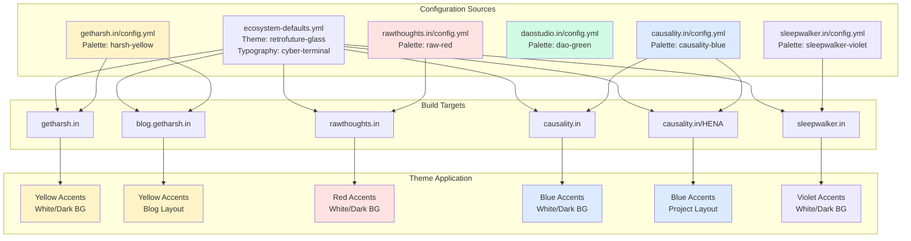
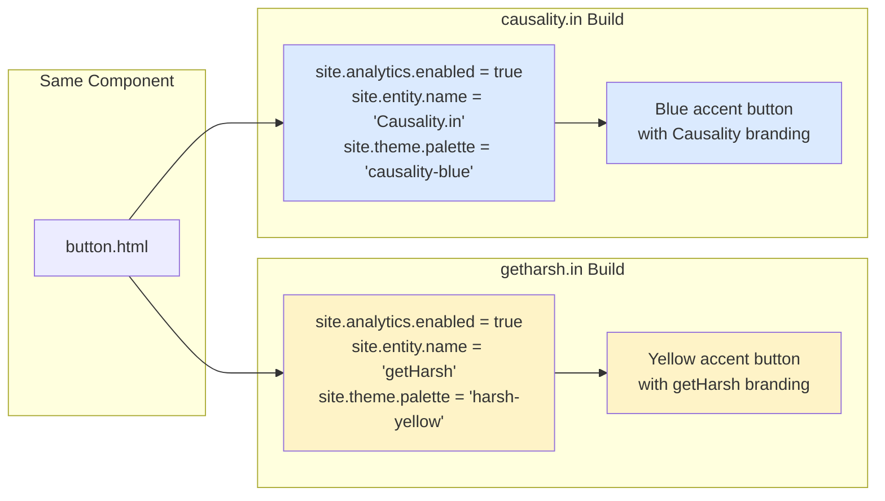
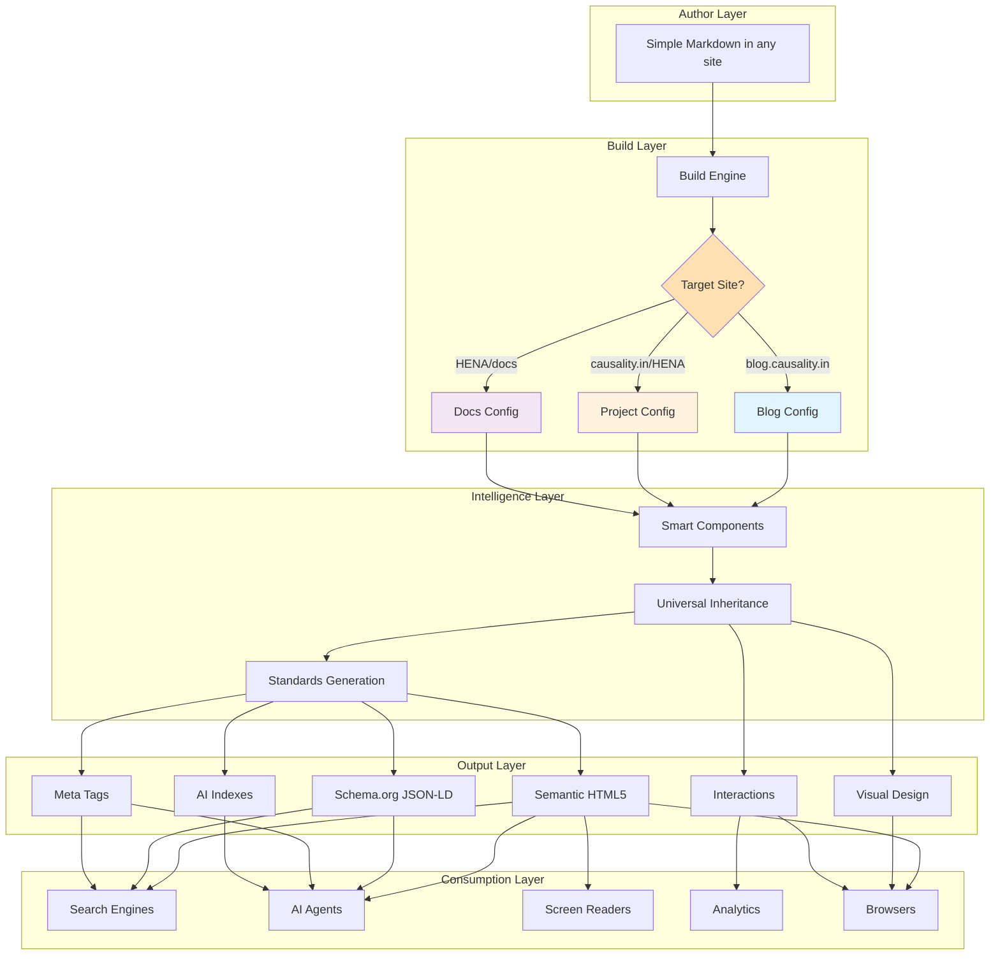

# Jekyll Theme Architecture & Component Specification

## Overview

This specification defines a **Universal Intelligence Component Library** built as a Jekyll theme that serves as the presentation layer for the getHarsh multi-domain ecosystem. The theme provides 57 essential components that implement complete Universal Intelligence integration (ARIA, Analytics, SEO, AI Discovery, Standards, Performance) while maintaining clear architectural boundaries with the getHarsh engine.

## Directory Structure

```
/Users/getharsh/GitHub/Website/getHarsh/     # getHarsh Engine (parent directory)
├── docs/                                    # This specification (you are here)
│   ├── README.md                           # Navigation hub for Jekyll theme specs
│   ├── ARCHITECTURE.md                     # Complete technical architecture
│   ├── COMPONENTS.md                       # Component library overview
│   ├── COMPONENT-TABLE.md                  # Component inventory (57 components)
│   ├── CONTEXT-ENGINE.md                   # Central intelligence core
│   ├── CONTEXT-DETECTION.md                # Detection algorithms
│   ├── CONTEXT-MAPPING.md                  # Mapping rules
│   └── ... (consumer systems: ARIA, SEO, AI, etc.)
│
├── jekyll/                                  # Jekyll Theme Implementation
│   ├── _includes/                          # Component templates
│   │   ├── components/                     # Context engine & utilities
│   │   ├── atoms/                          # 15 atomic components
│   │   ├── molecules/                      # 24 molecule components
│   │   └── organisms/                      # 18 organism components
│   ├── _sass/                              # SCSS architecture
│   │   ├── base/                           # Base layers & responsive
│   │   ├── components/                     # Component styles
│   │   ├── theme-systems/                  # Visual themes
│   │   ├── typography/                     # Typography systems
│   │   └── palettes/                       # Color palettes
│   └── assets/js/                          # JavaScript modules
│       ├── core/                           # Core system modules
│       ├── components/                     # Component behaviors
│       └── theme-systems/                  # Theme enhancements
│
├── config/                                  # Engine configuration
│   ├── ecosystem-defaults.yml              # Base configuration
│   └── schema/                             # Proto schemas
│
└── ... (other engine components)
```

**Key Understanding**:
- **This specification** (`/docs/`) defines the Jekyll theme architecture
- **Implementation** lives in `/jekyll/` directory
- **Engine configuration** in `/config/` is processed by getHarsh engine
- The Jekyll theme is one subsystem within the larger getHarsh engine

### System Architecture Boundaries

**getHarsh Engine Responsibilities** (parent directory: `../`):
- Multi-repository orchestration (5 domains + 5 blogs + N projects)
- Configuration inheritance processing (`../config/ecosystem-defaults.yml` → domain → blog/project)
- Content aggregation from distributed sources (`../master_posts/`)
- Path resolution and absolute path provision
- Build mode management (LOCAL vs PRODUCTION)
- Output placement coordination
- Build scripts and tools (`../version_control.sh`, `../path-utils.sh`, etc.)

**Jekyll Theme System Responsibilities** (implementation: `../jekyll/`):
- Universal Intelligence Component Library implementation (57 components)
- Content processing via absolute paths (path-agnostic)
- Component rendering with multi-layer architecture (Jekyll + SCSS + JavaScript)
- Standards-compliant output generation
- Business model optimization (lead generation focused)
- Theme implementation in `../jekyll/_includes/`, `../jekyll/_sass/`, `../jekyll/assets/js/`

> **Single Source of Truth**: This document serves as the navigation hub. Complete technical details live in the linked specification files below.



## 📚 Documentation Structure

This specification is organized into focused documents:

### 🏗️ [ARCHITECTURE.md](./ARCHITECTURE.md)
**Complete Technical Architecture** *(Single Source of Truth)*
- [Multi-dimensional inheritance system](./ARCHITECTURE.md#4-the-multi-dimensional-inheritance-architecture)
- [Config-driven UI system principles](./ARCHITECTURE.md#1-config-driven-ui-system)
- [Jekyll HTML escaping solution](./ARCHITECTURE.md#2-jekyll-html-escaping-solution)
- [Multi-site build architecture](./ARCHITECTURE.md#multi-site-build-architecture)
- [CSS & JavaScript layer composition](./ARCHITECTURE.md#css--javascript-architecture)
- [Complete theme system breakdown](./ARCHITECTURE.md#layer-2-theme-systems-also-multi-layer)

### 🧩 [COMPONENTS.md](./COMPONENTS.md)
**Complete Component Library** *(Single Source of Truth)*
- [Atomic components with universal intelligence](./COMPONENTS.md#core-principle-atomic-components--universal-intelligence)
- [Layout, content, interactive, and navigation components](./COMPONENTS.md#1-layout-components-foundation)
- [Feature components (consent, search, particles)](./COMPONENTS.md#5-feature-components)
- [Meta components (icons, structured data)](./COMPONENTS.md#6-meta-components)
- [Real-world usage examples](./COMPONENTS.md#the-beauty-of-universal-inheritance-author-simplicity)
- [Component requirements matrix](./COMPONENTS.md#component-requirements-matrix)

### 🧠 [CONTEXT-ENGINE.md](./CONTEXT-ENGINE.md)
**Central Context Engine - Universal Intelligence Core** *(Single Source of Truth)*
- [Multi-source data extraction](./CONTEXT-ENGINE.md#multi-source-data-extraction)
- [Universal context schema](./CONTEXT-ENGINE.md#universal-context-schema)
- [Dynamic field resolution system](./CONTEXT-ENGINE.md#dynamic-field-resolution-system)
- [Semantic intelligence layer](./CONTEXT-ENGINE.md#semantic-intelligence-layer)
- [Content intelligence layer](./CONTEXT-ENGINE.md#content-intelligence-layer)
- [Consumer integration pattern](./CONTEXT-ENGINE.md#consumer-integration-pattern)

### ♿ [ARIA.md](./ARIA.md)
**Deterministic ARIA Generation System** *(Context Consumer)*
- [Universal context to ARIA conversion](./ARIA.md#aria-context-transformation)
- [Rule-based pattern matching system](./ARIA.md#rule-based-pattern-matching-system)
- [Component intelligence patterns](./ARIA.md#component-intelligence-patterns)
- [Form validation integration](./ARIA.md#form-validation-integration)
- [Navigation intelligence](./ARIA.md#navigation-intelligence)
- [Live regions for dynamic content](./ARIA.md#live-regions-for-dynamic-content)

### 📊 [ANALYTICS.md](./ANALYTICS.md)
**Intelligent Semantic Analytics System** *(Context Consumer)*
- [Universal context to analytics conversion](./ANALYTICS.md#analytics-context-transformation)
- [Clean labeling intelligence](./ANALYTICS.md#clean-labeling-intelligence)
- [Google Analytics 4 integration](./ANALYTICS.md#google-analytics-4-2025---rich-event-structure)
- [Facebook Pixel implementation](./ANALYTICS.md#facebook-pixel-2025---intelligent-event-mapping)
- [Journey mapping intelligence](./ANALYTICS.md#journey-mapping-intelligence)
- [Zero-configuration implementation](./ANALYTICS.md#zero-configuration-implementation)

### 🔍 [SEO.md](./SEO.md)
**SEO Meta Tags & Structured Data System** *(Context Consumer)*
- [Universal context to SEO conversion](./SEO.md#seo-context-transformation)
- [Meta tags generation](./SEO.md#meta-tags-generation)
- [Schema.org JSON-LD generation](./SEO.md#schemaorg-json-ld-generation)
- [Open Graph and Twitter Cards](./SEO.md#meta-tags-generation)
- [Implementation integration](./SEO.md#implementation-integration)

### 🤖 [AI.md](./AI.md)
**AI Discovery & Integration System** *(Context Consumer)*
- [Universal context to AI discovery conversion](./AI.md#ai-context-transformation)
- [LLMs.txt generation](./AI.md#llmstxt-generation)
- [AI manifest generation](./AI.md#ai-manifest-generation)
- [Content index generation](./AI.md#content-index-generation)
- [Cross-domain AI intelligence](./AI.md#cross-domain-ai-intelligence)

### 📱 [RESPONSIVE.md](./RESPONSIVE.md)
**Responsive Design Architecture & Universal Intelligence** *(Context Consumer)*
- [Mobile-first breakpoint strategy](./RESPONSIVE.md#mobile-first-breakpoint-strategy)
- [Universal context to device-optimized output](./RESPONSIVE.md#responsive-context-transformation)
- [Device-specific performance optimization](./RESPONSIVE.md#device-specific-performance-optimization)
- [Touch-friendly responsive accessibility](./RESPONSIVE.md#accessibility-responsive-integration)
- [Business model responsive optimization](./RESPONSIVE.md#component-responsive-integration)
- [Component responsive integration patterns](./RESPONSIVE.md#universal-component-responsive-behavior)

### 🏆 [STANDARDS.md](./STANDARDS.md)
**Complete Compliance Guide** *(Single Source of Truth)*
- [Schema.org and structured data implementation](./STANDARDS.md#structured-data-implementation)
- [Multi-repository SEO/AI file distribution](./STANDARDS.md#multi-repository-seoai-file-distribution)
- [Analytics integration (GA4, Meta Pixel)](./STANDARDS.md#analytics-implementation-google-analytics--facebook-pixel)
- [Accessibility (ARIA, WCAG) standards](./STANDARDS.md#accessibility-standards)
- [Progressive Web App (PWA) support](./STANDARDS.md#progressive-web-app-pwa-support)
- [AI discovery (LLMs.txt, manifests)](./STANDARDS.md#ai-discovery-implementation)

## 🎯 Key Features

### **Universal Inheritance**
Every component automatically inherits features from configuration:
- ✅ **Analytics tracking** (ecosystem-level, with consent)
- ✅ **SEO metadata** (Schema.org, Open Graph, Twitter Cards)
- ✅ **AI discovery** (LLMs.txt, AI manifests, structured indexes)
- ✅ **Accessibility** (intelligent ARIA generation)
- ✅ **Theme visual system** (selected at domain level)
- ✅ **Typography system** (complete type scales)
- ✅ **Color palette** (domain-specific accent colors)

### **Zero Configuration Components**
Authors write simple includes, get rich output:

```liquid
<!-- Author writes: -->


<!-- System generates: -->
<button class="btn"
        data-component="button"
        data-track-click="true"        <!-- Universal tracking -->
        aria-label="Learn More"        <!-- Intelligent ARIA -->
        <!-- Plus theme styling, typography, effects -->>
  Learn More
</button>
```

### **Multi-Domain Architecture**
Single component codebase serves infinite site variations:



## 🛠️ Technical Architecture

> **Complete Details**: See [ARCHITECTURE.md](./ARCHITECTURE.md) for full technical specifications

### **Multi-Layer Composition**
```
Result = [Base Component (HTML + SCSS + JS) with Semantic Properties]
       × [Responsive System (SCSS + JS)]
       × [Theme System (SCSS + JS)]
       × [Typography System (SCSS + JS)]
       × [Color Palette (SCSS)]
       × [Syntax System (SCSS)]
       × [Config Inheritance]
```

**Detailed Implementation**: [Multi-dimensional inheritance architecture](./ARCHITECTURE.md#4-the-multi-dimensional-inheritance-architecture)

### **Configuration Simplicity**
```yaml
# This is ALL the configuration needs:
getharsh.in:
  theme:
    system: "retrofuture-glass"  # Retrofuturism + Glassmorphism
    typography: "cyber-terminal" # Terminal + Cyberpunk typography
    palette: "harsh-yellow"      # Yellow accent colors
    syntax: "adaptive"           # Adapts to palette colors
```

**Complete Config Guide**: [Config-driven UI system](./ARCHITECTURE.md#1-config-driven-ui-system)

### **Platform Restrictions**
**IMPORTANT**: This theme engine strictly supports only these platforms:
- **Social Media**: Twitter/X, GitHub, LinkedIn, YouTube, Instagram, HuggingFace, Reddit
- **Community**: Discord, WhatsApp Channels, Email
- **Analytics**: Google Analytics, Meta Pixel (with consent)

No other platforms (Facebook, Pinterest, Disqus, etc.) are supported by design to maintain focus and simplicity.

**Standards Compliance**: [Complete platform restrictions](./ARCHITECTURE.md#platform-restrictions)

## 🌟 Revolutionary Aspects

> **Implementation Details**: See linked specifications below for complete examples

### **1. Configuration-Driven Everything**
```yaml
# One config change affects ENTIRE system:
analytics:
  enabled: false  # ALL tracking stops everywhere!
```
**Learn More**: [Config-driven UI system](./ARCHITECTURE.md#1-config-driven-ui-system)

### **2. Central Context Engine**
```javascript
// Universal context extraction from ALL sources
const universalContext = contextEngine.extract({
  ecosystem: {...}, domain: {...}, project: {...}, 
  page: {...}, component: {...}, theme: {...}
});
```
**Learn More**: [Central Context Engine](./CONTEXT-ENGINE.md)

### **3. Modular Intelligence Systems**
```liquid
<!-- Author writes: -->


<!-- Context Engine extracts rich context -->
<!-- Each system transforms context for its specific standards -->
aria-label="Download, PDF document, will download file"        <!-- ARIA -->
data-analytics-event="download" data-category="content"        <!-- Analytics -->
<meta property="og:type" content="article">                    <!-- SEO -->
# Content: Technical guide for developers                      <!-- AI Discovery -->
```
**Universal Intelligence**: All systems consume from [Central Context Engine](./CONTEXT-ENGINE.md)

### **4. Standards Compliance Through Context**
- **Central Intelligence**: [Universal context extraction](./CONTEXT-ENGINE.md)
- **Responsive Architecture**: [Context-to-device transformation](./RESPONSIVE.md)
- **Deterministic ARIA**: [Context-to-accessibility transformation](./ARIA.md)
- **Intelligent Analytics**: [Context-to-analytics transformation](./ANALYTICS.md)
- **SEO Optimization**: [Context-to-SEO transformation](./SEO.md)
- **AI Discovery**: [Context-to-AI transformation](./AI.md)
- **Complete Standards**: [Implementation compliance](./STANDARDS.md)

## 🚀 Getting Started

1. **Understand Integration**: Start with [SYSTEM-INTEGRATION.md](./SYSTEM-INTEGRATION.md) to understand getHarsh engine boundaries
2. **Read the Architecture**: Continue with [ARCHITECTURE.md](./ARCHITECTURE.md) to understand the multi-layer system
3. **Explore Components**: Review [COMPONENTS.md](./COMPONENTS.md) for the complete component library
4. **Check Standards**: See [STANDARDS.md](./STANDARDS.md) for compliance requirements
5. **Configure Your Domain**: Set up your `config.yml` with theme selections (handled by getHarsh engine)
6. **Start Building**: Use simple component includes to create rich pages

## 📊 Architecture Overview



## 🎯 The Magic Formula

```
Simple Input × Intelligent Components × Universal Inheritance = Rich Semantic Output
```

Where:
- **Simple Input** = Basic markdown with minimal front matter
- **Intelligent Components** = Auto-generate all standards-compliant markup ([Component Library](./COMPONENTS.md))
- **Universal Inheritance** = Features cascade from config automatically ([Architecture](./ARCHITECTURE.md))
- **Rich Semantic Output** = Complete HTML5 + Schema.org + Meta tags + AI discovery ([Standards](./STANDARDS.md))

The result is a maintainable, flexible, and infinitely customizable system where changing a single configuration value can transform an entire ecosystem of websites while maintaining perfect consistency and standards compliance.

> **Complete Technical Details**: Each aspect is fully documented in the linked specification files above

## Implementation Reference

### Specification vs Implementation

| Specification (This Directory) | Implementation | Purpose |
|-------------------------------|----------------|----------|
| `/docs/README.md` | `../jekyll/README.md` | Navigation hub vs Usage guide |
| `/docs/ARCHITECTURE.md` | `../jekyll/_config.yml` | Architecture spec vs Jekyll config |
| `/docs/COMPONENTS.md` | `../jekyll/_includes/` | Component specs vs Templates |
| `/docs/COMPONENT-TABLE.md` | `../jekyll/_includes/components/` | Component inventory vs Files |
| `/docs/CONTEXT-ENGINE.md` | `../jekyll/_includes/components/context-engine.html` | Engine spec vs Implementation |
| `/docs/theme-systems/` | `../jekyll/_sass/theme-systems/` | Theme specs vs SCSS files |
| `/docs/typography/` | `../jekyll/_sass/typography/` | Type specs vs Font systems |
| `/docs/palettes/` | `../jekyll/_sass/palettes/` | Color specs vs Palette files |

### Key Paths for Development

**When implementing components**:
```bash
# Specification location
/Users/getharsh/GitHub/Website/getHarsh/docs/COMPONENTS/

# Implementation location  
/Users/getharsh/GitHub/Website/getHarsh/jekyll/_includes/
├── atoms/
├── molecules/
└── organisms/
```

**When implementing styles**:
```bash
# Architecture specification
/Users/getharsh/GitHub/Website/getHarsh/docs/ARCHITECTURE.md

# SCSS implementation
/Users/getharsh/GitHub/Website/getHarsh/jekyll/_sass/
├── base/           # Base layers
├── components/     # Component styles
├── theme-systems/  # Visual themes
├── typography/     # Type systems
└── palettes/       # Color systems
```

**When implementing JavaScript**:
```bash
# Module specification
/Users/getharsh/GitHub/Website/getHarsh/docs/JAVASCRIPT-MODULES.md

# JavaScript implementation
/Users/getharsh/GitHub/Website/getHarsh/jekyll/assets/js/
├── core/           # Context system, base classes
├── components/     # Component behaviors
└── theme-systems/  # Theme enhancements
```

### Integration with getHarsh Engine

The Jekyll theme receives processed configuration from the getHarsh engine:

```yaml
# Engine provides (../config/ecosystem-defaults.yml → processed)
site:
  theme:
    system: "retrofuture-glass"
    typography: "cyber-terminal"
    palette: "harsh-yellow"
  
# Jekyll theme consumes (../jekyll/_config.yml receives)
theme: {{ site.theme.system }}
typography: {{ site.theme.typography }}
palette: {{ site.theme.palette }}
```

---

*This specification defines not just a theme, but a complete **multi-dimensional component architecture** that achieves the perfect balance of simplicity for authors and richness for consumers.*