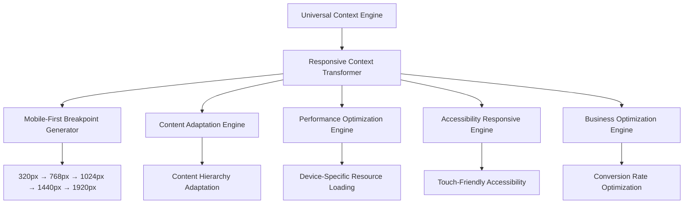

# Responsive Design Architecture & Universal Intelligence Integration

## Overview

The **Responsive Design Architecture** is a **pure transformation layer** that provides comprehensive responsive behavior for all components in the Universal Intelligence Component Library. This system ensures optimal user experience across all device types while maintaining performance, accessibility, and business optimization goals.

**Pure Transformation**: This system contains NO content detection logic - all device type determination, breakpoint selection, and connection speed assessment for content decisions happens in the Context Engine. The only detection remaining is for real-time viewport measurements and browser API access.

**Universal Context Source**: All responsive decisions leverage the [Central Context Engine](./CONTEXT-ENGINE.md) for intelligent breakpoint selection, content adaptation, and device-specific optimization.

> **Context Details**: See [CONTEXT-ENGINE.md](./CONTEXT-ENGINE.md) for complete multi-dimensional context extraction powering responsive intelligence

## Responsive Context Transformation

### Universal Context to Device-Optimized Output

The Responsive system receives universal context and transforms it for optimal display across all viewport sizes:



## Mobile-First Breakpoint Strategy

### Base Responsive Layer (SCSS)

**CRITICAL**: This is the single source of truth for ALL responsive breakpoints in the Jekyll theme. Components MUST use these mixins - they NEVER define their own media queries.

```scss
// _sass/base/_responsive.scss - The foundation of responsive design
:root {
  // Mobile-first breakpoint definitions - DEFINE ONCE, USE EVERYWHERE
  --breakpoint-mobile-min: 320px;
  --breakpoint-mobile-max: 767px;
  --breakpoint-tablet-min: 768px;
  --breakpoint-tablet-max: 1023px;
  --breakpoint-desktop-min: 1024px;
  --breakpoint-desktop-max: 1439px;
  --breakpoint-large-min: 1440px;
  --breakpoint-large-max: 1919px;
  --breakpoint-xl-min: 1920px;
  
  // Responsive spacing system - fluid values that scale with viewport
  --space-xs: clamp(0.25rem, 1vw, 0.5rem);
  --space-sm: clamp(0.5rem, 2vw, 0.75rem);
  --space-md: clamp(0.75rem, 3vw, 1rem);
  --space-lg: clamp(1rem, 4vw, 1.5rem);
  --space-xl: clamp(1.5rem, 5vw, 2rem);
  --space-2xl: clamp(2rem, 6vw, 3rem);
  --space-3xl: clamp(3rem, 8vw, 4rem);
  
  // Touch target sizes - WCAG 2.2 compliance
  --touch-target-min: 44px;        // WCAG 2.2 AA minimum
  --touch-target-recommended: 48px; // Better UX on mobile
  --touch-target-spacing: 8px;      // Minimum space between targets
  
  // Container widths for consistent layouts
  --container-mobile: 100%;
  --container-tablet: 90%;
  --container-desktop: 85%;
  --container-large: 80%;
  --container-max: 1440px;
  
  // Responsive typography scale ratios
  --scale-ratio-mobile: 1.125;   // Major second
  --scale-ratio-tablet: 1.2;     // Minor third
  --scale-ratio-desktop: 1.25;   // Major third
  --scale-ratio-large: 1.333;    // Perfect fourth
}

// SCSS Mixins - The approved way to handle responsive design
// Mobile-only (up to 767px)
@mixin mobile {
  @media (max-width: #{var(--breakpoint-mobile-max)}) {
    @content;
  }
}

// Tablet-only (768px to 1023px)
@mixin tablet {
  @media (min-width: #{var(--breakpoint-tablet-min)}) and (max-width: #{var(--breakpoint-tablet-max)}) {
    @content;
  }
}

// Desktop-only (1024px to 1439px)
@mixin desktop {
  @media (min-width: #{var(--breakpoint-desktop-min)}) and (max-width: #{var(--breakpoint-desktop-max)}) {
    @content;
  }
}

// Large screens only (1440px to 1919px)
@mixin large {
  @media (min-width: #{var(--breakpoint-large-min)}) and (max-width: #{var(--breakpoint-large-max)}) {
    @content;
  }
}

// Extra large screens (1920px+)
@mixin xl {
  @media (min-width: #{var(--breakpoint-xl-min)}) {
    @content;
  }
}

// Progressive enhancement mixins - mobile-first approach
@mixin tablet-up {
  @media (min-width: #{var(--breakpoint-tablet-min)}) {
    @content;
  }
}

@mixin desktop-up {
  @media (min-width: #{var(--breakpoint-desktop-min)}) {
    @content;
  }
}

@mixin large-up {
  @media (min-width: #{var(--breakpoint-large-min)}) {
    @content;
  }
}

// Container mixin for consistent max-widths
@mixin container {
  width: var(--container-mobile);
  max-width: var(--container-max);
  margin-left: auto;
  margin-right: auto;
  padding-left: var(--space-md);
  padding-right: var(--space-md);
  
  @include tablet-up {
    width: var(--container-tablet);
    padding-left: var(--space-lg);
    padding-right: var(--space-lg);
  }
  
  @include desktop-up {
    width: var(--container-desktop);
    padding-left: var(--space-xl);
    padding-right: var(--space-xl);
  }
  
  @include large-up {
    width: var(--container-large);
  }
}

// Touch-friendly mixin for mobile interactions
@mixin touch-friendly {
  min-height: var(--touch-target-min);
  min-width: var(--touch-target-min);
  
  // Increase tap target on mobile without affecting visual size
  @include mobile {
    position: relative;
    
    &::before {
      content: '';
      position: absolute;
      top: 50%;
      left: 50%;
      transform: translate(-50%, -50%);
      width: var(--touch-target-recommended);
      height: var(--touch-target-recommended);
      min-width: var(--touch-target-recommended);
      min-height: var(--touch-target-recommended);
    }
  }
}

// Responsive visibility utilities
@mixin mobile-only {
  @include tablet-up {
    display: none !important;
  }
}

@mixin tablet-only {
  @include mobile {
    display: none !important;
  }
  @include desktop-up {
    display: none !important;
  }
}

@mixin desktop-only {
  @media (max-width: #{var(--breakpoint-tablet-max)}) {
    display: none !important;
  }
}

// Responsive text truncation
@mixin truncate-lines($lines: 1) {
  overflow: hidden;
  text-overflow: ellipsis;
  
  @if $lines == 1 {
    white-space: nowrap;
  } @else {
    display: -webkit-box;
    -webkit-line-clamp: $lines;
    -webkit-box-orient: vertical;
    white-space: normal;
  }
}
```

### Component Usage Patterns

**❌ NEVER DO THIS** (hardcoded breakpoints):

```scss
// BAD - Duplicated breakpoint values
.btn {
  padding: 0.75rem 1.5rem;
  
  @media (max-width: 768px) {
    padding: 0.5rem 1rem;
  }
}

.card {
  padding: 1.5rem;
  
  @media (max-width: 768px) { // Same breakpoint hardcoded again!
    padding: 1rem;
  }
}
```

**✅ ALWAYS DO THIS** (use mixins):

```scss
// GOOD - Using responsive mixins and variables
.btn {
  padding: var(--space-md) var(--space-lg);
  
  @include mobile {
    padding: var(--space-sm) var(--space-md);
    @include touch-friendly; // Ensures WCAG compliance
  }
  
  @include tablet-up {
    padding: var(--space-md) var(--space-xl);
  }
}

.card {
  padding: var(--space-xl);
  
  @include mobile {
    padding: var(--space-md);
  }
  
  @include desktop-up {
    padding: var(--space-2xl);
  }
}
```

### Responsive Component Architecture

```scss
// Example: Complete responsive component using the system
.hero-section {
  // Mobile-first base styles
  @include container;
  padding-top: var(--space-2xl);
  padding-bottom: var(--space-2xl);
  
  // Progressive enhancement
  @include tablet-up {
    padding-top: var(--space-3xl);
    padding-bottom: var(--space-3xl);
  }
  
  @include desktop-up {
    display: grid;
    grid-template-columns: 1fr 1fr;
    gap: var(--space-2xl);
    align-items: center;
  }
  
  &__title {
    font-size: clamp(1.5rem, 5vw, 3rem);
    line-height: 1.2;
    margin-bottom: var(--space-md);
    
    @include desktop-up {
      font-size: clamp(2rem, 4vw, 4rem);
      line-height: 1.1;
    }
  }
  
  &__cta {
    @include touch-friendly;
    width: 100%;
    
    @include tablet-up {
      width: auto;
      display: inline-block;
    }
  }
}
```

### Context-Driven Breakpoint System

```javascript
class ResponsiveContextTransformer {
  constructor(universalContext) {
    this.context = universalContext;
    this.cache = new Map(); // Performance: Cache responsive configs
  }
  
  generateResponsiveStrategy() {
    // Performance: Return cached result if available
    const cacheKey = 'responsive_strategy';
    if (this.cache.has(cacheKey)) {
      return this.cache.get(cacheKey);
    }
    
    try {
      const { semantics, content, business, technical, sources } = this.context;
      
      const strategy = {
        // Mobile-first breakpoints
        breakpoints: this.generateBreakpoints(),
        
        // Content adaptation rules
        contentAdaptation: this.generateContentAdaptation(),
        
        // Navigation responsive behavior
        navigationStrategy: this.generateNavigationStrategy(),
        
        // Typography scaling
        typographyScaling: this.generateTypographyScaling(),
        
        // Image responsive behavior
        imageStrategy: this.generateImageStrategy(),
        
        // Business-specific responsive optimization
        businessOptimization: this.generateBusinessOptimization()
      };
      
      // Performance: Cache the result
      this.cache.set(cacheKey, strategy);
      return strategy;
      
    } catch (error) {
      console.error('Responsive strategy generation failed:', error);
      // Robustness: Return minimal responsive configuration
      return this.getMinimalResponsiveConfig();
    }
  }
  
  // Context-aware breakpoint generation
  generateBreakpoints() {
    const { business, content, sources } = this.context;
    
    return {
      // Standard mobile-first breakpoints
      mobile: {
        min: '320px',
        max: '767px',
        target: 'mobile-phones',
        priority: 'performance', // Critical for business
        optimizations: ['reduce-content', 'simplify-navigation', 'enlarge-touch-targets']
      },
      tablet: {
        min: '768px', 
        max: '1023px',
        target: 'tablets-small-laptops',
        priority: 'balance', // Balance content and performance
        optimizations: ['adapt-layout', 'show-more-content', 'hybrid-navigation']
      },
      desktop: {
        min: '1024px',
        max: '1439px', 
        target: 'laptops-desktops',
        priority: 'content', // Full feature set
        optimizations: ['full-layout', 'sidebar-content', 'advanced-navigation']
      },
      large: {
        min: '1440px',
        max: '1919px',
        target: 'large-screens',
        priority: 'enhancement', // Enhanced experience
        optimizations: ['wider-containers', 'more-whitespace', 'enhanced-typography']
      },
      xl: {
        min: '1920px',
        target: 'ultra-wide-4k',
        priority: 'optimization', // Prevent over-stretching
        optimizations: ['max-container-width', 'optimal-line-length', 'enhanced-spacing']
      }
    };
  }
  
  // Business model aware content adaptation
  generateContentAdaptation() {
    const { business, semantics } = this.context;
    
    return {
      // Lead generation priority on mobile
      mobile: {
        prioritizeContactCTAs: business.conversionType === 'lead_generation',
        simplifyNavigation: true,
        reduceImageSizes: true,
        stackLayoutVertically: true,
        hideNonEssentialContent: true,
        optimizeFormFields: business.conversionType !== 'content_engagement'
      },
      
      // Balanced approach on tablet
      tablet: {
        showSecondaryContent: true,
        useHybridNavigation: true,
        optimizeImageSizes: true,
        useTwoColumnLayout: semantics.contentType !== 'tutorial',
        showRelatedContent: true
      },
      
      // Full experience on desktop
      desktop: {
        showAllContent: true,
        useAdvancedNavigation: true,
        enableSidebars: true,
        useMultiColumnLayouts: true,
        showAdvancedInteractions: true,
        enableHoverEffects: true
      },
      
      // Enhanced experience on large screens
      large: {
        useWiderContainers: true,
        increaseWhitespace: true,
        enhanceTypography: true,
        showAdditionalContext: true,
        enableAdvancedAnimations: true
      }
    };
  }
  
  // Context-driven navigation responsive strategy
  generateNavigationStrategy() {
    const { business, content } = this.context;
    
    return {
      mobile: {
        type: 'hamburger',
        position: 'top-right',
        overlay: true,
        animation: 'slide-in',
        prioritizeBusinessLinks: business.conversionType === 'lead_generation',
        maxMenuItems: 6,
        showContactButton: true,
        buttonSize: 'large' // Touch-friendly
      },
      
      tablet: {
        type: 'hybrid',
        primaryVisible: true,
        secondaryCollapsed: true,
        showBreadcrumbs: content.depth > 1,
        buttonSize: 'medium'
      },
      
      desktop: {
        type: 'full',
        showAllLevels: true,
        enableDropdowns: true,
        showSearchBox: true,
        enableKeyboardNav: true,
        buttonSize: 'standard'
      }
    };
  }
  
  // Performance-optimized typography scaling
  generateTypographyScaling() {
    const { semantics, content } = this.context;
    
    return {
      // Fluid typography with performance optimization
      fluidTypography: {
        enabled: true,
        method: 'clamp', // CSS clamp() for performance
        baseSize: semantics.audience?.includes('developer') ? '16px' : '18px'
      },
      
      scaling: {
        mobile: {
          baseFont: '16px',
          scaleRatio: 1.125, // Major second
          lineHeight: 1.6,
          maxWidth: '75ch' // Optimal reading length
        },
        tablet: {
          baseFont: '17px', 
          scaleRatio: 1.2, // Minor third
          lineHeight: 1.5,
          maxWidth: '70ch'
        },
        desktop: {
          baseFont: '18px',
          scaleRatio: 1.25, // Major third  
          lineHeight: 1.4,
          maxWidth: '65ch'
        }
      },
      
      // Content-specific adjustments
      contentOptimization: {
        tutorial: {
          codeBlocks: {
            mobile: { fontSize: '14px', overflow: 'scroll' },
            tablet: { fontSize: '15px', overflow: 'auto' },
            desktop: { fontSize: '16px', overflow: 'visible' }
          }
        },
        blog: {
          readingExperience: {
            mobile: { fontSize: '18px', lineHeight: 1.7 },
            tablet: { fontSize: '19px', lineHeight: 1.6 },
            desktop: { fontSize: '20px', lineHeight: 1.5 }
          }
        }
      }
    };
  }
  
  // Intelligent image responsive strategy
  generateImageStrategy() {
    const { performance, content } = this.context;
    
    return {
      // Performance-optimized responsive images
      responsiveImages: {
        enabled: true,
        formats: ['avif', 'webp', 'jpg'], // Progressive enhancement
        lazyLoading: {
          mobile: true, // Critical for mobile performance
          tablet: true,
          desktop: performance.connectionSpeed !== 'fast'
        }
      },
      
      // Device-specific sizing
      sizing: {
        mobile: {
          maxWidth: '100vw',
          heights: 'auto',
          aspectRatio: 'preserve',
          compression: 'high'
        },
        tablet: {
          maxWidth: '90vw', 
          heights: 'optimized',
          aspectRatio: 'adaptive',
          compression: 'medium'
        },
        desktop: {
          maxWidth: '80vw',
          heights: 'original',
          aspectRatio: 'original', 
          compression: 'low'
        }
      },
      
      // Content-specific optimization
      contentOptimization: {
        hero: {
          mobile: { width: '100vw', height: '40vh' },
          tablet: { width: '100vw', height: '50vh' },
          desktop: { width: '100vw', height: '60vh' }
        },
        gallery: {
          mobile: { columns: 1, gap: '0.5rem' },
          tablet: { columns: 2, gap: '1rem' },
          desktop: { columns: 3, gap: '1.5rem' }
        },
        thumbnail: {
          mobile: { size: '80px' },
          tablet: { size: '100px' },
          desktop: { size: '120px' }
        }
      }
    };
  }
  
  // Business model responsive optimization
  generateBusinessOptimization() {
    const { business } = this.context;
    
    return {
      // Lead generation focused optimizations
      leadGeneration: business.conversionType === 'lead_generation' ? {
        mobile: {
          stickyContactButton: true,
          reducedFormFields: true,
          prominentPhoneNumber: true,
          simplifiedCalendarView: true
        },
        tablet: {
          sidebarContactForm: false, // Not enough space
          inlineContactPrompts: true,
          expandedCalendarView: true
        },
        desktop: {
          sidebarContactForm: true,
          multipleContactOptions: true,
          fullCalendarView: true,
          chatWidget: true
        }
      } : null,
      
      // Appointment booking optimizations  
      appointmentBooking: business.conversionType === 'appointment_booking' ? {
        mobile: {
          fullScreenCalendar: true,
          simplifiedTimeSlots: true,
          oneClickBooking: false // Prevent accidental bookings
        },
        tablet: {
          sideBySideCalendar: true,
          detailedTimeSlots: true, 
          confirmationStep: true
        },
        desktop: {
          advancedCalendarView: true,
          multipleServiceOptions: true,
          instantBookingEnabled: true
        }
      } : null,
      
      // Project sponsorship optimizations
      projectSponsorship: business.conversionType === 'project_sponsorship' ? {
        mobile: {
          prominentSponsorButton: true,
          simplifiedAmountSelection: true,
          trustSignals: ['paypal-logo']
        },
        tablet: {
          sponsorshipTiers: true,
          projectProgress: true,
          trustSignals: ['paypal-logo', 'secure-badges']
        },
        desktop: {
          detailedSponsorship: true,
          multiplePaymentOptions: true,
          socialProof: true,
          trustSignals: ['paypal-logo', 'secure-badges', 'testimonials']
        }
      } : null
    };
  }
}
```

## Device-Specific Performance Optimization

### Connection-Aware Resource Loading

```javascript
class ResponsivePerformanceOptimizer {
  constructor(responsiveContext) {
    this.context = responsiveContext;
    this.connectionInfo = navigator.connection || navigator.mozConnection || navigator.webkitConnection;
    this.cache = new Map();
  }
  
  optimizeForDevice() {
    try {
      const deviceType = this.detectDeviceType();
      const connectionSpeed = this.assessConnectionSpeed();
      
      return {
        // Resource loading strategy
        resourceLoading: this.getResourceLoadingStrategy(deviceType, connectionSpeed),
        
        // Image optimization
        imageOptimization: this.getImageOptimization(deviceType, connectionSpeed),
        
        // JavaScript optimization
        scriptOptimization: this.getScriptOptimization(deviceType),
        
        // CSS optimization
        styleOptimization: this.getStyleOptimization(deviceType)
      };
      
    } catch (error) {
      console.error('Device optimization failed:', error);
      return this.getFallbackOptimization();
    }
  }
  
  // Performance: Device viewport detection with caching
  // Note: This is real-time viewport detection, not content analysis
  detectDeviceType() {
    const cacheKey = 'device_type';
    if (this.cache.has(cacheKey)) {
      return this.cache.get(cacheKey);
    }
    
    try {
      const width = window.innerWidth;
      const height = window.innerHeight;
      const touchSupport = 'ontouchstart' in window;
      const orientation = width > height ? 'landscape' : 'portrait';
      
      let deviceType;
      if (width < 768) {
        deviceType = 'mobile';
      } else if (width < 1024) {
        deviceType = touchSupport ? 'tablet' : 'small-laptop';
      } else if (width < 1440) {
        deviceType = 'desktop';
      } else {
        deviceType = 'large-screen';
      }
      
      const result = {
        type: deviceType,
        width,
        height,
        orientation,
        touchSupport,
        pixelDensity: window.devicePixelRatio || 1
      };
      
      this.cache.set(cacheKey, result);
      return result;
      
    } catch (error) {
      console.error('Device detection failed:', error);
      return { type: 'desktop', width: 1024, height: 768, touchSupport: false };
    }
  }
  
  // Performance: Connection speed measurement
  // Note: This is infrastructure measurement for performance optimization
  assessConnectionSpeed() {
    try {
      if (this.connectionInfo) {
        const { effectiveType, downlink, rtt } = this.connectionInfo;
        
        // Modern Network Information API
        if (effectiveType) {
          switch (effectiveType) {
            case 'slow-2g': return 'very-slow';
            case '2g': return 'slow';
            case '3g': return 'medium';
            case '4g': return 'fast';
            default: return 'medium';
          }
        }
        
        // Fallback to bandwidth/latency analysis
        if (downlink && rtt) {
          if (downlink > 10 && rtt < 100) return 'fast';
          if (downlink > 1.5 && rtt < 300) return 'medium'; 
          return 'slow';
        }
      }
      
      // Fallback: Assume medium connection
      return 'medium';
      
    } catch (error) {
      console.error('Connection assessment failed:', error);
      return 'medium';
    }
  }
  
  // Device-specific resource loading
  getResourceLoadingStrategy(deviceType, connectionSpeed) {
    const strategies = {
      mobile: {
        'very-slow': {
          criticalOnly: true,
          lazyLoadEverything: true,
          compressImages: 'maximum',
          deferNonEssential: true
        },
        'slow': {
          essentialFirst: true,
          aggressiveLazyLoad: true,
          compressImages: 'high',
          deferSecondary: true
        },
        'medium': {
          prioritizeVisible: true,
          lazyLoadBelowFold: true,
          compressImages: 'medium',
          loadSecondaryOnIdle: true
        },
        'fast': {
          preloadCritical: true,
          lazyLoadNonVisible: true,
          compressImages: 'low',
          loadSecondaryEager: true
        }
      },
      
      tablet: {
        'slow': {
          prioritizeContent: true,
          lazyLoadImages: true,
          compressImages: 'medium',
          deferEnhancements: true
        },
        'medium': {
          balancedLoading: true,
          lazyLoadBelowFold: true,
          compressImages: 'low',
          loadEnhancementsOnIdle: true
        },
        'fast': {
          preloadNext: true,
          lazyLoadFarContent: true,
          optimizeImages: true,
          loadEnhancementsEager: true
        }
      },
      
      desktop: {
        'slow': {
          contentFirst: true,
          lazyLoadSecondary: true,
          optimizeImages: true,
          deferNonCritical: true
        },
        'medium': {
          standardLoading: true,
          lazyLoadDistant: true,
          standardImages: true,
          loadNormalPriority: true
        },
        'fast': {
          preloadAggressive: true,
          eagerLoadVisible: true,
          highQualityImages: true,
          loadAllFeatures: true
        }
      }
    };
    
    return strategies[deviceType.type]?.[connectionSpeed] || strategies.desktop.medium;
  }
}
```

## Accessibility Responsive Integration

### Touch-Friendly Responsive Accessibility

```javascript
class ResponsiveAccessibilityOptimizer {
  constructor(responsiveContext) {
    this.context = responsiveContext;
    this.touchSupport = 'ontouchstart' in window;
  }
  
  generateAccessibilityOptimizations() {
    const deviceType = this.context.deviceType;
    
    return {
      // Touch target optimization
      touchTargets: this.optimizeTouchTargets(deviceType),
      
      // Focus management 
      focusManagement: this.optimizeFocusManagement(deviceType),
      
      // Screen reader optimization
      screenReaderOptimization: this.optimizeScreenReader(deviceType),
      
      // Keyboard navigation
      keyboardNavigation: this.optimizeKeyboardNav(deviceType)
    };
  }
  
  // Device-specific touch target optimization
  optimizeTouchTargets(deviceType) {
    const touchOptimizations = {
      mobile: {
        minSize: '44px', // WCAG 2.2 minimum
        recommendedSize: '48px',
        spacing: '8px',
        hitAreaExpansion: true,
        hoverStateHandling: 'remove' // No hover on touch
      },
      
      tablet: {
        minSize: '44px',
        recommendedSize: '44px', 
        spacing: '6px',
        hitAreaExpansion: true,
        hoverStateHandling: 'conditional' // Hybrid devices
      },
      
      desktop: {
        minSize: '24px', // Mouse precision
        recommendedSize: '32px',
        spacing: '4px', 
        hitAreaExpansion: false,
        hoverStateHandling: 'full' // Full hover support
      }
    };
    
    return touchOptimizations[deviceType.type] || touchOptimizations.desktop;
  }
  
  // Responsive focus management
  optimizeFocusManagement(deviceType) {
    return {
      mobile: {
        focusVisibleStrategy: 'always-visible',
        focusRingSize: 'large',
        skipLinkBehavior: 'prominent',
        modalFocusTrap: 'strict',
        keyboardShortcuts: 'essential-only'
      },
      
      tablet: {
        focusVisibleStrategy: 'keyboard-only',
        focusRingSize: 'medium',
        skipLinkBehavior: 'standard',
        modalFocusTrap: 'lenient',
        keyboardShortcuts: 'common'
      },
      
      desktop: {
        focusVisibleStrategy: 'keyboard-only',
        focusRingSize: 'standard',
        skipLinkBehavior: 'keyboard-triggered',
        modalFocusTrap: 'flexible',
        keyboardShortcuts: 'full'
      }
    }[deviceType.type] || {};
  }
}
```

## Component Responsive Integration

### Universal Component Responsive Behavior

```liquid
<!-- Responsive component integration pattern -->

  Universal responsive behavior for all components
  Automatically applied through Central Context Engine


<!-- Generate responsive context for component -->


<!-- Component with responsive intelligence -->
<div class="component-wrapper"
     data-component="{{ component_name }}"
     data-responsive-strategy="{{ responsive_context.strategy }}"
     
     <!-- Mobile-first responsive classes -->
     class="
       {{ component_name }} 
       {{ component_name }}--mobile-first
       {{ component_name }}--mobile
       {{ component_name }}--tablet
       {{ component_name }}--desktop
     "
     
     <!-- Performance: Responsive loading strategy -->
     data-loading-strategy="{{ responsive_context.performance.loadingStrategy }}"
     data-image-strategy="{{ responsive_context.performance.imageStrategy }}"
     
     <!-- Accessibility: Touch and keyboard optimization -->
     data-touch-optimized="{{ responsive_context.accessibility.touchOptimized }}"
     data-keyboard-nav="{{ responsive_context.accessibility.keyboardOptimized }}"
     
     <!-- Business: Conversion optimization -->
     data-conversion-optimized="{{ responsive_context.business.conversionOptimized }}">
  
  <!-- Component content with responsive behavior -->
  {{ component_content }}
  
</div>

<!-- Performance: Responsive CSS with mobile-first approach -->
<style>
/* Mobile-first base styles (320px+) */
.{{ component_name }} {
  /* Essential mobile styles */
  {{ responsive_context.styles.mobile | base_styles }}
}

/* Tablet enhancement (768px+) */
@media (min-width: 768px) {
  .{{ component_name }} {
    {{ responsive_context.styles.tablet | enhancement_styles }}
  }
}

/* Desktop enhancement (1024px+) */  
@media (min-width: 1024px) {
  .{{ component_name }} {
    {{ responsive_context.styles.desktop | enhancement_styles }}
  }
}

/* Large screen optimization (1440px+) */
@media (min-width: 1440px) {
  .{{ component_name }} {
    {{ responsive_context.styles.large | optimization_styles }}
  }
}

/* Ultra-wide prevention (1920px+) */
@media (min-width: 1920px) {
  .{{ component_name }} {
    {{ responsive_context.styles.xl | constraint_styles }}
  }
}

/* Performance: Reduced motion preferences */
@media (prefers-reduced-motion: reduce) {
  .{{ component_name }} {
    animation-duration: 0.01ms !important;
    animation-iteration-count: 1 !important;
    transition-duration: 0.01ms !important;
  }
}

/* Accessibility: High contrast mode */
@media (prefers-contrast: high) {
  .{{ component_name }} {
    {{ responsive_context.styles.highContrast | contrast_styles }}
  }
}
</style>

<!-- Performance: Responsive JavaScript with device detection -->
<script>
(function() {
  'use strict';
  
  class ResponsiveComponentBehavior {
    constructor(element) {
      this.element = element;
      this.componentName = '{{ component_name }}';
      this.responsiveContext = {{ responsive_context | jsonify }};
      this.currentBreakpoint = null;
      this.resizeTimeout = null;
    }
    
    init() {
      try {
        // Performance: Initial breakpoint detection
        this.detectBreakpoint();
        this.applyBreakpointBehavior();
        
        // Performance: Debounced resize handler
        window.addEventListener('resize', this.handleResize.bind(this));
        
        // Performance: Orientation change handling
        window.addEventListener('orientationchange', this.handleOrientationChange.bind(this));
        
      } catch (error) {
        console.error(`Responsive initialization failed for ${this.componentName}:`, error);
      }
    }
    
    // Performance: Efficient viewport breakpoint detection with caching
    // Note: This is real-time viewport measurement for responsive CSS
    detectBreakpoint() {
      try {
        const width = window.innerWidth;
        let breakpoint;
        
        if (width < 768) {
          breakpoint = 'mobile';
        } else if (width < 1024) {
          breakpoint = 'tablet'; 
        } else if (width < 1440) {
          breakpoint = 'desktop';
        } else if (width < 1920) {
          breakpoint = 'large';
        } else {
          breakpoint = 'xl';
        }
        
        // Performance: Only update if breakpoint changed
        if (this.currentBreakpoint !== breakpoint) {
          this.currentBreakpoint = breakpoint;
          this.onBreakpointChange(breakpoint);
        }
        
      } catch (error) {
        console.error('Breakpoint detection failed:', error);
        this.currentBreakpoint = 'desktop'; // Safe fallback
      }
    }
    
    // Performance: Debounced resize handling
    handleResize() {
      clearTimeout(this.resizeTimeout);
      
      this.resizeTimeout = setTimeout(() => {
        try {
          this.detectBreakpoint();
          this.optimizeForViewport();
        } catch (error) {
          console.error('Resize handling failed:', error);
        }
      }, 150); // 150ms debounce for performance
    }
    
    // Performance: Orientation change optimization
    handleOrientationChange() {
      setTimeout(() => {
        try {
          this.detectBreakpoint();
          this.optimizeForOrientation();
        } catch (error) {
          console.error('Orientation change handling failed:', error);
        }
      }, 100); // Small delay for accurate viewport detection
    }
    
    // Business: Breakpoint-specific behavior
    onBreakpointChange(breakpoint) {
      try {
        const breakpointConfig = this.responsiveContext[breakpoint];
        if (!breakpointConfig) return;
        
        // Update element classes
        this.updateBreakpointClasses(breakpoint);
        
        // Apply breakpoint-specific optimizations
        this.applyBreakpointOptimizations(breakpointConfig);
        
        // Business: Update conversion optimizations
        this.updateConversionOptimizations(breakpointConfig);
        
      } catch (error) {
        console.error('Breakpoint change handling failed:', error);
      }
    }
    
    // Performance: Efficient class management
    updateBreakpointClasses(newBreakpoint) {
      try {
        const breakpoints = ['mobile', 'tablet', 'desktop', 'large', 'xl'];
        
        // Remove old breakpoint classes
        breakpoints.forEach(bp => {
          this.element.classList.remove(`${this.componentName}--${bp}-active`);
        });
        
        // Add new breakpoint class
        this.element.classList.add(`${this.componentName}--${newBreakpoint}-active`);
        
        // Update data attribute for CSS targeting
        this.element.dataset.currentBreakpoint = newBreakpoint;
        
      } catch (error) {
        console.error('Class update failed:', error);
      }
    }
    
    // Business: Conversion optimization updates
    updateConversionOptimizations(breakpointConfig) {
      try {
        if (!this.responsiveContext.business?.conversionOptimized) return;
        
        const businessConfig = breakpointConfig.business;
        if (!businessConfig) return;
        
        // Update contact button prominence
        if (businessConfig.prominentContactButton) {
          this.enhanceContactButtons();
        }
        
        // Update form field optimization
        if (businessConfig.optimizeFormFields) {
          this.optimizeFormFields();
        }
        
        // Update calendar view
        if (businessConfig.optimizeCalendarView) {
          this.optimizeCalendarView();
        }
        
      } catch (error) {
        console.error('Conversion optimization failed:', error);
      }
    }
    
    cleanup() {
      try {
        clearTimeout(this.resizeTimeout);
        window.removeEventListener('resize', this.handleResize.bind(this));
        window.removeEventListener('orientationchange', this.handleOrientationChange.bind(this));
      } catch (error) {
        console.error('Cleanup failed:', error);
      }
    }
  }
  
  // Performance: Initialize when DOM is ready
  document.addEventListener('DOMContentLoaded', () => {
    try {
      const componentElement = document.querySelector('[data-component="{{ component_name }}"]');
      if (componentElement) {
        const responsiveBehavior = new ResponsiveComponentBehavior(componentElement);
        responsiveBehavior.init();
        
        // Performance: Store instance for cleanup
        componentElement._responsiveBehavior = responsiveBehavior;
      }
    } catch (error) {
      console.error('Responsive component initialization failed:', error);
    }
  });
  
  // Performance: Cleanup on page unload
  window.addEventListener('beforeunload', () => {
    try {
      const componentElement = document.querySelector('[data-component="{{ component_name }}"]');
      if (componentElement?._responsiveBehavior) {
        componentElement._responsiveBehavior.cleanup();
      }
    } catch (error) {
      console.error('Responsive component cleanup failed:', error);
    }
  });
})();
</script>
```

## Related Systems Integration

### Context Engine Responsive Integration

This responsive architecture integrates seamlessly with existing SPEC systems:

- **[CONTEXT-ENGINE.md](./CONTEXT-ENGINE.md)** - Provides universal context for responsive decisions
- **[COMPONENTS.md](./COMPONENTS.md)** - Component architecture with responsive behavior
- **[STANDARDS.md](./STANDARDS.md)** - Standards compliance across all breakpoints
- **[PERFORMANCE.md](./PERFORMANCE.md)** - Performance optimization for all devices
- **[ARIA.md](./ARIA.md)** - Accessibility across responsive breakpoints
- **[ANALYTICS.md](./ANALYTICS.md)** - Device-specific analytics optimization

## Key Benefits

### Universal Responsive Intelligence

✅ **Mobile-First Architecture**: Performance-optimized progressive enhancement from 320px  
✅ **Context-Driven Breakpoints**: Intelligent breakpoint selection based on content and business context  
✅ **Business Model Optimized**: Lead generation and conversion optimization across all devices  
✅ **Performance Optimized**: Connection-aware resource loading and device-specific optimization  
✅ **Accessibility Enhanced**: Touch-friendly targets and responsive accessibility patterns  
✅ **Zero Configuration**: Automatic responsive behavior through Central Context Engine  
✅ **Standards Compliant**: WCAG 2.2 AA compliance across all breakpoints and devices  
✅ **Error Resilient**: Comprehensive error handling with graceful degradation  
✅ **Memory Efficient**: Cached responsive configurations and optimized event handling  
✅ **High Performance**: Debounced resize handling, efficient class management, and optimized resource loading

## Target-Aware Responsive Design & Multi-Repository Coordination

### Repository Context Responsive Optimization

**Multi-Repository Responsive Coordination**: The responsive system adapts breakpoint strategies and content prioritization based on repository context and target type:

```javascript
// REQUIRED: Target-aware responsive optimization
class TargetAwareResponsiveOptimizer {
  constructor(universalContext) {
    this.context = universalContext;
    this.targetContext = universalContext.targetContext;
    this.repositoryContext = this.targetContext.repositoryContext;
  }
  
  // REQUIRED: Repository-specific responsive strategies
  generateRepositoryResponsiveStrategy() {
    const { repositoryContext, targetType } = this.targetContext;
    
    const repositoryStrategies = {
      'domain': this.generateDomainResponsiveStrategy(),
      'blog': this.generateBlogResponsiveStrategy(),
      'project': this.generateProjectResponsiveStrategy(),
      'docs': this.generateDocsResponsiveStrategy()
    };
    
    return repositoryStrategies[repositoryContext] || this.generateDefaultResponsiveStrategy();
  }
  
  // REQUIRED: Domain repository responsive (portfolio showcase focus)
  generateDomainResponsiveStrategy() {
    const { business, semantics } = this.context;
    
    return {
      // REQUIRED: Portfolio showcase responsive priorities
      contentPriority: {
        mobile: ['hero', 'key_projects', 'contact_cta'],
        tablet: ['hero', 'project_grid', 'about_summary', 'contact_cta'],
        desktop: ['hero', 'project_showcase', 'about_detailed', 'testimonials', 'contact_cta']
      },
      
      // REQUIRED: Business conversion responsive optimization
      conversionOptimization: {
        mobile: {
          ctaPlacement: 'above_fold_prominent',
          contactVisibility: 'always_visible',
          projectPreviews: 'compact_grid'
        },
        tablet: {
          ctaPlacement: 'multiple_strategic',
          contactVisibility: 'sticky_sidebar',
          projectPreviews: 'detailed_cards'
        },
        desktop: {
          ctaPlacement: 'contextual_inline',
          contactVisibility: 'persistent_sidebar',
          projectPreviews: 'full_showcase'
        }
      },
      
      // REQUIRED: Cross-repository navigation responsive
      crossRepositoryNavigation: {
        mobile: 'hamburger_menu_with_blog_link',
        tablet: 'horizontal_nav_with_blog_prominent',
        desktop: 'full_nav_with_cross_repository_section'
      }
    };
  }
  
  // REQUIRED: Blog repository responsive (educational content focus)
  generateBlogResponsiveStrategy() {
    const { semantics, content } = this.context;
    
    return {
      // REQUIRED: Educational content responsive priorities
      contentPriority: {
        mobile: ['article_title', 'reading_progress', 'content_body', 'related_articles'],
        tablet: ['article_header', 'content_body', 'sidebar_navigation', 'related_content'],
        desktop: ['full_article_layout', 'sidebar_navigation', 'cross_references', 'author_bio']
      },
      
      // REQUIRED: Reading experience optimization
      readingOptimization: {
        mobile: {
          fontSize: 'large_readable',
          lineHeight: 'generous_spacing',
          paragraphSpacing: 'comfortable_mobile',
          tableOfContents: 'collapsible_floating'
        },
        tablet: {
          fontSize: 'optimal_tablet',
          lineHeight: 'balanced_spacing',
          paragraphSpacing: 'standard_comfortable',
          tableOfContents: 'sidebar_sticky'
        },
        desktop: {
          fontSize: 'desktop_optimized',
          lineHeight: 'precise_spacing',
          paragraphSpacing: 'traditional_book',
          tableOfContents: 'persistent_sidebar'
        }
      },
      
      // REQUIRED: Technical content responsive adaptations
      technicalContentAdaptation: {
        codeBlocks: {
          mobile: 'horizontal_scroll_with_indicators',
          tablet: 'wrapped_with_line_numbers',
          desktop: 'full_width_with_syntax_highlighting'
        },
        diagrams: {
          mobile: 'tap_to_zoom_modal',
          tablet: 'inline_with_pan_zoom',
          desktop: 'full_size_inline_interactive'
        }
      }
    };
  }
}
```

### Cross-Repository Responsive Navigation

```scss
// REQUIRED: Cross-repository responsive navigation
.cross-repository-nav {
  // REQUIRED: Mobile-first responsive navigation
  @include breakpoint('mobile') {
    // Mobile: Compact cross-repository access
    .cross-repo-links {
      display: none; // Hidden in main nav, accessible via menu
    }
    
    .mobile-menu & {
      .cross-repo-links {
        display: block;
        padding: var(--space-md);
        border-top: 1px solid var(--color-border);
        
        .cross-repo-link {
          display: block;
          padding: var(--space-sm);
          margin: var(--space-xs) 0;
          background: var(--color-surface-subtle);
          border-radius: var(--radius-sm);
          
          // REQUIRED: Touch-friendly targets
          min-height: 44px;
          display: flex;
          align-items: center;
        }
      }
    }
  }
  
  @include breakpoint('tablet') {
    // Tablet: Horizontal navigation with cross-repository prominence
    .cross-repo-links {
      display: flex;
      gap: var(--space-sm);
      
      .cross-repo-link {
        padding: var(--space-sm) var(--space-md);
        border: 1px solid var(--color-border);
        border-radius: var(--radius-sm);
        background: var(--color-surface);
        
        &:hover {
          background: var(--color-surface-hover);
          border-color: var(--color-accent);
        }
      }
    }
  }
  
  @include breakpoint('desktop') {
    // Desktop: Full navigation with cross-repository section
    .cross-repo-links {
      display: flex;
      gap: var(--space-md);
      
      .cross-repo-link {
        padding: var(--space-md) var(--space-lg);
        border-radius: var(--radius-md);
        
        // REQUIRED: Repository-specific styling
        &--blog {
          background: var(--color-blog-accent);
          color: var(--color-blog-text);
        }
        
        &--domain {
          background: var(--color-domain-accent);
          color: var(--color-domain-text);
        }
      }
    }
  }
}
```

### Build Mode Responsive Considerations

```yaml
# REQUIRED: Responsive behavior per build mode
responsive_build_mode_config:
  local_mode:
    # REQUIRED: Local development responsive testing
    development_indicators: true
    breakpoint_debugging: true
    localhost_responsive_testing: true
    
    # REQUIRED: Local development responsive patterns
    localhost_responsive_patterns:
      cross_repository_navigation: "Same-window navigation with responsive indicators"
      viewport_debugging: "Visible breakpoint indicators"
      touch_simulation: "Desktop hover states disabled for touch testing"
    
  production_mode:
    # REQUIRED: Production responsive optimization
    optimized_responsive: true
    minimal_debug_info: false
    cross_domain_responsive: true
    
    # REQUIRED: Production responsive patterns
    production_responsive_patterns:
      cross_repository_navigation: "Optimized cross-repository responsive navigation"
      performance_optimized: "Lazy loading and connection-aware responsive images"
      analytics_integration: "Responsive interaction tracking"
```

### Target-Specific Responsive Components

```liquid
<!-- REQUIRED: Target-aware responsive component patterns -->
 Universal Context Generation 


 Repository-aware responsive layout 
<div class="responsive-layout responsive-layout--{{ site.repository_context }}"
     data-target-type="{{ site.target_type }}"
     data-repository-context="{{ site.repository_context }}">
  
  
    <!-- Domain repository: Portfolio-focused responsive layout -->
    <header class="responsive-header responsive-header--portfolio">
      <div class="container">
        <nav class="responsive-nav responsive-nav--domain" role="navigation">
          <!-- Mobile-first navigation with cross-repository access -->
          <button class="nav-toggle" 
                  aria-expanded="false"
                  aria-controls="primary-navigation"
                  data-component="nav-toggle">
            <span class="sr-only">Toggle navigation</span>
            <span class="nav-toggle__icon"></span>
          </button>
          
          <div id="primary-navigation" class="nav-menu">
            <ul class="nav-list">
              <li><a href="/">Portfolio</a></li>
              <li><a href="/about">About</a></li>
              <li class="nav-cross-repo">
                <a href="{{ site.cross_repository_urls.blog }}"
                   class="nav-link nav-link--cross-repo"
                   target="_blank">
                  Blog & Tutorials
                </a>
              </li>
            </ul>
          </div>
        </nav>
      </div>
    </header>
    
    <main class="responsive-main responsive-main--portfolio">
      <!-- Repository-specific responsive content -->
      
    </main>
    
  
    <!-- Blog repository: Educational content-focused responsive layout -->
    <header class="responsive-header responsive-header--blog">
      <div class="container">
        <nav class="responsive-nav responsive-nav--blog" role="navigation">
          <!-- Educational content navigation with cross-repository -->
          <div class="blog-nav-wrapper">
            <a href="{{ site.cross_repository_urls.domain }}"
               class="back-to-portfolio"
               target="_blank">
              ← Portfolio
            </a>
            
            <div class="blog-navigation">
              <ul class="blog-nav-list">
                <li><a href="/">Latest</a></li>
                <li><a href="/archives">Archives</a></li>
                <li><a href="/categories">Categories</a></li>
              </ul>
            </div>
          </div>
        </nav>
      </div>
    </header>
    
    <main class="responsive-main responsive-main--blog">
      <!-- Blog-specific responsive content -->
      
    </main>
    
  
</div>
```

### Multi-Repository Responsive Performance

```javascript
// REQUIRED: Responsive performance coordination across repositories
class MultiRepositoryResponsivePerformance {
  constructor(universalContext) {
    this.context = universalContext;
    this.crossRepositoryUrls = this.context.targetContext.crossRepositoryUrls;
  }
  
  // REQUIRED: Cross-repository responsive resource optimization
  optimizeResponsiveResources() {
    const { repositoryContext, targetType } = this.context.targetContext;
    
    // REQUIRED: Repository-specific responsive optimizations
    const responsiveOptimizations = {
      'domain': {
        priorityResources: ['hero-image-mobile.webp', 'portfolio-grid.css'],
        lazyLoadThreshold: 2, // Load more content aggressively for portfolio
        crossRepositoryPrefetch: this.generateCrossRepositoryPrefetch('blog')
      },
      'blog': {
        priorityResources: ['article-typography.css', 'code-syntax.css'],
        lazyLoadThreshold: 3, // Conservative loading for reading experience
        crossRepositoryPrefetch: this.generateCrossRepositoryPrefetch('domain')
      }
    };
    
    return responsiveOptimizations[repositoryContext] || {};
  }
  
  // REQUIRED: Generate cross-repository resource prefetch
  generateCrossRepositoryPrefetch(targetRepo) {
    const targetUrl = this.crossRepositoryUrls[targetRepo];
    
    if (targetUrl) {
      return [
        {
          rel: 'dns-prefetch',
          href: targetUrl
        },
        {
          rel: 'preconnect',
          href: targetUrl,
          crossorigin: true
        }
      ];
    }
    
    return [];
  }
  
  // REQUIRED: Responsive breakpoint coordination
  coordinateResponsiveBreakpoints() {
    return {
      // REQUIRED: Consistent breakpoints across repositories
      breakpoints: {
        mobile: '320px',
        tablet: '768px', 
        desktop: '1024px',
        wide: '1440px'
      },
      
      // REQUIRED: Repository-specific responsive behavior
      repositoryBehavior: {
        'domain': 'portfolio_showcase_optimization',
        'blog': 'reading_experience_optimization'
      },
      
      // REQUIRED: Cross-repository navigation responsive coordination
      crossRepositoryNavigation: {
        mobileStrategy: 'unified_menu_with_cross_links',
        tabletStrategy: 'horizontal_nav_with_repo_indicators',
        desktopStrategy: 'full_nav_with_cross_repository_section'
      }
    };
  }
}
```

## Component-Specific Responsive Adaptations

### Intent-Based Component Behaviors

```javascript
class ComponentResponsiveAdapter {
  constructor(universalContext) {
    this.context = universalContext;
    this.intent = universalContext.dynamicSignals?.intent || {};
  }
  
  // Project Card responsive adaptations
  adaptProjectCard(viewport) {
    return {
      mobile: {
        layout: 'vertical-stack',
        bodyStructure: 'single-column',
        contentOrder: ['title', 'description', 'metadata', 'footer'],
        chipVisibility: {
          contentType: false,  // Hide on mobile
          projectChips: true,
          statusLabel: true
        }
      },
      tablet: {
        layout: 'horizontal-grid',
        bodyStructure: 'two-column',
        chipVisibility: {
          contentType: false,  // Hide on tablet too
          projectChips: true,
          statusLabel: true
        }
      },
      desktop: {
        layout: 'horizontal-grid',
        bodyStructure: 'two-column',
        chipVisibility: {
          contentType: true,  // Show on desktop
          projectChips: true,
          statusLabel: true
        }
      }
    }[viewport];
  }
  
  // Sponsor page grid adaptations
  adaptSponsorGrid(viewport) {
    return {
      mobile: {
        gridColumns: 1,
        gridRows: 3,
        appointmentWidget: 'link',  // Convert to simple link
        appointmentText: 'Book an appointment →',
        hideOnEmpty: ['sponsor-cta']  // Hide sponsor CTA if no projects
      },
      tablet: {
        gridColumns: 3,
        gridRows: 1,
        appointmentWidget: 'embedded',
        hideOnEmpty: []
      },
      desktop: {
        gridColumns: 3,
        gridRows: 1,
        appointmentWidget: 'embedded',
        hideOnEmpty: []
      }
    }[viewport];
  }
  
  // Social components responsive behavior
  adaptSocialComponents(viewport) {
    const intent = this.intent.contentIntent || 'awareness';
    
    return {
      socialShare: {
        mobile: intent === 'awareness' ? 'hidden' : 'bottom-fixed',
        tablet: 'article-bottom',
        desktop: intent === 'conversion' ? 'floating-right' : 'article-bottom'
      },
      socialDiscuss: {
        mobile: 'hidden',  // Always hidden on mobile
        tablet: 'visible',
        desktop: 'visible'
      }
    };
  }
  
  // Navigation responsive patterns
  adaptNavigation(variant, viewport) {
    const navPatterns = {
      mobile: {
        type: 'hamburger',
        specialCases: {
          sponsor: ['back-button-visible'],  // Back stays outside hamburger
          blog: ['current-section-highlight']
        }
      },
      tablet: {
        type: 'horizontal',
        specialCases: {
          blog: ['condensed-items']
        }
      },
      desktop: {
        type: 'horizontal-full',
        specialCases: {}
      }
    };
    
    return navPatterns[viewport];
  }
  
  // Empty state adaptations
  adaptEmptyStates(pageType, viewport) {
    if (pageType === 'projects' && viewport === 'mobile') {
      return {
        showSponsorCTA: false,  // Hide sponsor CTA on mobile when no projects
        showConnectCTA: true
      };
    }
    
    return {
      showSponsorCTA: true,
      showConnectCTA: true
    };
  }
}
```

## Responsive Integration with Context Engine

The responsive system leverages enhanced context from the Context Engine:

```liquid
 Get universal context with intent and navigation 




 Apply responsive adaptations based on intent 


 Component renders with appropriate responsive classes 
<div class="social-share {{ responsive_behavior.socialShare.classes }}">
  <!-- Component content -->
</div>
```

This **Responsive Design Architecture** provides the missing foundation for all component specifications, ensuring optimal user experience and business performance across all devices while maintaining the elegant simplicity of the Universal Intelligence Component Library, enhanced with target-aware multi-repository responsive coordination and cross-repository performance optimization.

## Pure Transformation Architecture

**IMPORTANT**: This Responsive system is a **pure transformation layer** that:

1. **Receives** universal context from the Central Context Engine
2. **Transforms** context into responsive behaviors and optimizations
3. **Contains NO content detection logic** - all content-based decisions happen in the Context Engine
4. **Uses pre-calculated decisions** from Context Engine for content adaptation

The only detection methods remaining in this system are:

- `detectDeviceType()` - Real-time viewport measurements for responsive CSS
- `detectBreakpoint()` - Current viewport breakpoint for responsive layouts
- `assessConnectionSpeed()` - Network API measurements for performance optimization

These are NOT content detection methods but real-time browser measurements needed for responsive CSS and performance optimization. All content-based responsive decisions (what to show/hide, how to adapt content) come from the Context Engine.
