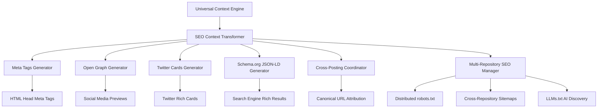

# SEO Meta Tags & Structured Data System

## Overview

The **SEO Meta Tags & Structured Data System** consumes rich context from the [Central Context Engine](./CONTEXT-ENGINE.md) to automatically generate comprehensive SEO metadata, Open Graph tags, Twitter Cards, Schema.org JSON-LD structured data, and **multi-repository SEO coordination** (robots.txt, sitemaps, LLMs.txt).

**Universal Context Source**: All context extraction (target-aware processing, repository context, cross-posting relationships) is handled by the [Central Context Engine](./CONTEXT-ENGINE.md)

**Multi-Repository Architecture**: The system coordinates SEO across distributed GitHub repositories serving different paths of the same domain experience, enabling proper canonical links, cross-repository sitemaps, and AI content discovery.

> **Context Details**: See [CONTEXT-ENGINE.md](./CONTEXT-ENGINE.md) for complete multi-dimensional context extraction from all hierarchy sources

## Schema.org and OpenGraph Standards

### Schema.org Type Mappings

**CRITICAL**: Use content type for Schema.org, never expose internal tracking/scoring data.

| Content Type | Schema.org Type | Description |
|--------------|-----------------|-------------|
| `blog`, `post` | `BlogPosting` | Blog articles |
| `tutorial` | `HowTo` | Step-by-step guides |
| `project`, `portfolio` | `CreativeWork` | Portfolio projects |
| `about` | `AboutPage` | About pages |
| `contact` | `ContactPage` | Contact pages |
| `organization` | `Organization` | Company pages |
| Default | `WebPage` | General pages |

### OpenGraph Type Mappings

| Content Type | OG Type | Fallback |
|--------------|---------|----------|
| `blog`, `article` | `article` | `website` |
| `project` | `website` | - |
| `profile` | `profile` | `website` |
| `video` | `video.other` | `website` |

### Privacy-Safe Structured Data

```javascript
// ❌ WRONG - Exposes internal data
{
  "@type": "BlogPosting",
  "customerJourneyStage": "decision",
  "leadScore": 85
}

// ✅ CORRECT - Public data only
{
  "@type": "BlogPosting", 
  "headline": "Building with React",
  "datePublished": "2024-01-15"
}
```

## SEO Context Transformation

### Universal Context to SEO Conversion

The SEO system receives universal context and transforms it specifically for search engine optimization and social media sharing:



## Cross-Posting & Multi-Repository SEO Coordination

### Cross-Posting Best Practices (2025)

The system implements research-backed cross-posting strategies with proper canonical URL handling and attribution:

```javascript
class CrossPostingCoordinator {
  constructor(universalContext) {
    this.context = universalContext;
  }
  
  generateCrossPostingMeta() {
    const { dynamicSignals } = this.context;
    const pageData = dynamicSignals.page;
    
    // Cross-posting detection from frontmatter
    if (pageData.canonical_url && pageData.primary_blog) {
      return {
        canonicalUrl: pageData.canonical_url,
        primaryBlog: pageData.primary_blog,
        targetBlogs: pageData.target_blogs || [],
        isOriginalContent: this.context.isOriginalContent(), // From Context Engine
        attributionNotice: this.context.generateAttributionInfo() // From Context Engine
      };
    }
    
    return null;
  }
}
```

### Multi-Repository SEO File Coordination

**Distributed robots.txt Strategy:**

```txt
# robots.txt in domain repository (getharsh.in)
User-agent: *
Sitemap: https://getharsh.in/sitemap.xml
Sitemap: https://blog.getharsh.in/sitemap.xml

# robots.txt in blog repository (blog.getharsh.in)  
User-agent: *
Sitemap: https://blog.getharsh.in/sitemap.xml
Sitemap: https://getharsh.in/sitemap.xml
```

**LLMs.txt AI Content Discovery (2025 Standard):**

```txt
# llms.txt in primary domain repository
# Domain Content
/: Homepage with ecosystem overview
/about: Company information and mission
/HENA/: AI agent project documentation
/HENA/docs/: Technical documentation

# Cross-Repository Content
https://blog.getharsh.in/: Blog posts and articles
https://blog.getharsh.in/archives: Complete post archives
```

## Meta Tags Generation

### Context-Driven Meta Tags

```javascript
class SEOContextTransformer {
  constructor(universalContext) {
    this.context = universalContext; // From Central Context Engine
  }
  
  generateMetaTags() {
    const { semantics, content, sources } = this.context;
    
    return {
      // Basic SEO Meta Tags
      title: this.buildSEOTitle(),
      description: this.buildSEODescription(),
      keywords: this.buildSEOKeywords(),
      robots: this.buildRobotsDirective(),
      canonical: this.buildCanonicalURL(),
      
      // Open Graph Meta Tags
      ogTitle: this.buildOGTitle(),
      ogDescription: this.buildOGDescription(),
      ogType: this.deriveOGType(),
      ogImage: this.buildOGImage(),
      ogURL: this.buildOGURL(),
      ogSiteName: this.buildOGSiteName(),
      
      // Twitter Card Meta Tags
      twitterCard: this.deriveTwitterCardType(),
      twitterTitle: this.buildTwitterTitle(),
      twitterDescription: this.buildTwitterDescription(),
      twitterImage: this.buildTwitterImage(),
      twitterSite: this.buildTwitterSite(),
      
      // Additional Meta Tags
      author: this.buildAuthorMeta(),
      publishedTime: this.buildPublishedTime(),
      modifiedTime: this.buildModifiedTime(),
      articleTag: this.buildArticleTags(),
      locale: this.buildLocale()
    };
  }
  
  // SEO Title transformation (uses Context Engine intelligence)
  buildSEOTitle() {
    // Use pre-calculated title from Context Engine
    return this.context.buildSEOTitle();
  }
  
  // SEO Description transformation (uses Context Engine intelligence)
  buildSEODescription() {
    // Use pre-calculated description from Context Engine
    return this.context.buildSEODescription();
  }
  
  // Canonical URL with cross-posting support (2025 best practices)
  buildCanonicalURL() {
    const { dynamicSignals, targetContext } = this.context;
    const pageData = dynamicSignals.page;
    
    // Cross-posting: Use explicit canonical_url if provided
    if (pageData.canonical_url) {
      return pageData.canonical_url;
    }
    
    // Original content: Build canonical URL from current context
    const { crossRepositoryUrls } = targetContext;
    const currentUrl = this.buildCurrentPageURL();
    
    return currentUrl;
  }
  
  buildCurrentPageURL() {
    const { targetContext, processedConfig } = this.context;
    const baseUrl = processedConfig.domainInfo.url || processedConfig.site?.url;
    const currentPath = this.getCurrentPagePath();
    
    return `${baseUrl}${currentPath}`;
  }
  
  // Open Graph Type transformation (uses Context Engine intelligence)
  deriveOGType() {
    // Use pre-calculated OG type from Context Engine
    return this.context.deriveOGType();
  }
}
```

## Schema.org JSON-LD Generation

### Context-Rich Structured Data

```javascript
class SchemaOrgGenerator {
  constructor(universalContext) {
    this.context = universalContext;
  }
  
  generateJSONLD() {
    const { semantics, content, sources } = this.context;
    
    // Base schema selection based on content type
    if (semantics.contentType === 'article' || sources.page.layout === 'post') {
      return this.generateArticleSchema();
    }
    if (semantics.contentType === 'project' || sources.page.layout === 'project') {
      return this.generateSoftwareApplicationSchema();
    }
    if (semantics.contentType === 'about' || sources.page.layout === 'profile') {
      return this.generatePersonSchema();
    }
    
    return this.generateWebPageSchema();
  }
  
  // Article Schema for blog posts and tutorials (with cross-posting support)
  generateArticleSchema() {
    const { content, dynamicSignals, processedConfig, semantics } = this.context;
    const pageData = dynamicSignals.page;
    
    // Check for sponsorship
    const sponsor = dynamicSignals?.sponsor;
    const intent = dynamicSignals?.intent || {};
    
    const schema = {
      "@context": "https://schema.org",
      "@type": sponsor?.isSponsored ? 'SponsoredPosting' : (semantics.contentType === 'tutorial' ? 'HowTo' : 'Article'),
      "headline": content.title,
      "description": content.description,
      "author": {
        "@type": "Person",
        "name": processedConfig.ecosystemInfo.author || processedConfig.domainInfo.author,
        "url": processedConfig.domainInfo.url
      },
      "publisher": {
        "@type": "Organization", 
        "name": processedConfig.domainInfo.name || processedConfig.ecosystemInfo.name,
        "url": processedConfig.domainInfo.url
      },
      "datePublished": pageData.publishedDate,
      "dateModified": pageData.lastUpdated || pageData.publishedDate,
      "mainEntityOfPage": {
        "@type": "WebPage",
        "@id": pageData.canonical_url || this.buildCurrentPageURL()
      },
      "keywords": content.keywords,
      "articleSection": semantics.contentType,
      "about": this.generateAboutEntities(),
      "teaches": semantics.contentType === 'tutorial' ? content.keywords : undefined,
      "difficulty": semantics.technicalLevel,
      "audience": {
        "@type": "Audience",
        "audienceType": semantics.audience
      }
    };
    
    // Add cross-posting attribution for Schema.org
    if (pageData.canonical_url && pageData.primary_blog) {
      schema.isBasedOn = {
        "@type": "BlogPosting",
        "@id": pageData.canonical_url,
        "publisher": {
          "@type": "Organization",
          "name": pageData.primary_blog
        }
      };
    }
    
    // Add sponsor information if applicable
    if (sponsor?.isSponsored) {
      schema.sponsor = {
        "@type": "Organization",
        "name": sponsor.name,
        "url": sponsor.url
      };
      schema.sponsorshipDisclosure = sponsor.disclosureText;
    }
    
    // Add intent-based enhancements
    if (intent.contentIntent === 'conversion') {
      schema.potentialAction = {
        "@type": "InteractAction",
        "target": processedConfig.domainInfo.url + "/contact"
      };
    }
    
    return schema;
  }
  
  // Project/Software Schema
  generateSoftwareApplicationSchema() {
    const { content, sources, semantics } = this.context;
    
    return {
      "@context": "https://schema.org",
      "@type": sources.project?.type === 'software' ? 'SoftwareApplication' : 'CreativeWork',
      "name": content.title,
      "description": content.description,
      "author": {
        "@type": "Person",
        "name": sources.ecosystem.author,
        "url": sources.domain.baseUrl
      },
      "applicationCategory": semantics.contentType,
      "operatingSystem": this.extractOperatingSystem(),
      "programmingLanguage": this.extractProgrammingLanguages(),
      "runtimePlatform": this.extractRuntimePlatforms(),
      "developmentStatus": sources.project?.status,
      "license": sources.project?.license,
      "codeRepository": sources.project?.repository,
      "downloadUrl": sources.project?.downloadUrl,
      "screenshot": sources.project?.screenshots,
      "featureList": this.extractFeatures(),
      "keywords": content.keywords,
      "audience": {
        "@type": "Audience",
        "audienceType": semantics.audience
      }
    };
  }
  
  // Person Schema for about pages
  generatePersonSchema() {
    const { content, sources, semantics } = this.context;
    
    return {
      "@context": "https://schema.org",
      "@type": "Person",
      "name": sources.ecosystem.author,
      "description": content.description,
      "url": sources.domain.baseUrl,
      "sameAs": this.extractSocialProfiles(),
      "jobTitle": sources.ecosystem.role || semantics.role,
      "worksFor": {
        "@type": "Organization",
        "name": sources.ecosystem.organization
      },
      "knowsAbout": content.keywords,
      "hasCredential": this.extractCredentials(),
      "alumniOf": this.extractEducation(),
      "award": this.extractAwards(),
      "owns": this.extractProjects()
    };
  }
  
  // Helper methods using Context Engine intelligence
  extractProgrammingLanguages() {
    // Use pre-calculated languages from Context Engine
    return this.context.extractProgrammingLanguages();
  }
  
  extractFeatures() {
    // Use pre-calculated features from Context Engine
    return this.context.extractContentFeatures();
  }
}
```

## LLMs.txt AI Content Discovery Generation (2025)

### AI-First Content Curation

The system generates LLMs.txt files following the 2025 AI content discovery standard for enhanced discoverability by AI agents and language models:

```javascript
class LLMsTextGenerator {
  constructor(universalContext) {
    this.context = universalContext;
    this.targetContext = universalContext.targetContext;
  }
  
  generateLLMsText() {
    const { targetContext, processedConfig } = this.context;
    const { repositoryContext, crossRepositoryUrls } = targetContext;
    
    if (repositoryContext === 'domain') {
      return this.generatePrimaryDomainLLMsText();
    } else if (repositoryContext === 'blog') {
      return this.generateBlogLLMsText();
    }
    
    return null;
  }
  
  generatePrimaryDomainLLMsText() {
    const { processedConfig } = this.context;
    const domainInfo = processedConfig.domainInfo;
    
    return `# ${domainInfo.name} - AI Content Discovery

## About
${domainInfo.description}

## Domain Content
/: Homepage with ecosystem overview
/about: Company information and mission
${this.generateProjectPaths()}

## Cross-Repository Content
${this.generateCrossRepositoryPaths()}

## AI Discovery
This content is curated for AI agents and large language models.
For comprehensive information about our ecosystem, explore all linked repositories.
`;
  }
  
  generateProjectPaths() {
    const { processedConfig } = this.context;
    const projects = processedConfig.projects || [];
    
    return projects.map(project => 
      `/${project.slug}/: ${project.description}\n/${project.slug}/docs/: Technical documentation`
    ).join('\n');
  }
  
  generateCrossRepositoryPaths() {
    const { targetContext } = this.context;
    const { crossRepositoryUrls } = targetContext;
    
    return Object.entries(crossRepositoryUrls).map(([key, url]) => {
      if (key === 'blog') {
        return `${url}/: Blog posts and articles\n${url}/archives: Complete post archives`;
      }
      return `${url}/: ${key} domain content`;
    }).join('\n');
  }
  
  generateBlogLLMsText() {
    const { processedConfig } = this.context;
    const domainInfo = processedConfig.domainInfo;
    
    return `# ${domainInfo.name} Blog - AI Content Discovery

## About
Blog content for ${domainInfo.description}

## Blog Content
/: Latest blog posts
/archives: Complete post archives
/categories: Posts organized by category
/tags: Posts organized by tags

## Related Content
${this.generateCrossRepositoryPaths()}
`;
  }
}
```

### Multi-Repository LLMs.txt Coordination

**Implementation Strategy:**

- **Primary Domain Repository**: Contains comprehensive LLMs.txt with cross-repository references
- **Blog Repositories**: Contains blog-specific LLMs.txt with backlinks to primary domain
- **Project Repositories**: References included in primary domain LLMs.txt
- **AI Discovery**: Enables AI agents to understand complete ecosystem structure

## Implementation Integration

### Automated Meta Tag Injection

```liquid
<!-- Universal Context Generation -->


<!-- SEO Meta Tags Generation -->


<head>
  <!-- Basic SEO Meta Tags -->
  <title>{{ seo_context.title }}</title>
  <meta name="description" content="{{ seo_context.description }}">
  <meta name="keywords" content="{{ seo_context.keywords | join: ', ' }}">
  <meta name="robots" content="{{ seo_context.robots }}">
  <link rel="canonical" href="{{ seo_context.canonical }}">
  
  <!-- Open Graph Meta Tags -->
  <meta property="og:title" content="{{ seo_context.ogTitle }}">
  <meta property="og:description" content="{{ seo_context.ogDescription }}">
  <meta property="og:type" content="{{ seo_context.ogType }}">
  <meta property="og:image" content="{{ seo_context.ogImage }}">
  <meta property="og:url" content="{{ seo_context.ogURL }}">
  <meta property="og:site_name" content="{{ seo_context.ogSiteName }}">
  
  <!-- Twitter Card Meta Tags -->
  <meta name="twitter:card" content="{{ seo_context.twitterCard }}">
  <meta name="twitter:title" content="{{ seo_context.twitterTitle }}">
  <meta name="twitter:description" content="{{ seo_context.twitterDescription }}">
  <meta name="twitter:image" content="{{ seo_context.twitterImage }}">
  <meta name="twitter:site" content="{{ seo_context.twitterSite }}">
  
  <!-- Schema.org JSON-LD -->
  <script type="application/ld+json">
    {{ seo_context.jsonld | jsonify }}
  </script>
  
  <!-- Cross-Posting Attribution (when applicable) -->
  
    <meta name="original-source" content="{{ page.canonical_url }}">
    <meta name="original-publisher" content="{{ page.primary_blog }}">
  
</head>
```

## Key Benefits

### Context-Driven SEO Excellence

✅ **Rich Meta Tags**: Automatically generated from universal context
✅ **Smart Descriptions**: Enhanced with semantic context (audience, difficulty, reading time)
✅ **Dynamic Schema.org**: Content-type aware structured data
✅ **Social Media Optimization**: Context-appropriate Open Graph and Twitter Cards
✅ **Cross-Domain Consistency**: Leverages ecosystem and domain branding
✅ **Zero Configuration**: Authors write content, SEO is automatic
✅ **Standards Compliant**: Follows all SEO and social media best practices

**Related Systems**:

- [CONTEXT-ENGINE.md](./CONTEXT-ENGINE.md) - Universal context extraction
- [ANALYTICS.md](./ANALYTICS.md) - Analytics transformation
- [ARIA.md](./ARIA.md) - Accessibility transformation
- [AI.md](./AI.md) - AI discovery transformation

This **SEO Meta Tags & Structured Data System** transforms universal context into comprehensive SEO optimization, ensuring maximum discoverability while maintaining the architecture's elegant modularity.
