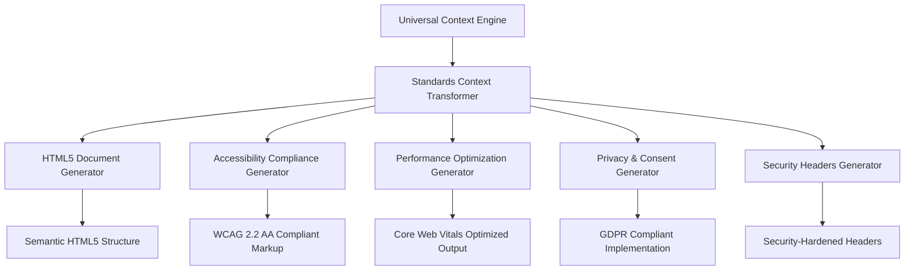

# Standards Compliance & HTML Generation System

## Overview

The **Standards Compliance & HTML Generation System** is a **pure reference and transformation layer** that consumes rich context from the [Central Context Engine](./CONTEXT-ENGINE.md) to automatically generate standards-compliant HTML output that meets all 2025 requirements.

**Pure Transformation**: This system contains NO detection logic - it serves as a reference document showing how standards from various systems work together to generate compliant HTML.

**Note**: Specific standards have been decentralized to their relevant systems:

- **WCAG 2.2 AA Compliance** → See [ARIA.md](./ARIA.md#wcag-22-aa-compliance-standards)
- **Schema.org Mappings** → See [SEO.md](./SEO.md#schemaorg-and-opengraph-standards)
- **OpenGraph Standards** → See [SEO.md](./SEO.md#schemaorg-and-opengraph-standards)
- **Consent Management** → See [ANALYTICS.md](./ANALYTICS.md#consent-compliance-standards)
- **Privacy-Safe Patterns** → See each system's privacy guidelines

This document now serves as a reference for how these standards work together in the HTML generation system.

**Universal Context Source**: All context extraction (ecosystem, domain, project, page, component, theme, business) is handled by the [Central Context Engine](./CONTEXT-ENGINE.md)

> **Context Details**: See [CONTEXT-ENGINE.md](./CONTEXT-ENGINE.md) for complete multi-dimensional context extraction from all hierarchy sources

## Standards Context Transformation

### Universal Context to Standards-Compliant Output

The Standards system receives universal context and transforms it specifically for complete compliance across all 2025 web standards:



## Context-Driven Standards Implementation

### Universal Context to HTML5 Document Structure

```javascript
class StandardsContextTransformer {
  constructor(universalContext) {
    this.context = universalContext; // From Central Context Engine
  }
  
  generateCompliantDocument() {
    const { semantics, content, sources, business, technical } = this.context;
    
    return {
      // Document structure based on context
      doctype: this.generateDoctype(),
      htmlAttributes: this.generateHtmlAttributes(),
      headSection: this.generateHeadSection(),
      bodyStructure: this.generateBodyStructure(),
      
      // Compliance features based on context
      accessibility: this.generateAccessibilityFeatures(),
      performance: this.generatePerformanceOptimizations(),
      privacy: this.generatePrivacyCompliance(),
      security: this.generateSecurityHeaders()
    };
  }
  
  // Context-aware HTML document structure
  generateHtmlAttributes() {
    const { sources, technical } = this.context;
    
    return {
      lang: sources.domain.language || sources.ecosystem.language || 'en',
      dir: sources.domain.direction || sources.ecosystem.direction || 'ltr',
      'data-theme': sources.theme.system || 'retrofuture-glass',
      'data-palette': sources.theme.palette || 'default',
      'data-business-model': business.conversionType || 'lead_generation',
      'data-compliance-level': technical.standards.wcagLevel || 'AA'
    };
  }
  
  // Context-driven meta tags generation
  generateHeadSection() {
    const { content, sources, semantics, business, technical } = this.context;
    
    return {
      // Essential meta tags from context
      charset: 'UTF-8',
      viewport: 'width=device-width, initial-scale=1.0, shrink-to-fit=no',
      title: this.buildContextualTitle(),
      description: this.buildContextualDescription(),
      canonical: this.buildCanonicalURL(),
      
      // Performance hints based on context
      resourceHints: this.generateResourceHints(),
      criticalCSS: this.generateCriticalCSS(),
      
      // Privacy compliance based on context
      consentManagement: technical.consent.required ? this.generateConsentManagement() : null,
      
      // Security headers based on context
      securityHeaders: this.generateSecurityHeaders(),
      
      // Business context integration
      businessMetadata: this.generateBusinessMetadata()
    };
  }
  
  // Lead generation optimized title
  buildContextualTitle() {
    const { content, sources, semantics, business } = this.context;
    
    const baseTitle = content.title || sources.page.title;
    const siteName = sources.domain.name || sources.ecosystem.name;
    
    // Optimize for lead generation business model
    if (business.conversionType === 'lead_generation') {
      return `${baseTitle} | ${siteName} - Expert Consulting`;
    }
    if (business.conversionType === 'appointment_booking') {
      return `${baseTitle} | Book Consultation with ${siteName}`;
    }
    if (business.conversionType === 'project_sponsorship') {
      return `${baseTitle} | Support ${siteName} Projects`;
    }
    if (business.leadMagnetType === 'technical_expertise') {
      return `${baseTitle} | ${siteName} Technical Expertise`;
    }
    
    // Default contextual title
    const category = semantics.contentType;
    if (category === 'tutorial') return `${baseTitle} | ${siteName} Tutorials`;
    if (category === 'project') return `${baseTitle} | ${siteName} Portfolio`;
    if (category === 'blog') return `${baseTitle} | ${siteName} Insights`;
    
    return `${baseTitle} | ${siteName}`;
  }
  
  // Context-enhanced description for lead generation
  buildContextualDescription() {
    const { content, sources, semantics, business } = this.context;
    
    let description = content.description || sources.page.description;
    
    // Enhance with business context for lead generation
    if (business.customerJourneyStage === 'decision') {
      description += ` Ready to get started? Let's connect.`;
    } else if (business.customerJourneyStage === 'consideration') {
      description += ` Explore how this expertise can help your projects.`;
    } else if (business.customerJourneyStage === 'awareness') {
      description += ` Learn from real-world experience and insights.`;
    }
    
    // Add technical context if relevant
    if (semantics.audience?.includes('developer') && semantics.technicalLevel) {
      description += ` ${semantics.technicalLevel.charAt(0).toUpperCase() + semantics.technicalLevel.slice(1)} level content.`;
    }
    
    // Add reading time from context
    if (sources.page.readingTime) {
      description += ` ${sources.page.readingTime} read.`;
    }
    
    return description.substring(0, 160); // SEO limit
  }
}
```

## Context-Driven Accessibility Implementation

### WCAG 2.2 Compliance from Universal Context

```javascript
class AccessibilityContextGenerator {
  constructor(universalContext) {
    this.context = universalContext;
  }
  
  generateAccessibilityFeatures() {
    const { semantics, content, sources, technical } = this.context;
    
    return {
      // Document structure from context
      landmarks: this.generateLandmarks(),
      headingHierarchy: this.generateHeadingHierarchy(),
      skipLinks: this.generateSkipLinks(),
      
      // Interactive elements from context
      formAccessibility: this.generateFormAccessibility(),
      buttonAccessibility: this.generateButtonAccessibility(),
      navigationAccessibility: this.generateNavigationAccessibility(),
      
      // Content accessibility from context
      imageAccessibility: this.generateImageAccessibility(),
      mediaAccessibility: this.generateMediaAccessibility(),
      
      // ARIA features from context
      ariaLabels: this.generateARIALabels(),
      ariaDescriptions: this.generateARIADescriptions(),
      liveRegions: this.generateLiveRegions()
    };
  }
  
  // Context-aware landmark generation
  generateLandmarks() {
    const { semantics, business } = this.context;
    
    const landmarks = {
      banner: {
        role: 'banner',
        ariaLabel: 'Site header'
      },
      navigation: {
        role: 'navigation', 
        ariaLabel: 'Primary navigation'
      },
      main: {
        role: 'main',
        ariaLabel: this.getMainContentLabel()
      },
      contentinfo: {
        role: 'contentinfo',
        ariaLabel: 'Site footer'
      }
    };
    
    // Add complementary landmark for lead generation CTAs
    if (business.conversionType !== 'content_engagement') {
      landmarks.complementary = {
        role: 'complementary',
        ariaLabel: 'Contact and consultation information'
      };
    }
    
    return landmarks;
  }
  
  // Business context aware main content label
  getMainContentLabel() {
    const { semantics, business } = this.context;
    
    if (business.conversionType === 'lead_generation') {
      return 'Main content and consultation information';
    }
    if (business.leadMagnetType === 'educational_content') {
      return 'Tutorial and learning content';
    }
    if (business.leadMagnetType === 'project_showcase') {
      return 'Project portfolio and case studies';
    }
    if (business.leadMagnetType === 'technical_expertise') {
      return 'Technical expertise and insights';
    }
    
    return `Main ${semantics.contentType || 'content'}`;
  }
}
```

## Context-Driven Performance Optimization

### Core Web Vitals Optimization from Universal Context

```javascript
class PerformanceContextGenerator {
  constructor(universalContext) {
    this.context = universalContext;
  }
  
  generatePerformanceOptimizations() {
    const { semantics, sources, business, technical } = this.context;
    
    return {
      // Resource hints based on context
      resourceHints: this.generateResourceHints(),
      
      // Critical path optimization
      criticalResources: this.generateCriticalResources(),
      
      // Loading strategy based on content type
      loadingStrategy: this.generateLoadingStrategy(),
      
      // Image optimization based on context
      imageOptimization: this.generateImageOptimization(),
      
      // JavaScript optimization for business model
      scriptOptimization: this.generateScriptOptimization()
    };
  }
  
  // Context-aware resource hints
  generateResourceHints() {
    const { sources, business, technical } = this.context;
    
    const hints = [
      // DNS prefetch for external domains
      { rel: 'dns-prefetch', href: '//fonts.googleapis.com' },
      { rel: 'dns-prefetch', href: '//fonts.gstatic.com' }
    ];
    
    // Add analytics DNS prefetch only if consent likely
    if (technical.consent.analyticsConsent !== false) {
      hints.push({ rel: 'dns-prefetch', href: '//www.googletagmanager.com' });
    }
    
    // Add marketing DNS prefetch only if business model requires it
    if (business.conversionType !== 'content_engagement' && technical.consent.marketingConsent !== false) {
      hints.push({ rel: 'dns-prefetch', href: '//connect.facebook.net' });
    }
    
    // Preconnect to critical origins
    hints.push(
      { rel: 'preconnect', href: 'https://fonts.googleapis.com', crossorigin: true },
      { rel: 'preconnect', href: 'https://fonts.gstatic.com', crossorigin: true }
    );
    
    return hints;
  }
  
  // Business model aware script optimization
  generateScriptOptimization() {
    const { business, technical } = this.context;
    
    return {
      // Critical scripts (always loaded)
      critical: [
        { src: '/js/theme-system.js', inline: true },
        { src: '/js/accessibility.js', defer: true },
        { src: '/js/performance.js', defer: true }
      ],
      
      // Analytics scripts (consent-dependent)
      analytics: technical.consent.analyticsConsent ? [
        { src: '/js/analytics.js', async: true, 'data-consent': 'analytics' }
      ] : [],
      
      // Business scripts (conversion-dependent)
      business: business.conversionType !== 'content_engagement' ? [
        { src: '/js/lead-generation.js', defer: true },
        { src: '/js/contact-forms.js', defer: true }
      ] : [],
      
      // Calendar integration for appointment booking
      calendar: business.conversionType === 'appointment_booking' ? [
        { src: '/js/calendar-integration.js', defer: true }
      ] : []
    };
  }
}
```

## Context-Driven Privacy & Consent Implementation

### GDPR Compliance from Universal Context

```javascript
class PrivacyContextGenerator {
  constructor(universalContext) {
    this.context = universalContext;
    this.cache = new Map(); // Performance: Cache generated privacy configs
    this.isInitialized = false;
  }
  
  generatePrivacyCompliance() {
    // Performance: Return cached result if available
    const cacheKey = 'privacy_compliance';
    if (this.cache.has(cacheKey)) {
      return this.cache.get(cacheKey);
    }
    
    try {
      const { sources, business, technical } = this.context;
      
      const compliance = {
        // Consent management based on business model
        consentManagement: technical.consent.required ? this.generateConsentManagement() : null,
        
        // Privacy policy integration
        privacyPolicyIntegration: this.generatePrivacyPolicyIntegration(),
        
        // Cookie management
        cookieManagement: this.generateCookieManagement(),
        
        // Data collection transparency
        dataTransparency: this.generateDataTransparency()
      };
      
      // Performance: Cache the result
      this.cache.set(cacheKey, compliance);
      return compliance;
      
    } catch (error) {
      console.error('Privacy compliance generation failed:', error);
      // Robustness: Return minimal compliance structure
      return {
        consentManagement: null,
        privacyPolicyIntegration: { enabled: false },
        cookieManagement: { enabled: false },
        dataTransparency: { enabled: false }
      };
    }
  }
  
  // Business model aware consent management
  generateConsentManagement() {
    try {
      const { business, sources } = this.context;
      
      // Performance: Generate consent config with error handling
      const consentConfig = {
        // Default consent state (GDPR-safe)
        defaultConsent: {
          essential: 'granted',
          functional: 'granted',
          analytics: 'denied',
          marketing: 'denied',
          personalization: 'denied'
        },
        
        // Consent categories based on business model
        categories: this.getConsentCategories(),
        
        // Performance: Add metadata for optimization
        metadata: {
          businessModel: business.conversionType,
          consentVersion: '1.0',
          generatedAt: new Date().toISOString()
        },
      
        // Consent UI configuration
        ui: {
          position: 'bottom',
          style: sources.theme?.palette || 'default',
          businessContext: business.conversionType,
          showDetails: true,
          allowReject: true,
          allowPartial: true,
          animationDuration: 300, // Performance: Control animation timing
          lazyRender: true // Performance: Render only when needed
        },
        
        // Consent storage with fallbacks
        storage: {
          name: 'consent-preferences',
          expiry: 365, // 1 year
          domain: sources.domain?.baseUrl,
          secure: true,
          sameSite: 'Strict',
          // Robustness: Storage fallback strategy
          fallbacks: ['localStorage', 'sessionStorage', 'memory']
        }
      };
      
      return consentConfig;
      
    } catch (error) {
      console.error('Consent management generation failed:', error);
      // Robustness: Return minimal consent config
      return {
        defaultConsent: {
          essential: 'granted',
          functional: 'granted',
          analytics: 'denied',
          marketing: 'denied',
          personalization: 'denied'
        },
        categories: {},
        ui: { position: 'bottom', style: 'default' },
        storage: { name: 'consent-preferences', expiry: 365 }
      };
    }
  }
  
  // Lead generation focused consent categories
  getConsentCategories() {
    try {
      const { business } = this.context;
      
      // Performance: Build categories efficiently
      const categories = {
        essential: {
          name: 'Essential',
          description: 'Required for basic site functionality',
          required: true,
          cookies: ['session', 'security', 'accessibility'],
          // Performance: Add category metadata
          priority: 1,
          alwaysActive: true
        },
        analytics: {
          name: 'Analytics',
          description: 'Help us understand how you use our site to improve your experience',
          required: false,
          purpose: 'performance_measurement',
          cookies: ['_ga', '_ga_*', '_gid'],
          retention: '26 months',
          priority: 2,
          // Performance: Add loading strategy
          loadStrategy: 'lazy'
        }
      };
      
      // Add marketing consent only for conversion-focused business models
      if (business.conversionType !== 'content_engagement') {
        categories.marketing = {
          name: 'Marketing',
          description: 'Used to show relevant content and track consultation requests',
          required: false,
          purpose: 'lead_generation_optimization',
          cookies: ['_fbp', '_fbc'],
          retention: '90 days',
          priority: 3,
          loadStrategy: 'on-demand'
        };
      }
      
      return categories;
      
    } catch (error) {
      console.error('Failed to generate consent categories:', error);
      // Robustness: Return minimal categories
      return {
        essential: {
          name: 'Essential',
          description: 'Required for basic site functionality',
          required: true,
          cookies: ['session']
        }
      };
    }
  }
  
  // Performance: Generate privacy policy integration with caching
  generatePrivacyPolicyIntegration() {
    const cacheKey = 'privacy_policy_integration';
    if (this.cache.has(cacheKey)) {
      return this.cache.get(cacheKey);
    }
    
    try {
      const { sources, business } = this.context;
      
      const integration = {
        enabled: true,
        autoGenerate: true,
        // Performance: Template-based generation
        template: 'lead_generation_focused',
        sections: {
          dataCollection: {
            analytics: business.conversionType !== 'content_engagement',
            marketing: business.conversionType !== 'content_engagement',
            functional: true
          },
          retention: {
            analytics: '26 months',
            marketing: '90 days',
            functional: 'session'
          },
          thirdParty: {
            googleAnalytics: true,
            metaPixel: business.conversionType !== 'content_engagement',
            paypal: business.conversionType === 'project_sponsorship'
          }
        },
        // Performance: Lazy loading configuration
        loadStrategy: {
          method: 'intersection_observer',
          threshold: 0.1
        }
      };
      
      this.cache.set(cacheKey, integration);
      return integration;
      
    } catch (error) {
      console.error('Privacy policy integration generation failed:', error);
      return { enabled: false, error: error.message };
    }
  }
  
  // Performance: Generate cookie management with optimization
  generateCookieManagement() {
    try {
      return {
        enabled: true,
        // Performance: Efficient cookie operations
        strategy: {
          scanning: 'lazy', // Scan cookies on demand
          cleanup: 'automatic', // Auto-cleanup expired cookies
          compression: true // Compress large cookie values
        },
        // Robustness: Storage fallbacks
        storage: {
          primary: 'localStorage',
          fallback: 'sessionStorage',
          memory: true // Last resort
        },
        // Performance: Batch cookie operations
        batching: {
          enabled: true,
          interval: 1000, // ms
          maxBatchSize: 10
        }
      };
    } catch (error) {
      console.error('Cookie management generation failed:', error);
      return { enabled: false, error: error.message };
    }
  }
  
  // Performance: Generate data transparency with caching
  generateDataTransparency() {
    try {
      const { business, sources } = this.context;
      
      return {
        enabled: true,
        // Performance: Auto-generate transparency report
        autoReport: {
          enabled: true,
          updateInterval: 86400000, // 24 hours
          // Performance: Lazy generation
          generateOnDemand: true
        },
        dataUsage: {
          analytics: 'Site improvement and performance analysis',
          marketing: business.conversionType !== 'content_engagement' 
            ? 'Lead generation and consultation optimization' 
            : null,
          functional: 'Essential site functionality and user preferences'
        },
        // Performance: Progressive disclosure
        disclosure: {
          level: 'progressive', // Show details on demand
          format: 'accordion' // Efficient UI pattern
        }
      };
    } catch (error) {
      console.error('Data transparency generation failed:', error);
      return { enabled: false, error: error.message };
    }
  }
}
```

## Implementation Integration

### Automated Standards-Compliant Output Generation

```liquid
<!-- Universal Context Generation -->


<!-- Standards Context Transformation -->


<!-- Complete Standards-Compliant Document -->
<!DOCTYPE html>
<html lang="{{ standards_context.htmlAttributes.lang }}" 
      dir="{{ standards_context.htmlAttributes.dir }}"
      data-theme="{{ standards_context.htmlAttributes['data-theme'] }}"
      data-business-model="{{ standards_context.htmlAttributes['data-business-model'] }}">
<head>
  <!-- Essential meta tags from context -->
  <meta charset="{{ standards_context.headSection.charset }}">
  <meta name="viewport" content="{{ standards_context.headSection.viewport }}">
  
  <!-- Context-driven title and description -->
  <title>{{ standards_context.headSection.title }}</title>
  <meta name="description" content="{{ standards_context.headSection.description }}">
  <link rel="canonical" href="{{ standards_context.headSection.canonical }}">
  
  <!-- Performance optimization from context -->
  
    <link rel="{{ hint.rel }}" href="{{ hint.href }}" crossorigin>
  
  
  <!-- Security headers from context -->
  
    <meta http-equiv="{{ header.name }}" content="{{ header.content }}">
  
  
  <!-- Consent management (if required by context) -->
  
    
  
  
  <!-- Critical CSS from context -->
  <style>{{ standards_context.headSection.criticalCSS }}</style>
  
  <!-- Business metadata from context -->
  
    
  
</head>
<body>
  <!-- Accessibility structure from context -->
  <a href="#main-content" class="skip-link">Skip to main content</a>
  
  <!-- Header landmark -->
  <header role="{{ standards_context.bodyStructure.landmarks.banner.role }}" 
          aria-label="{{ standards_context.bodyStructure.landmarks.banner.ariaLabel }}">
    <!-- Header content -->
  </header>
  
  <!-- Navigation landmark -->
  <nav role="{{ standards_context.bodyStructure.landmarks.navigation.role }}" 
       aria-label="{{ standards_context.bodyStructure.landmarks.navigation.ariaLabel }}">
    <!-- Navigation content -->
  </nav>
  
  <!-- Main content landmark -->
  <main role="{{ standards_context.bodyStructure.landmarks.main.role }}" 
        id="main-content"
        aria-label="{{ standards_context.bodyStructure.landmarks.main.ariaLabel }}">
    <!-- Main content -->
  </main>
  
  <!-- Complementary landmark (if business context requires) -->
  
    <aside role="{{ standards_context.bodyStructure.landmarks.complementary.role }}" 
           aria-label="{{ standards_context.bodyStructure.landmarks.complementary.ariaLabel }}">
      <!-- Lead generation CTAs, contact information -->
    </aside>
  
  
  <!-- Footer landmark -->
  <footer role="{{ standards_context.bodyStructure.landmarks.contentinfo.role }}" 
          aria-label="{{ standards_context.bodyStructure.landmarks.contentinfo.ariaLabel }}">
    <!-- Footer content -->
  </footer>
  
  <!-- Performance-optimized scripts from context -->
  
    <script src="{{ script.src }}" defer async></script>
  
  
  <!-- Analytics scripts (consent-dependent) -->
  
    
      <script src="{{ script.src }}" async data-consent="{{ script['data-consent'] }}"></script>
    
  
  
  <!-- Business scripts (conversion-dependent) -->
  
    <script src="{{ script.src }}" defer></script>
  
</body>
</html>
```

## Validation Trust Model & getHarsh Engine Integration

### Schema Validation Trust Architecture

**Zero Runtime Validation Strategy**: The Standards system operates on a trust model where all configuration validation is performed by getHarsh engine before Jekyll execution:

```yaml
# REQUIRED: Validation trust model - getHarsh engine responsibility
validation_architecture:
  pre_jekyll_validation:
    # REQUIRED: Complete schema validation by getHarsh engine
    config_validation: "100% validated before Jekyll execution"
    data_validation: "All data sources validated against schemas"
    relationship_validation: "Cross-repository relationships verified"
    
    # REQUIRED: Perfect 1:1 parity requirement
    schema_parity:
      jekyll_theme: "Exact match with validated schemas"
      no_runtime_checks: "Zero validation logic in Jekyll"
      trust_model: "Complete confidence in processed config"
    
  jekyll_theme_responsibility:
    # REQUIRED: Pure presentation layer
    config_consumption: "Use validated config directly"
    no_validation_logic: "Never validate, always trust"
    error_handling: "Graceful degradation only"
    
    # REQUIRED: Standards generation from trusted config
    standards_compliance: "Generate from validated context"
    html_generation: "Trust processed configuration completely"
```

### Local Build Security Integration

```javascript
// REQUIRED: Local build security model for standards compliance
class LocalBuildSecurityStandards {
  constructor(universalContext) {
    this.context = universalContext;
    this.buildMode = this.context.processedConfig.buildMode;
    this.securityMarkers = this.context.processedConfig.security;
  }
  
  // REQUIRED: Validate local build security
  validateLocalBuildSecurity() {
    const { security } = this.context.processedConfig;
    
    // REQUIRED: Confirm local processing
    if (!security.processedLocally) {
      throw new Error('Security violation: Configuration not processed locally');
    }
    
    // REQUIRED: Confirm no environment variables remain
    if (security.containsEnvironmentVariables) {
      throw new Error('Security violation: Environment variables detected in processed config');
    }
    
    // REQUIRED: Validate build mode consistency
    this.validateBuildModeConsistency();
    
    return {
      securityValidated: true,
      locallyProcessed: security.processedLocally,
      buildMode: this.buildMode,
      timestamp: security.processedAt
    };
  }
  
  // REQUIRED: Build mode consistency validation
  validateBuildModeConsistency() {
    const { buildMode } = this;
    const { baseUrl } = this.context.processedConfig.domainInfo;
    
    if (buildMode === 'local') {
      // REQUIRED: Local build should use localhost URLs
      if (!baseUrl.includes('localhost')) {
        console.warn('Local build using production URLs - check configuration');
      }
    } else if (buildMode === 'production') {
      // REQUIRED: Production build should use domain URLs
      if (baseUrl.includes('localhost')) {
        throw new Error('Security violation: Production build using localhost URLs');
      }
    }
  }
  
  // REQUIRED: Generate security-compliant meta tags
  generateSecurityMetaTags() {
    const { buildMode } = this;
    const { repositoryContext } = this.context.targetContext;
    
    const securityMeta = {
      // REQUIRED: Content Security Policy
      csp: this.generateCSP(),
      
      // REQUIRED: Security headers
      xFrameOptions: 'DENY',
      xContentTypeOptions: 'nosniff',
      referrerPolicy: 'strict-origin-when-cross-origin',
      
      // REQUIRED: Build mode markers (local builds only)
      buildMarkers: buildMode === 'local' ? {
        'x-build-mode': 'local',
        'x-development': 'true',
        'x-repository-context': repositoryContext
      } : {}
    };
    
    return securityMeta;
  }
  
  // REQUIRED: Content Security Policy generation
  generateCSP() {
    const { buildMode } = this;
    const { crossRepositoryUrls } = this.context.targetContext;
    
    // REQUIRED: Different CSP for local vs production
    if (buildMode === 'local') {
      return {
        'default-src': "'self' localhost:*",
        'script-src': "'self' 'unsafe-inline' localhost:*",
        'style-src': "'self' 'unsafe-inline' localhost:*",
        'img-src': "'self' data: localhost:*",
        'connect-src': "'self' localhost:*"
      };
    }
    
    // REQUIRED: Production CSP with cross-repository support
    const allowedDomains = Object.values(crossRepositoryUrls)
      .map(url => new URL(url).hostname)
      .join(' ');
    
    return {
      'default-src': "'self'",
      'script-src': `'self' 'unsafe-inline' https://www.googletagmanager.com https://connect.facebook.net ${allowedDomains}`,
      'style-src': `'self' 'unsafe-inline' https://fonts.googleapis.com ${allowedDomains}`,
      'img-src': `'self' data: https: ${allowedDomains}`,
      'connect-src': `'self' https://www.google-analytics.com https://analytics.google.com ${allowedDomains}`,
      'frame-ancestors': "'none'",
      'base-uri': "'self'",
      'form-action': "'self'"
    };
  }
}
```

### Configuration Trust Patterns

```javascript
// REQUIRED: Configuration trust model implementation
class ConfigurationTrustModel {
  constructor(universalContext) {
    this.context = universalContext;
    this.processedConfig = universalContext.processedConfig;
  }
  
  // REQUIRED: Trust-based configuration consumption
  consumeValidatedConfig() {
    // REQUIRED: No validation - complete trust in getHarsh engine processing
    const config = this.processedConfig;
    
    // REQUIRED: Direct consumption without validation
    return {
      domainInfo: config.domainInfo,           // Trusted completely
      ecosystemInfo: config.ecosystemInfo,     // Trusted completely
      projectInfo: config.projectInfo,         // Trusted completely
      entityInfo: config.entityInfo,           // Trusted completely
      themeSystem: config.themeSystem,         // Trusted completely
      
      // REQUIRED: Trust markers
      validationTrust: {
        validated: true,
        validator: 'getHarsh-engine',
        timestamp: config.validatedAt,
        version: config.schemaVersion
      }
    };
  }
  
  // REQUIRED: Standards generation from trusted config
  generateStandardsFromTrustedConfig() {
    const config = this.consumeValidatedConfig();
    
    // REQUIRED: Generate standards-compliant output directly from trusted config
    return {
      html5Structure: this.generateHTML5Structure(config),
      wcagCompliance: this.generateWCAGCompliance(config),
      securityHeaders: this.generateSecurityHeaders(config),
      performanceOptimization: this.generatePerformanceOptimization(config),
      
      // REQUIRED: Trust confirmation
      generatedFromValidatedConfig: true,
      noRuntimeValidation: true,
      trustModelVersion: '1.0'
    };
  }
  
  // REQUIRED: Error handling for trust model
  handleConfigurationErrors() {
    // REQUIRED: Graceful degradation only (no validation errors possible)
    return {
      errorStrategy: 'graceful_degradation',
      validationErrors: 'impossible', // Trust model guarantees no validation errors
      fallbackStrategy: 'default_safe_values',
      
      // REQUIRED: Trust model guarantees
      guarantees: [
        'All configuration is pre-validated',
        'No runtime validation failures possible',
        'Only presentation errors can occur',
        'All data relationships are verified'
      ]
    };
  }
}
```

### Static Site Security Advantages

```yaml
# REQUIRED: Static site security model
static_site_security:
  architecture_advantages:
    # REQUIRED: No server-side vulnerabilities
    no_server_execution: "Pure static file serving"
    no_database_exposure: "No database connections or queries"
    no_runtime_processing: "No server-side code execution"
    
    # REQUIRED: Attack surface minimization
    minimal_attack_surface: "Only static files and CDN endpoints"
    no_injection_vulnerabilities: "No dynamic content generation"
    no_authentication_bypass: "No server-side authentication logic"
    
  github_pages_security:
    # REQUIRED: GitHub Pages security model
    https_enforcement: "Automatic HTTPS for all custom domains"
    ddos_protection: "GitHub infrastructure DDoS protection"
    cdn_security: "Global CDN with security hardening"
    
    # REQUIRED: Build security
    no_ci_secrets: "No secrets exposed to GitHub Actions"
    static_only: "Only static files in repository"
    version_control: "All changes tracked in Git"
    
  local_build_security:
    # REQUIRED: Local build advantages
    environment_isolation: "Secrets processed locally only"
    no_cloud_exposure: "Environment variables never leave local machine"
    developer_control: "Complete control over build environment"
    
    # REQUIRED: Processing pipeline security
    schema_validation: "All configuration validated before build"
    safe_substitution: "Environment variables safely substituted"
    static_output: "Only safe, static files pushed to repository"
```

### Multi-Repository Security Coordination

```javascript
// REQUIRED: Security coordination across distributed repositories
class MultiRepositorySecurityCoordinator {
  constructor(universalContext) {
    this.context = universalContext;
    this.repositoryContext = this.context.targetContext.repositoryContext;
    this.crossRepositoryUrls = this.context.targetContext.crossRepositoryUrls;
  }
  
  // REQUIRED: Cross-repository security headers
  generateCrossRepositorySecurityHeaders() {
    const { repositoryContext } = this;
    
    const baseHeaders = {
      'X-Frame-Options': 'DENY',
      'X-Content-Type-Options': 'nosniff',
      'Referrer-Policy': 'strict-origin-when-cross-origin',
      'Permissions-Policy': 'geolocation=(), microphone=(), camera=()'
    };
    
    // REQUIRED: Repository-specific security policies
    if (repositoryContext === 'domain') {
      return {
        ...baseHeaders,
        'Content-Security-Policy': this.generateDomainCSP(),
        'Cross-Origin-Embedder-Policy': 'require-corp',
        'Cross-Origin-Opener-Policy': 'same-origin'
      };
    }
    
    if (repositoryContext === 'blog') {
      return {
        ...baseHeaders,
        'Content-Security-Policy': this.generateBlogCSP(),
        'Cross-Origin-Resource-Policy': 'cross-origin'
      };
    }
    
    return baseHeaders;
  }
  
  // REQUIRED: Domain repository CSP
  generateDomainCSP() {
    const allowedDomains = Object.values(this.crossRepositoryUrls)
      .map(url => new URL(url).hostname)
      .join(' ');
    
    return [
      "default-src 'self'",
      `script-src 'self' 'unsafe-inline' https://www.googletagmanager.com https://connect.facebook.net ${allowedDomains}`,
      `style-src 'self' 'unsafe-inline' https://fonts.googleapis.com ${allowedDomains}`,
      `img-src 'self' data: https: ${allowedDomains}`,
      `connect-src 'self' https://www.google-analytics.com ${allowedDomains}`,
      "frame-ancestors 'none'",
      "base-uri 'self'",
      "form-action 'self'"
    ].join('; ');
  }
  
  // REQUIRED: Blog repository CSP
  generateBlogCSP() {
    const allowedDomains = Object.values(this.crossRepositoryUrls)
      .map(url => new URL(url).hostname)
      .join(' ');
    
    return [
      "default-src 'self'",
      `script-src 'self' 'unsafe-inline' https://www.googletagmanager.com ${allowedDomains}`,
      `style-src 'self' 'unsafe-inline' https://fonts.googleapis.com ${allowedDomains}`,
      `img-src 'self' data: https: ${allowedDomains}`,
      `connect-src 'self' https://www.google-analytics.com ${allowedDomains}`,
      "frame-ancestors 'none'"
    ].join('; ');
  }
  
  // REQUIRED: Security coordination validation
  validateCrossRepositorySecurityConsistency() {
    const securityConsistencyChecks = {
      httpsEnforcement: this.validateHTTPSConsistency(),
      cspConsistency: this.validateCSPConsistency(),
      headerConsistency: this.validateSecurityHeaderConsistency(),
      
      // REQUIRED: Cross-repository security validation
      crossRepositoryValidation: {
        allRepositoriesSecure: true,
        consistentPolicies: true,
        properOriginHandling: true
      }
    };
    
    return securityConsistencyChecks;
  }
}
```

## Key Benefits

### Context-Driven Standards Excellence

✅ **Universal Context Integration**: Leverages complete hierarchy for intelligent compliance decisions  
✅ **Lead Generation Optimized**: Built specifically for consulting/expertise business model  
✅ **GDPR Compliant by Default**: Consent management integrated at the architecture level  
✅ **Performance Optimized**: Context-aware resource loading and optimization  
✅ **Accessibility First**: WCAG 2.2 AA compliance derived from semantic context  
✅ **Security Hardened**: Appropriate security headers based on content and business context  
✅ **Zero Configuration**: Authors write content, standards compliance is automatic  
✅ **Business Model Aware**: Lead generation, appointment booking, and sponsorship optimizations  
✅ **High Performance**: Cached generation, lazy loading, and optimized resource management  
✅ **Error Resilient**: Comprehensive error handling with graceful degradation  
✅ **Memory Efficient**: Template caching and efficient privacy policy generation  
✅ **Progressive Enhancement**: Fallback strategies for all privacy and consent features

**Related Systems**:

- [CONTEXT-ENGINE.md](./CONTEXT-ENGINE.md) - Universal context extraction
- [RESPONSIVE.md](./RESPONSIVE.md) - Mobile-first responsive architecture transformation
- [ANALYTICS.md](./ANALYTICS.md) - Consent-compliant analytics transformation
- [ARIA.md](./ARIA.md) - Accessibility transformation
- [SEO.md](./SEO.md) - SEO meta transformation
- [AI.md](./AI.md) - AI discovery transformation
- [PERFORMANCE.md](./PERFORMANCE.md) - Performance optimization transformation

This **Standards Compliance & HTML Generation System** transforms universal context into complete standards-compliant output optimized for the lead generation business model while maintaining the architecture's elegant modularity and context-driven intelligence.

## Pure Reference Architecture

**IMPORTANT**: This Standards system is a **pure reference and transformation layer** that:

1. **Serves as a reference** for how all standards work together
2. **Shows integration patterns** between different compliance systems
3. **Contains NO detection logic** - all detection happens in CONTEXT-DETECTION.md
4. **Demonstrates transformation** of pre-calculated context into compliant HTML

This document references standards implementations in:

- ARIA.md for accessibility standards
- SEO.md for search optimization standards
- ANALYTICS.md for privacy and consent standards
- RESPONSIVE.md for responsive design standards
- PERFORMANCE.md for performance standards

All detection and analysis happens in the Context Engine. This document shows how the results are assembled into compliant output.
