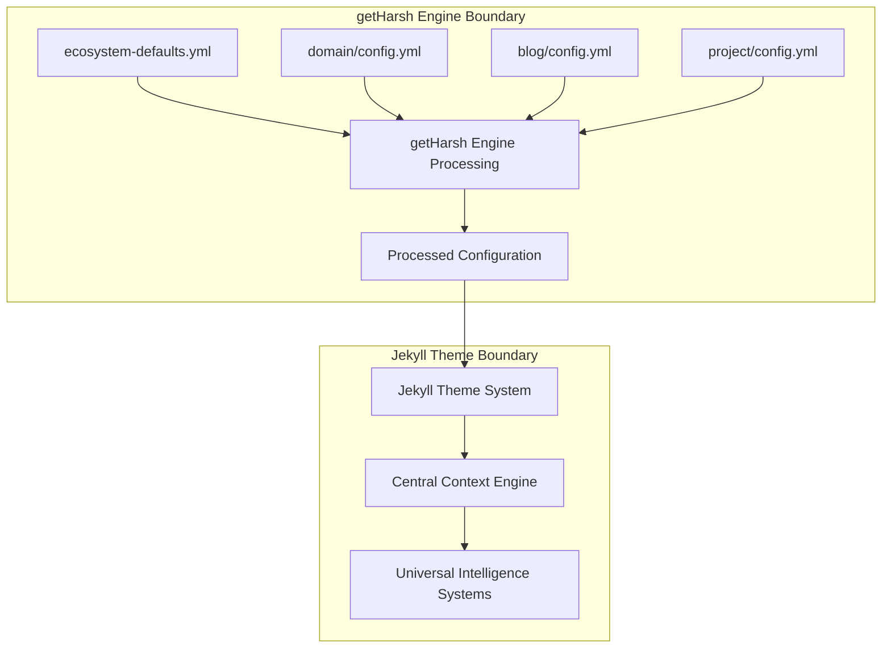

# System Integration - getHarsh Engine & Jekyll Theme Boundaries

## Overview

This document defines the clear architectural boundaries and integration patterns between the **getHarsh Engine** (multi-repository orchestration system) and the **Jekyll Theme System** (Universal Intelligence Component Library implementation).

## Architecture Boundaries

### getHarsh Engine Responsibilities

The getHarsh engine operates as the orchestration layer handling:

**Multi-Repository Distributed Serving:**
- 5 domain repositories (`getharsh.in`, `rawthoughts.in`, `causality.in`, `sleepwalker.in`, `daostudio.in`)
- 5 blog repositories (`blog.getharsh.in`, `blog.rawthoughts.in`, etc.)
- N project repositories (symlinked into domain `PROJECTS/` folders)
- Master posts repository (central content source)
- **Repository Context Management**: Same domain, different repositories serve different paths
- **Cross-Repository Coordination**: SEO files, manifests, and navigation across repositories

**Configuration Processing:**
- Schema-based configuration inheritance with parallel paths:
  - **Domain + Blog**: `ecosystem-defaults.yml` → domain `config.yml` → blog `config.yml`
  - **Domain + Project + Docs**: `ecosystem-defaults.yml` → domain `config.yml` → project `config.yml` → docs `config.yml`
- Build mode management (LOCAL vs PRODUCTION)
- **Local Build Security**: Environment variable substitution and redaction handled locally
- Repository context injection (`site.repository_context`, `site.target_type`)
- Cross-repository URL mapping generation
- Output path determination and management

**Content Orchestration:**
- Cross-repository content aggregation
- Project documentation extraction (from main/docs branches)
- Marketing content integration (from master_posts)
- Absolute path resolution for all content sources

**Build Coordination:**
- Atomic branch operations for content extraction
- Version-aware documentation builds
- **Local Build Security**: Security validation and redaction performed locally
- Multi-domain port assignment and serving
- **Static File Distribution**: Built files pushed to appropriate GitHub repositories
- **Cross-Repository SEO**: Distributed robots.txt, sitemaps, and LLMs.txt coordination

### Jekyll Theme System Responsibilities

The Jekyll theme system operates as the presentation layer implementing:

**Universal Intelligence Component Library:**
- 47 components as specified in [COMPONENT-TABLE.md](./COMPONENT-TABLE.md)
- Multi-layer architecture (Jekyll + SCSS + JavaScript)
- **Target-Aware Components**: Behavior adapts based on `site.target_type` and `site.repository_context`
- **Cross-Repository Navigation**: Components generate correct URLs across distributed repositories
- Central Context Engine integration
- Specialized system transformations (ARIA, Analytics, SEO, AI, Standards, Performance)

**Content Processing:**
- Path-agnostic content processing (receives absolute paths)
- Component rendering with Universal Intelligence integration
- Standards-compliant HTML generation
- Business model optimization (lead generation focused)

**Theme Architecture:**
- Responsive design system implementation
- Three-layer component architecture compliance
- Configuration-driven customization
- Performance-optimized output

## Integration Patterns

### Build Mode Integration

**LOCAL Mode:**
```yaml
# Passed by getHarsh engine to Jekyll theme
site:
  url: "http://localhost:4001"  # Port managed by getHarsh engine
  baseurl: ""
  mode: "local"
  target_type: "domain"           # or "blog", "project", "docs"
  repository_context: "domain"    # or "blog" for blog repositories
  
  # Cross-repository URL mapping for local development
  cross_repository_urls:
    blog: "http://localhost:4002"
    causality: "http://localhost:4003"
    rawthoughts: "http://localhost:4004"
  
  # Repository serving context
  serving_paths: ["/", "/HENA/", "/HENA/docs/"]
  inheritance_path: ["ecosystem-defaults", "domain", "project"]
  
paths:
  content_source: "/absolute/path/to/aggregated/content"
  output_destination: "/absolute/path/to/domain/site_local"
  assets_source: "/absolute/path/to/processed/assets"
```

**PRODUCTION Mode:**
```yaml
# Passed by getHarsh engine to Jekyll theme
site:
  url: "https://getharsh.in"     # CNAME managed by getHarsh engine
  baseurl: ""
  mode: "production"
  target_type: "domain"           # or "blog", "project", "docs"
  repository_context: "domain"    # or "blog" for blog repositories
  
  # Cross-repository URL mapping for production
  cross_repository_urls:
    blog: "https://blog.getharsh.in"
    causality: "https://causality.in"
    rawthoughts: "https://rawthoughts.in"
  
  # Repository serving context
  serving_paths: ["/", "/HENA/", "/HENA/docs/"]
  inheritance_path: ["ecosystem-defaults", "domain", "project"]
  
paths:
  content_source: "/absolute/path/to/aggregated/content"
  output_destination: "/absolute/path/to/domain/site"
  assets_source: "/absolute/path/to/processed/assets"
```

### Content Aggregation Pattern

The getHarsh engine aggregates content from multiple sources and provides unified access:

```yaml
# Example aggregated content structure provided to Jekyll theme
# NOTE: Path-agnostic - Jekyll theme never sees source repository information
content:
  posts:
    path: "/absolute/path/to/aggregated/posts"
    # Sources aggregated by getHarsh engine - theme doesn't know origin
  
  projects:
    path: "/absolute/path/to/aggregated/projects"
    # Project content aggregated from multiple repositories
  
  pages:
    path: "/absolute/path/to/processed/pages"
    # Page content processed from master sources
    
  # Frontmatter-driven content relationships
  content_relationships:
    path: "/absolute/path/to/relationship/mapping.json"
    # Cross-domain content relationships based on frontmatter tags
```

### Configuration Inheritance Flow



## Component Integration Examples

### Cross-Domain Content Highlighting

**getHarsh Engine Provides:**
```yaml
highlight_content:
  recent_posts:
    path: "/absolute/path/to/recent/posts.json"
    # Sources aggregated by engine - theme receives processed data only
  
  featured_projects:
    path: "/absolute/path/to/featured/projects.json"
    # Project data aggregated from multiple repositories
    
  # Frontmatter-based relationships for dynamic content discovery
  content_relationships:
    path: "/absolute/path/to/frontmatter/relationships.json"
    # Cross-domain relationships based on uses_project/updates_project tags
```

**Jekyll Theme Processes:**
```liquid
<!-- Component receives absolute paths, not repository details -->

```

### Navigation Cross-Linking

**getHarsh Engine Provides:**
```yaml
ecosystem_navigation:
  domains:
    - name: "Causality Research"
      url: "https://causality.in"           # PRODUCTION mode
      # url: "http://localhost:4003"        # LOCAL mode
      description: "AI & Physics emergence"
    
    - name: "Raw Thoughts"
      url: "https://rawthoughts.in"         # PRODUCTION mode
      # url: "http://localhost:4002"        # LOCAL mode
      description: "Post-AGI economics"
```

**Jekyll Theme Processes:**
```liquid
<!-- Theme doesn't handle URL resolution, just renders provided URLs -->

```

### Local Build + Static Serving Integration

**Build Process Flow:**
1. **Local Environment Processing**: getHarsh engine processes environment variables locally
2. **Repository Context Switching**: Engine builds each repository context separately  
3. **Target-Specific Configuration**: Different processed configs per target and repository
4. **Jekyll Build Execution**: Theme builds with processed config and absolute paths
5. **Static File Distribution**: Built files pushed to appropriate GitHub repositories
6. **GitHub Pages Serving**: Pure static file serving (no Jekyll execution on GitHub)
7. **CNAME Resolution**: GoDaddy CNAME routes to GitHub Pages endpoints

**Security Model:**
- **Local Secret Processing**: All environment variables handled locally by getHarsh engine
- **Static File Output**: Only processed, static files pushed to GitHub repositories
- **No CI/CD Secrets**: GitHub never sees environment variables or build secrets
- **Repository Isolation**: Each repository contains only its served content

### Cross-Repository SEO Coordination

**Distributed robots.txt Strategy:**
```txt
# robots.txt in domain repository (getharsh.in)
User-agent: *
Sitemap: https://getharsh.in/sitemap.xml
Sitemap: https://blog.getharsh.in/sitemap.xml

# robots.txt in blog repository (blog.getharsh.in)  
User-agent: *
Sitemap: https://blog.getharsh.in/sitemap.xml
Sitemap: https://getharsh.in/sitemap.xml
```

**LLMs.txt AI Content Coordination:**
```txt
# llms.txt in primary domain repository
# Domain Content
/: Homepage with ecosystem overview
/about: Company information and mission
/HENA/: AI agent project documentation

# Cross-Repository Content
https://blog.getharsh.in/: Blog posts and articles
https://blog.getharsh.in/archives: Complete post archives
```

**Cross-Repository Navigation Components:**
```liquid
<!-- Components with repository context awareness -->

  <a href="{{ site.cross_repository_urls.blog }}">Blog</a>

  <a href="{{ site.cross_repository_urls.domain }}">Home</a>
  <a href="{{ site.cross_repository_urls.domain }}/HENA/">Projects</a>

```

## Key Principles

### Separation of Concerns

✅ **getHarsh Engine**: Multi-repository orchestration, local build security, cross-repository coordination  
✅ **Jekyll Theme**: Target-aware component implementation, cross-repository navigation, standards compliance  
❌ **No Overlap**: Theme never handles Git operations, engine never renders components

### Path Agnosticism

✅ **Theme Receives**: Absolute paths to processed content  
✅ **Theme Processes**: Content from those paths without knowing source repositories  
❌ **Theme Never**: Resolves paths, manages repositories, or handles symlinks

### Build Mode Transparency

✅ **Engine Manages**: LOCAL vs PRODUCTION mode switching  
✅ **Theme Receives**: Appropriate URLs and paths for the current mode  
❌ **Theme Never**: Determines build mode or switches between localhost/production URLs

### Configuration Flow

✅ **Engine Processes**: Multi-repository configuration inheritance  
✅ **Theme Receives**: Final processed configuration as unified data  
❌ **Theme Never**: Reads raw configuration files or handles inheritance

## Integration Validation

### Component Requirements

All Jekyll theme components must:
1. **Accept absolute paths** as parameters (never resolve paths)
2. **Process provided data** without knowing source repositories  
3. **Adapt behavior** based on `site.target_type` and `site.repository_context`
4. **Generate cross-repository URLs** using `site.cross_repository_urls`
5. **Generate standards-compliant output** following SPEC requirements
6. **Integrate with Universal Intelligence** systems as specified

### Engine Requirements

The getHarsh engine must:
1. **Provide absolute paths** for all content sources
2. **Handle build mode switching** transparently to the theme
3. **Process configuration inheritance** with parallel paths for different target types
4. **Inject repository context** (`site.repository_context`, `site.target_type`)
5. **Generate cross-repository URL mappings** for navigation
6. **Coordinate SEO files** (robots.txt, sitemaps, LLMs.txt) across repositories
7. **Handle local build security** (environment variable processing)
8. **Manage static file distribution** to appropriate GitHub repositories

## Related Documentation

- **[README.md](./README.md)** - Overall system architecture
- **[CONTEXT-ENGINE.md](./CONTEXT-ENGINE.md)** - Context processing within theme boundary
- **[COMPONENT-TABLE.md](./COMPONENT-TABLE.md)** - Complete component specifications
- **[ARCHITECTURE.md](./ARCHITECTURE.md)** - Multi-layer component architecture

This integration architecture ensures clean separation between orchestration (getHarsh engine) and presentation (Jekyll theme) while enabling sophisticated cross-domain content discovery and Universal Intelligence integration.